# 我为什么想要写书？ Why

一直以来，写书确实是我想做的一件事，一直没做，主要是时机不成熟，关键是自己的能力和时间不够。因此，边工作边积累，从点点滴滴的小碎片开始，过去 4-5 年，积累不少[笔记](https://github.com/XiangyunHuang/notesdown)，因此也有一些[体会](/2022/07/notesdown-blogdown-bookdown/)。现在是时候系统地梳理一次了，说实话，想法一直有，但行动的时候，担心能力不够，做不了，2022 年上半年邮电出版社的编辑找到我的时候，心里打过退堂鼓。实际上，是做着做着就会了，就有信心了，不要怕推倒重来。到目前为止，我已建立足够的自信去独立完成书籍的写作，主要制约我的是时间和精力。

2019-2021 年，在[益辉](https://yihui.org/)和[大鹏](https://connect.xjtlu.edu.cn/user/pengzhao)的带领下，忝列[《现代统计图形》](https://github.com/XiangyunHuang/msg)第三作者，我所做工作十分有限，抱了两条大腿，近距离了解写书的过程亦是收获。在《现代统计图形》[新书发布会](https://www.bilibili.com/video/BV1aL411J7Bs)上，大鹏将写书过程中遇到的种种问题一股脑抛出来了，供有兴趣写书的新手参考，兴许可以少走些弯路。

2017-2022 年，陆陆续续写了很多技术博客，特别是 2022 年，写了 13 篇，给统计之都投了 3 篇，在云讲堂讲了一次，介绍[《R Markdown 制作 beamer 幻灯片》](https://www.bilibili.com/video/BV1GP411j7pJ/)。2018 年[毕业论文](https://github.com/XiangyunHuang/Thesis-Template-Bookdown)采用 bookdown 组织和编辑，拿到[第一届 bookdown 大赛亚军奖](https://bookdown.org/home/contest/)。2020 年又基于 LaTeX 社区的写书模版[ElegantBook](https://github.com/ElegantLaTeX/ElegantBook) 做了 bookdown 模版 --- [ElegantBookdown](https://github.com/XiangyunHuang/ElegantBookdown)，可见写书的工具掌握得不错了，顺便一提，ElegantBook 模版于 2023-01-01 停止维护了，我这下游也随之停止维护了。2022 年，R 语言社区又出现新的书籍写作工具 --- [Quarto](https://quarto.org/)，我也迅速跟进[尝鲜](https://d.cosx.org/d/423085)，遇到[一些问题](https://github.com/quarto-dev/quarto-cli/issues/created_by/XiangyunHuang)，我提报和关心的问题有望在将来的 Quarto 1.3 版本中修复，还是挺期待的。

2022 年，众多随机因素结合，一个确定性的事情是下定决心开始写书了，经过和出版社沟通，我们的书叫[《R 语言数据分析实战》](https://github.com/XiangyunHuang/data-analysis-in-action)，我先开了头，在 Github 上创建了仓库，搭建一个协作环境，可以测试大家的书稿，剩下的就需要各位作者将自己的部分提交上来。

# 想要写什么样的书？ Target

<!-- 愿景、目标 -->

首先说说我对《R 语言数据分析实战》的理解，「R 语言」是一门编程语言、一个工具，「数据分析」的整个流程是围绕数据展开的，产出的是数据洞见，「实战」意味着「R 语言」和「数据分析」的内容尽可能贴近工作、学习和研究的实际，书籍能够覆盖做具体项目所需的技能，包括数据、思维、统计、工具等方面的综合能力，不求面面俱到，但求真实具体，让读者有所启发。简而言之，「R 语言」是工具，「数据分析」是核心，而「数据」是核心中的核心，「实战」是目的。

我想我是受到《现代统计图形》的影响，里面讲了很多统计图形的历史背景、统计原理和使用实例，我觉得很有意思，也是有别于同类书籍的特色。另一个我是受到最近几年工作的影响，对社会、经济、历史感兴趣，做数据分析其实离不开这些。我曾在统计之都论坛开帖讨论一个非常大的话题 --- [书应该怎么写才符合素质教育的理念](https://d.cosx.org/d/421159)。我觉得就是应该拥有一定的综合能力，不局限于所学专业及其思维，集百家之长为分析所用。

切忌在不真实、不知来源的数据集上来回折腾，分析有故事、有背景的数据才有现实意义，才符合实际工作的要求。切忌浅尝辄止，在 100 个数据集上做一点的效果远远不及在 1 个数据集从头到尾的做。相信结合真实的数据讲故事一定会让 R 语言变得更加生动有趣，吸引更多的读者加入数据分析的行列中来，并应用到各自具体的工作中去。领域数据、分析方法和软件工具结合在一起，讲好故事，必能让这本书在浩如烟海的书丛之中独树一帜。

# 书里想写哪些内容？ What

《R 语言数据分析实战》的大致结构如图\@ref(fig:data-analysis)所示，内容很多很丰富。目前，我在负责数据探索和分析部分，数据探索的方法无非还是从趋势、对比、占比、关系、分布、不确定性、空间分布等方面展开，其实是有章可循的，为了增加趣味性，其一将基于过去 25 年 R 语言源代码提交日志，分析各个维护者的打码行为，其二将基于中国国家统计局发布的年鉴数据，分年龄、省份、地域等维度展示性别比的分布。提出一个好问题，收集数据相关的背景信息可能是更加消耗时间的，但这个时间是值得的，可以帮助我们确定分析角度，加深数据分析的深度，从而得到隐藏在数据中的洞见，讲好故事，而这又离不开领域知识。

很多数据分析方面的书籍或多或少都会包含上图中的内容。本书的特点是以真实的数据为基础，串讲一整块内容，层层加深，接近实战。本书以 ggplot2 包及其生态为主要的数据探索工具，适当借用 lattice 包、rgl 包 和 plotly 包等补位，数据探索分成四个章节：图形基础、统计图形、图形实例和绘图经验。在图形基础章节分作图工具、图形元素和常用技巧三小节。在概览总结 R 语言中的四大常用作图工具后，在权衡考虑流行性、易用性、通用性等因素后，选择 ggplot2 包及其生态。接着，收集了近 30 年世界银行发布的世界发展数据，以这份真实的数据串联介绍 ggplot2 绘图的八大基础要素。探索和展示真实的数据往往是一件综合性的事，涉及大部分的绘图要素，要素之间紧密相连，以合适的顺序层层叠加出来最终的效果。从工作、论坛中积累了一些常用技巧，兼顾趣味性和实用性，挑选了 10 个绘图小技巧。图形实例一章更加注重统计方法、故事背景、图形解释，将假设检验、回归分析、统计图形联系起来，回到波澜壮阔的 19-20 世纪，重温一些经典数据分析案例：弗朗西斯·高尔顿对子代身高与亲代身高的关系的研究，P. J. Bickel 等对加州伯克利分校的录取情况的研究等。从连续数据到分类数据，从假设检验到辛普森悖论，从线性模型到广义线性模型，从回归到相关，从时间到空间，从个体水平到群体水平，从点估计到区间估计，覆盖最常用的数据探索和分析的方法。

# 接下来想要怎么写？ How

就数据探索和分析部分来说，层次结构初步确定，收集整理了大量的数据，查阅了很多原始论文和书籍，我把想写的内容或多或少的呈现出来了，验证了这个写作方式的可能性，后面将按部就班，稳扎稳打，逐步填实，将草稿提升到初稿的水平。篇幅可能会超出预定的 450 页，全书的结构和内容可能会和最初的大不一样，详见书稿中的[_quarto.yml](https://github.com/XiangyunHuang/data-analysis-in-action/blob/main/_quarto.yml)。尽管书籍的详细纲目还未勾画出来，但我知道单纯罗列统计模型、机器学习算法及其 R 语言实现是不够的。

# 可能遇到哪些挑战？ Challenge

挑战指的是工具、数据、写作、协作等方面遇到的大量问题，而不是指某个具体的工具的一个具体的问题。一个具体的问题，我往往能分析、定位、解决或交给上游维护工具的人去解决。换句话说，一个 case 算不上挑战，一百个、两百个怎能不算挑战呢，何况这还仅是软件工具一个方面的技术问题。

## 软件工具

目前，书籍写作还处于早期阶段，我扫除的主要是一些技术性问题，所以就这方面展开说一说。2022 年 4 月初在论坛发了[Quarto 尝鲜](https://d.cosx.org/d/423085)的帖子，今天准备把尝鲜的结果发出来，主要是踩过的各种坑，不是跑跑示例，而是在写书的过程中，即把它当作生产力工具看待，以这个标准，看看它缺啥，痛点有哪些（有点产品经理的意思）。

-  在[复杂表格](https://github.com/rstudio/gt/issues/634)、[插图布局](https://github.com/quarto-dev/quarto-cli/issues/3435)、[交叉引用](https://github.com/quarto-dev/quarto-cli/issues/3600)和 [DOCX 格式](https://github.com/rstudio/gt/issues/1140)输出方面还存在一些问题，涉及 Quarto 和 gt 包两大工具。
-  书籍以 ggplot2 包及其生态为主要的数据探索和展示工具，而 ggplot2 最大的缺点是不太稳定，2022 年 11 月就迎接了第一波冲击，大量的 R 包及代码需要更新。除了 ggplot2 包和 gt 包，陆续发现问题的还有 spatstat、emo 和 echarts4r 等包，详见[地址](https://github.com/XiangyunHuang/data-analysis-in-action/issues/11)，有的解决了，有的还没有。定位是上游 R 包的问题，一般是早提报早解决，也可以平时记录，积累一段时间，集中批量提报，取决于 R 包维护者的活跃度。
-  书籍写作的时间跨度是比较长的， Github Action 提供的虚拟环境也会更新，一些 Action 也会更新，个人对这些不太熟悉，也会遇到不少[问题](https://github.com/XiangyunHuang/data-analysis-in-action/issues/17)，目前来看，都好解决。
-  目前，书稿直接和间接依赖的 R 包已达 300 +，考虑到书稿内容的可重复性，代码稳定性，要先固定住或统一管理软件依赖环境，以便集中精力写作，待初稿已成，再集中升级一波软件依赖。2023 年元旦前后马不停蹄地[制作 Docker 镜像](https://github.com/XiangyunHuang/data-analysis-in-action/commits?author=XiangyunHuang&since=2022-12-28&until=2023-01-03)，想快速了了最后一个技术相关的写作问题，同时撰写博文[《Docker 从入门到实战》](/2023/01/docker-in-action/)记录此事。
-  书稿准备提供 HTML 网页、PDF 文档、DOCX 文档和 EPUB 四种格式，这个挑战也是比较大的，所有可执行的代码块的选项需要根据输出适当设置，优先确保 HTML 格式没问题，出版社若是需要 DOCX 文档，也可以二者都兼顾。待初稿已成，我们会匿了 PDF 文档、DOCX 文档和 EPUB 电子书，写书不容易，出版社也不容易，都要糊口。说起这个，我想起 2018 年在统计之都论坛发帖 --- [《Advanced R》 第二版电子版放送](https://d.cosx.org/d/419775)，编译开源的书籍，获得 PDF 电子版。正如益辉所说，等到自己写书的时候，就知道了，这样干不好，所以，现在帖子里面的下载链接是不可用了。仅提供编译书籍的过程，详见帖子[《Advanced R》](https://d.cosx.org/d/420147)。

## 数据背景

接下来，要说数据方面的挑战，相对而言，这个挑战会更大。写书对作者而言，系统地梳理知识体系，传递一家之言，想要借助书籍传递什么呢？除了介绍最新、最有效的软件工具，更重要的是将软件工具应用到具体的数据分析场景中。在业界，首先业务存在，然后收集数据，最后分析数据驱动业务发展，如果业务不存在了，还要数据干什么呢？回到写书，业务就是数据背景、领域知识，于我个人而言，对了解这个复杂的社会、经济充满兴趣，自然想要找一些相关方面的数据，在此之上，做一些分析解读，可能因为政策、能力、数据等综合因素导致分析比较肤浅，但不做这个事情，我觉得分析毫无意义，技术本身缺少趣味性。肤浅的事情也要做，不做的话，永远也做不了有深度的分析。

2022 年集中看了一些人物传记，比如高尔顿、耐曼、博克斯、许宝騄、方开泰、冯康，也看了《统计发展史》、《数理统计简史》、《统计探源：统计概念和方法的历史》等书，还看了一些访谈，比如白志东直言在科研中写了三分之二的「survival papers」，这就是平凡而真实的事情，这就是生活。有人说这是八卦，我不这样认为，八卦的背后是智慧。重温高尔顿、皮尔逊、耐曼那个时代和大师之路，发现 200 年之后，很多的分析方法和思维是一样的，这值得学习，他们成名之后，还在一线不停地干，尽管会为管理、基金、人才而奔走。很多费时费力的事情，他们一样没少干，经历的苦难也远超自己，这让我心怀感激，充满信心，也不那么焦虑。我走不了大师之路，我只是从历史之中汲取学习的力量，而这正是我想传递给读者的，但预计挑战会很大。

高尔顿从观测数据和事实依据出发，发现回归现象，在朋友的帮助下导出二维正态分布模型。通过豌豆实验、亲子身高等一系列生物遗传实验和观测数据分析，为其表兄达尔文的自然选择学说提供了强有力的数据和理论支撑。关于卡尔 · 皮尔逊和费舍尔改进自由度，以及关于优生学的争论。从哲学的角度，他们信仰背景不同，皮尔逊师从高尔顿，受英国本土的培根经验主义影响甚大，而费舍尔的思想受法国的笛卡尔影响甚大，「我思故我在」是笛卡尔的名言。从实践上说，一个从数据 / 经验出发，一个从几何 / 理论出发。两个不同的时代在碰撞和交接，描述性统计、观察性研究到推断性统计、数理基础的研究，这是一个巨大转变。统计沦为纯数学研究的风气需要纠正，直到另一个天才的出现，约翰·图基提出探索性数据分析，并指明未来数据分析的新方向，回归到数据分析，回归实践。现在互联网热门因果推断，还是观测数据分析，工具变了而已。回归其实就是因果，发现实打实的确定性的生物规律岂能不叫因果。只是现在回归的概念被玩坏了，和相关沦为一谈。

简单来说，回归是拟合的一种方法。回归的本意是长期来看，数据向均值靠拢，描述数据中长期存在的规律，侧重对数据生成机制的统计推断。而拟合考虑的是预测和观测的距离，并将拟合结果外推产生预测（因为是外推，所以也不能长期预测），预测的依据是规律和暂时的关系。拟合一般来说需要的样本量小，操作起来比较容易，反而是统计推断（估计和检验）往往需要更多的观测，小样本情况下往往比较困难。 t 分布的诞生史就是一个例子，从它的发现到被统计界接受就经历了好长时间！最小二乘却是在还没研究清楚的情况下就先拿来做数据拟合和预测了！像极了眼下火热的各种 XX 学习！事实上，观测不一定是描述数据规律的，因为观测往往含有很多噪声，噪声有时候太多导致很难直接通过统计推断发现其中的规律，这通常需要很好的统计直觉，甚至需要发明新工具。 从拟合的角度来看，完全不需要操心这么多，只要保证测试集的误差接近数据的泛化误差即可，一般来说都有一些过拟合，所以防止过拟合是其永恒的主题。

## 以终为始

「提出想法」 --- 2022 年 1 月，我在统计之都论坛[留言](https://d.cosx.org/d/422907)：有独特的数据才是讲好故事的关键，发挥大家的智慧，一起找！其实，我一直有一个大致的方向，就是参照 Gapminder 的思路，跨长周期观察国家经济和居民生活相关的数据。改革开放 40 年的人均 GDP、Gini 系数、人均可支配收入，GDP 增速和失业率，人口结构变化，人口增速变化，物价指数变化，通货膨胀系数变化等等，国家间和国内分地域的情况。

「搜集数据」 --- 2022 年 2 月，年假期间，搜罗了大量邵东市政府发布的材料，结合一点房地产数据写了一篇短文[《邵东市房地产行业分析》](/2022/02/shaodong-house/)，发现搜集材料和数据真的不容易，将历史与当下，数据与工具结合起来是一个巨大的挑战。

「实际操作」 --- 2022 年 4 月，我在《专题地图及其应用》的文章下[留言](https://d.cosx.org/d/423119)：文中本想就癌症死亡率这个指标为例，搞清楚指标的建设过程，比如定义、计算及其可能涉及到的抽样调查、指标稳定性等，但是越挖越挖不动了，感觉自己能力有点捉急。我的初衷是想了解一下指标体系的搭建过程以及可能遇到的系列问题，在公司也遇到过一些指标及其建设，但不能拿出来讲，所以，想以某国统计年鉴的某一指标为例，因为它复杂度足够高，足以睥睨公司业务指标，以真实数据的例子走一遍，但是低估了年鉴里的指标构建的复杂度。

「寻找办法」 --- 2022 年 10 月开始读《原则：应对变化中的世界秩序》，有种所见略同的感觉，就是想以数据为支撑，结合历史、经济、政治，找寻规律，这本书写得很好，至少我觉得正对胃口，用数据还原真实的历史。达利欧及其团队已经做得很好了，而我还是要就某一个很小的点做下去，结合 2022 年的经验来看，有挑战，但还是要做，2023 年会更加务实一点，聚焦一点。

既然有人已经做过了，我为什么还要做呢？大部分情况下，人家只会介绍**结果**，之前的经验告诉我只有**过程**才能积累起来经验。我相信已经有人做过类似的事情了，但是我还是有必要亲自去做，原因是我需要数据收集、整理、分析的过程，而不是结果，迎难而上，积累经验。另一方面，购买的数据未必准确，未必可靠，未必全面。有些事情不难，但是很脏，很麻烦，这会让很多人觉得没有技术挑战，看不上，从而不想做，做了心烦意乱，结果反而是做不好。我就当磨练性子了，并且，在实际工作中也会遇到完全类似的境况。明知道要花费很多时间，而且不可避免，那么，对别人来说，同样如此。从经济的角度来说，这个事情本身价值是比较大的，就这个事情而言，生产率都差不多，劳动时间不可避免，做出结果需要的人力成本摆在那，价值也摆在那，反而大家容易接受，并认同它的价值，从而，做这件事的意义就比较明确了。如果某些人因为技术挑战不够高而小瞧它，反而可见此人见识一般，不够务实，甚至有眼高手低的可能。

我想我把其中的「道理」和「真实」都讲了，下面就说具体的事打算怎么做，2022 年我写了一篇[《R 语言画中国地图》](/2022/02/draw-china-maps/)，其中有一段在地图上展示邵阳市各个区县的人口变化数据。本想从邵阳市推至全国，考虑到收集数据的麻烦，后来把这事给放下了，倒也不是完全放下，去找了美国人口调查局和日本国家统计局。实际情况就是这样，大部分的事情不难，但是需要有耐心，有方法可以高效地处理好，才能够有充足的时间和精力对付真正难的事情。数据收集只有靠时间堆，这么多的区县，重点是不重不漏，少量缺失数据的区县，可以空间插补。首先确定好分析方向，设计数据整理的方案，然后搜集数据和背景材料，整理分析数据和材料，再借助工具高效地展示出来。假设有一张区县级数据表，设计表头主键、编号、省、市、区县、人口、面积、人口密度、人均收入等，就从数据开发的事情开始，再是数据分析、数据建模。这其中包含过去 40 年各省市区的经济、社会发展政策，以及与此有关的历史、地理、文化因素。就写书来说，我会尝试选择一个层面（比如国家）、一个方向（比如房地产）、一个角度（比如供需）来说。作为数据分析师，我非常想拥有做这种复杂事情的经验，这超过了我以往做过的所有事情。

所以，最后，放张图提醒自己目标聚焦，以终为始！

![我觉得写书和写 PhD 论文是可比的[^horse]](img/horse.png)

[^horse]: 图片来源 <https://i.redd.it/6adnkpngoyi71.png>

# 一点简单的回顾和反思

找一件挑战很大的事去锻炼自己，获得成长，因此选择写书。经过 10 个月的时间，遇到一些困难：

1. 长时间与书籍、论文和帮助手册打交道，缺少足够的沟通，没有有效的反馈，孤独前行的感觉，很压抑。

1. 容易陷入一个局部，将局部弄得很大、很厚，我甚至还可以将局部打磨得很好，最后虎头蛇尾。缺少局部和整体的把控，缺少深度和广度的权衡。

1. 容易陷入按照自己的技术、学识、兴趣去过度地充实某些章节。后续还要从读者的角度去看书，并据此调整组织、结构、顺序。

1. 好玩、有趣、有深度、有广度，什么都想要，还都想按照自己的能力边界去写，这也是个很大的问题。很多东西是自己知道，却远不够让别人也明白。中间怕是隔了座山吧！

1. 有些自认为熟练掌握的部分，没有足够的动力去写。有些想深入探索和学习的内容，又浅尝辄止了，再往深了，又缺乏动力了。久而久之，想写的很多，实际能写的不多，浮于表面。

1. 看懂别人的书，写书让被人看懂，后者的难度不是一个量级的，对写书，我还是过于乐观了。其实，我是个懒人，想做一些别人框好的事情，各个章节的内容、范围讲清楚，而真要我这么去做的时候，不久，我又会觉得没有成长，哎，这种人没救了吧。

1. 有些人表示书里说的东西不难，自己也能写书，其实写书不是能不能写的问题，而是哪些不要写的问题。有写书想法的人能写是基本的，写什么和怎么写才是核心的，写书不是个能力问题，是项目管理和时间规划问题，是内容取舍问题，是深度和广度的权衡问题。
