```{css, echo=FALSE}
.rmdinfo {
  border: 1px solid #ccc;
  border-left-width: 5px;
  border-radius: 5px;
  padding: 1em;
  margin: 1em 0;
}

div.rmdinfo::before {
  content: "声明";
  color: block;
  display: block;
  font-size: 1.1em;
  font-weight: bold;
  margin-bottom: 0.25em;
}

.rmdtip {
  border: 1px solid #34A853;
  border-left-width: 5px;
  border-radius: 5px;
  padding: 1em;
  margin: 1em 0;
}

div.rmdtip::before {
  content: "提示";
  color: #34A853;
  display: block;
  font-size: 1.1em;
  font-weight: bold;
  margin-bottom: 0.25em;
}

.rmdwarn {
  border: 1px solid #EA4335;
  border-left-width: 5px;
  border-radius: 5px;
  padding: 1em;
  margin: 1em 0;
}

div.rmdwarn::before {
  content: "警告";
  color: #EA4335;
  display: block;
  font-size: 1.1em;
  font-weight: bold;
  margin-bottom: 0.25em;
}

.rmdnote {
  border: 1px solid #FBBC05;
  border-left-width: 5px;
  border-radius: 5px;
  padding: 1em;
  margin: 1em 0;
}

div.rmdnote::before {
  content: "注意";
  color: #FBBC05;
  display: block;
  font-size: 1.1em;
  font-weight: bold;
  margin-bottom: 0.25em;
}

blockquote > p:last-child {
  text-align: right;
}
blockquote > p:first-child {
  text-align: inherit;
}

figure {
  text-align: center;
}
```
```{r setup, echo=FALSE}
# 控制输出的宽度
options(width = 79)
```

::: rmdinfo
本文引用的所有信息均为公开信息，仅代表作者本人观点，与就职单位无关。
:::

# 本文概览

R 语言在数据可视化方面有很长时间的积累，除了内置的基础作图系统 **graphics** [@R-base]和栅格作图系统 **grid**[@Paul2002]，以及衍生出来的代表作 **lattice** [@Sarkar2008]和 **ggplot2** [@Wickham2016]，更加易用、便携、交互的网页图形逐渐形成新的主流。移动终端设备的大规模普及，探索性数据分析和可视化需求越来越强烈，得益于现代硬件设施和前端技术的落地，交互式网页图形逐渐成为数据展示中的标配。图形种类繁多，交互式图形的种类不比静态的少，本文亦无意全面罗列，而是以散点图为例，详细介绍几个常见 R 包的使用。

本文将主要介绍 R 语言绘制交互式网页图形的扩展包，综合考虑了使用权限，图形种类，接口成熟度等方面因素，挑选了 [**plotly**](https://github.com/plotly/plotly.R)、 [**ggiraph**](https://github.com/davidgohel/ggiraph)、 [**scatterD3**](https://github.com/juba/scatterD3)、 [**apexcharter**](https://github.com/dreamRs/apexcharter) 和 [**echarts4r**](https://github.com/JohnCoene/echarts4r) 等几个 R 包，见表\@ref(tab:table-deps)。R 语言还有一些专门化的可视化扩展包，比如绘制交互网络图的[**visNetwork**](https://github.com/datastorm-open/visNetwork) ，绘制交互地图的[**leaflet**](https://github.com/rstudio/leaflet) 等，更多详见[Ryan Hafen](https://github.com/hafen) 收集整理的交互式图形[展览网站](https://gallery.htmlwidgets.org/)。


```{r table-deps, echo=FALSE}
# 获取 R 包元数据
Sys.setenv(R_CRAN_WEB = "https://mirrors.tuna.tsinghua.edu.cn/CRAN")
pdb <- tools::CRAN_package_db()

# 抽取 R 包的 URL
extract_url <- function(url) {
  x <- trimws(unlist(strsplit(url, split = ",")), which = "both", whitespace = " ")
  git <- grepl(x = x, pattern = "(github|gitlab)")
  x = ifelse(any(git), x[git][1], x[1])
  x
}

# 处理掉丑陋的成对单引号
rmd_lib <- c(
  "ggplot2", "plotly.js", "Echarts JavaScript",
  "ApexCharts"
)
rmd_regexp <- paste("'(", paste(rmd_lib, collapse = "|"), ")'", sep = "")

# DT + plotly 考虑用 reactable 和 rAmCharts4 替换
pkgs <- c(
  "plotly", "scatterD3", "echarts4r", 
  "apexcharter", "ggplot2", "ggiraph"
)
# 若有未安装的 R 包先安装，后面才能写入引用数据到文件
if(any(!pkgs %in% .packages(T))){
  install.packages(pkgs[!pkgs %in% .packages(T)])
}
# 提取 R Shiny 应用使用的 R 包及其基本描述
sub_pdb <- subset(
  x = pdb,
  select = c("Package", "Title", "Maintainer", "URL", "License"),
  subset = Package %in% pkgs
) |>
  transform(Title = gsub("(\\\n)", " ", Title)) |>
  transform(Title = gsub(rmd_regexp, "\\1", Title)) |> 
  transform(Maintainer = gsub("<([^<>]*)>", "", Maintainer)) |> 
  transform(URL = gsub("(\\\n)", " ", URL)) |> 
  transform(URL1 = unlist(lapply(URL, extract_url)) ) |> 
  transform(Package1 = paste0("**", Package, "**")) |> 
  transform(Package1 = paste0("[", Package1, "](", URL1, ")")) |> 
  transform(Package = paste0(Package1, "[@", Package, "]"))
  
sub_pdb = sub_pdb[order(sub_pdb$Maintainer), ] |> 
  subset(select = c("Package", "Title", "Maintainer", "License"))

# 展示表格
knitr::kable(sub_pdb,
  row.names = FALSE,
  caption = "制作交互式网页图形的 R 包（排名不分先后）",
  col.names = c("R 包", "简介", "维护者", "协议")
)
```
```{r write-bib, include=FALSE}
bib <- knitr::write_bib(
  x = pkgs, file = NULL, prefix = ""
)
bib <- unlist(bib)
bib <- gsub("(\\\n)", " ", bib)
xfun::write_utf8(bib, "packages.bib")
```

# plotly


目前为止，[**plotly**](https://github.com/plotly)  是笔者使用次数最多的交互式网页图形制作工具，它同时提供了 Python 语言和 R 语言版本 [**plotly**](https://github.com/plotly/plotly.R) [@Sievert2020]。支持丰富的图形，足可应付大部分场景，以 MIT 协议开源，可以商用，能够导出 SVG/PDF 格式矢量图形，也可以配合 R Shiny 应用，英文文档也很全，还有配套书籍，接口还算稳定。美中不足的地方是 [**plotly**](https://github.com/plotly/plotly.R) 依赖很重，去掉 **dplyr** 的依赖就好了，画图就画图嘛，没必要引入那么多数据操作的扩展包！


```r
library(plotly)

plot_ly(
  data = iris,
  # 横轴变量
  x = ~Sepal.Width,
  # 纵轴变量
  y = ~Sepal.Length,
  # 分类变量
  color = ~Species,
  # 调色板：RColorBrewer 包内置的调色板都支持
  colors = "Set2",
  # 图形种类：散点图
  type = "scatter",
  # 显示模式：散点，读者不妨试试 "markers+lines"
  mode = "markers",
  # 散点的样式
  marker = list(
    # 圆形
    symbol = "circle",
    # 如果有 size 变量，则映射到圆的直径，当然还可以映射到面积 area
    sizemode = "diameter",
    # 散点大小
    size = 15,
    # 圆的边界宽度为 2 和颜色为白色
    line = list(width = 2, color = "#FFFFFF"),
    # 圆的透明度，注意同一位置的圆点重合后颜色会加深
    opacity = 0.8
  ),
  text = ~ paste0(
    "萼片宽度：", Sepal.Width, "<br>",
    "萼片长度：", Sepal.Length
  ),
  hoverinfo = "text"
) |>
  layout(
    title = "鸢尾花数据",
    # 添加横轴标题，去掉水平线，坐标轴刻度值保留一位小数，如果单位是百分比，则为 .1%
    xaxis = list(title = "萼片宽度", showgrid = FALSE, tickformat = ".1f"),
    # 添加纵轴标题，去掉垂直线
    yaxis = list(title = "萼片长度", showgrid = FALSE, tickformat = ".1f"),
    # 取消拖拽和局部缩放
    dragmode = FALSE,
    # 设置图例标题并加粗
    legend = list(title = list(text = "<b> 种类 </b>")),
    # 按照下 bottom 左 left 上 top 右 right 的顺序设置图形边空
    margin = list(b = 50, l = 50, t = 35, r = 0)
  ) |>
  config(
    toImageButtonOptions = list(
      # 保存图片格式
      format = "svg", 
      # 图片宽度
      width = 800, 
      # 图片高度
      height = 600,
      # 图片文件名
      filename = paste("iris", Sys.Date(), sep = "_")
    )
  )
```

{.full}

{.full}

散点图更多详细设置见[文档](https://plotly.com/r/marker-style/)，此处不一一展示，建议读者直接使用上述代码在 R 控制台里运行起来，并且逐行注释并运行试试看效果，多试几次，对规律的理解会更加深刻，这样即使是其它图形种类也得心应手。散点图主要用来展示变量关系，既是散点，它一般会有大小、颜色、透明度、边界等属性。同样地，是坐标轴就会有横纵轴标签、刻度标签、刻度单位、背景网格线等，是图例就会有标题、位置、方向等，是文本就会有样式、字族、颜色、大小，是线就会有类型、宽度、颜色等。

::: rmdwarn
1.  Python 版本和 R 语言版本不要同时使用，以免 **plotly** 库版本不同带来冲突。另一个值得一提的是移除 **plotly** 图形右上方的工具条，可以添加全局的 CSS 设置。

    ```css
    .modebar {
      display: none !important;
    }
    ```

1.  不管是连续型还是离散型的调色板，数量都是 8-12 个有限值，一旦超出数量会触发警告：

    ```
    Warning message:
    In RColorBrewer::brewer.pal(n = 20, name = "Set2") :
      n too large, allowed maximum for palette Set2 is 8
    Returning the palette you asked for with that many colors
    ```

    不过，**plotly** 还是会通过插值方式返回足够多的色块，读者也可以尝试使用 `viridis`、`plasma`、`magma` 或 `inferno` 调色板，它们既可以当连续的也可以当离散的用。
:::


**plotly** 支持调用 **RColorBrewer** 包所有内置的调色板，图 \@ref(fig:rcolorbrewer) 是 **RColorBrewer** 包内置的所有调色板，可供快速查阅和对比渲染效果。

{.full}

上面提到 **plotly** 是支持集成到 R Shiny 应用中的，下面举个简单的例子，用热力图展示 *faithful* 数据集里喷发时间和等待时间的关系 [^faithful]。

```r
library(shiny)
library(KernSmooth)

ui <- fluidPage(
  titlePanel("老忠实间歇泉喷发规律"),
  sidebarLayout(
    sidebarPanel(
      sliderInput("x_bins",
        "水平方向的窗宽:",
        min = 0,
        max = 1,
        value = 0.7
      ),
      sliderInput("y_bins",
        "垂直方向的窗宽:",
        min = 1,
        max = 10,
        value = 7
      )
    ),
    mainPanel(
      plotly::plotlyOutput("heatmap")
    )
  )
)

server <- function(input, output) {
  output$heatmap <- plotly::renderPlotly({
    den <- bkde2D(x = faithful, bandwidth = c(input$x_bins, input$y_bins))

    plotly::plot_ly(x = den$x1, y = den$x2, z = den$fhat) |>
      plotly::add_heatmap() |>
      plotly::layout(
        xaxis = list(showgrid = F, title = "喷发时间（分钟）"),
        yaxis = list(showgrid = F, title = "等待时间（分钟）")
      ) |>
      plotly::config(displayModeBar = FALSE)
  })
}

shinyApp(ui = ui, server = server)
```
{.full}


[^faithful]: 美国怀俄明州黄石国家公园-老忠实间歇泉，每隔一段时间就喷发，非常守时规律，表现得很老实，故而得名，详见维基百科[介绍](https://en.wikipedia.org/wiki/Old_Faithful)

# ggiraph

从这扩展包 [**ggiraph**](https://github.com/davidgohel/ggiraph) 的名字就不难想到它与 **ggplot2** 有某种关联，实际上，它是真的有关联，目标就是制作交互式的 **ggplot2** 图形，在 [**ggvis**](https://github.com/rstudio/ggvis) 睡醒之前，它是最贴近 **ggplot2** 语法风格的！下面用一个示例先简略介绍 **ggplot2**，还是借用 Edgar Anderson 收集的鸢尾花数据，如图 \@ref(fig:ggplot2-iris) 所示。

```r
library(ggplot2)
# 提供数据映射关系
ggplot(data = iris, aes(x = Sepal.Width, y = Sepal.Length, color = Species)) +
  # 添加散点图层 
  geom_point() +
  # 添加分组的线性回归趋势
  geom_smooth(method = "lm", formula = y~x, se = FALSE) +
  # 设置坐标轴标签
  labs(x = "萼片长度", y = "萼片宽度", color = "种类") +
  # 设置经典的黑白主题，还可以设置已安装的系统字体，比如 Noto Sans 
  theme_bw(base_size = 13, base_family = "Noto Sans") +
  # 设置单独的标题字体
  theme(title = element_text(family = "Noto Serif CJK SC"))
```

{.full}


接下来看 **ggiraph** 如何绘制散点图的，tooltip 和 data_id 是交互图特有的，数据到图形的映射方式是一样的，仅仅将 `geom_point()` 换成 `geom_point_interactive()`，`geom_smooth()` 换成 `geom_smooth_interactive()`，就是在这些统计、几何图层函数加了后缀 **\_interactive**而已！

```r
library(ggiraph)
gg_point <- ggplot(data = iris, aes(x = Sepal.Width, y = Sepal.Length, color = Species)) +
  geom_point_interactive(aes(tooltip = Species, data_id = Sepal.Width)) +
  geom_smooth_interactive(method = "lm", formula = y ~ x, se = FALSE) +
  labs(x = "萼片长度", y = "萼片宽度", color = "种类") +
  theme_bw(base_size = 13, base_family = "Noto Sans") +
  theme(title = element_text(family = "Noto Serif CJK SC"))

girafe(ggobj = gg_point)
```


{.full}

单看保存后的 PNG 格式图 \@ref(fig:ggplot2-iris) 和 图\@ref(fig:ggiraph-iris)，几乎看不出差别！

# scatterD3

Julien Barnier 开发的[**scatterD3**](https://github.com/juba/scatterD3) 包基于鼎鼎大名的 [D3](https://d3js.org/) 图形库，在散点图方面的渲染效果非常好，支持原生 SVG 矢量图形导出。

{.full}

类似前面 **plotly** 的介绍，下面是一个完整的散点图示例，如图\@ref(fig:scatterd3-iris) 所示

```r
# 加载 R 包
library(scatterD3)

scatterD3(
  # 数据集
  data = iris, 
  # 横轴变量
  x = Sepal.Length, 
  # 纵轴变量
  y = Sepal.Width,
  # 分类变量
  col_var = Species, 
  # 分类调色板 Tableau
  colors = "schemeTableau10",
  # 散点的大小
  point_size = 200, 
  # 散点的透明度
  point_opacity = 0.7,
  # 鼠标悬停处散点的大小
  hover_size = 4, 
  # 鼠标悬停处散点的透明度
  hover_opacity = 1,
  # 横轴标题
  xlab = "Sepal Length",
  # 纵轴标题
  ylab = "Sepal Width", 
  # 图例标题
  col_lab = "Species",
  # 坐标轴字体大小
  axes_font_size = "160%", 
  # 图例字体大小
  legend_font_size = "16px",
  # 提示符出现左上
  tooltip_position = "top left", 
  # 聚类椭圆
  ellipses = TRUE, 
  # 去掉图形上的导出按钮
  menu = FALSE
)
```

{.full}

{.full}


::: rmdnote
[D3 离散型](https://github.com/d3/d3-scale-chromatic#categorical)的调色板支持所有 **RColorBrewer** 包内置的离散型调色板，外加 schemeCategory10 和 schemeTableau10 两个调色板，注意使用时要色板名添加前缀 scheme，[数值连续型](https://github.com/d3/d3-scale-chromatic#diverging) 与之类似，不再赘述。
:::


# apexcharter

[**apexcharter**](https://github.com/dreamRs/apexcharter) 是 [apexcharts.js](https://github.com/apexcharts/apexcharts.js) 的 R 接口，apexcharts.js 构建于 SVG 之上，也原生支持矢量图形导出。

```r
# 加载 R 包
library(apexcharter)

apex(
  data = iris,
  aes(x = Sepal.Width, y = Sepal.Length, fill = Species),
  type = "scatter"
) |>
  # 设置调色板
  ax_colors(RColorBrewer::brewer.pal(n = 3, name = "Set2")) |>
  # 散点的透明度
  ax_fill(opacity = 0.7) |>
  # 显示图例
  ax_legend(show = TRUE) |>
  # 标题
  ax_title(text = "散点图") |>
  # 副标题
  ax_subtitle(text = "鸢尾花数据集")
```

{.full}

{.full}

也可以采用一一指定类别和颜色的映射关系设置调色板，用下述代码替换 `ax_colors()` 所在行。

```r
ax_colors_manual(list(
  "setosa" = "#66C2A5",
  "versicolor" = "#FC8D62",
  "virginica" = "#8DA0CB"
))
```


# echarts4r

最后，提一下 John Coene 开发的 [**echarts4r**](https://github.com/JohnCoene/echarts4r) 包，它将 [Apache ECharts](https://echarts.apache.org/zh/) 引入 R 语言社区。Apache ECharts 是百度出品的前端开源框架，在 2013 年6月30日发布 1.0.0 版本，目前已经版本迭代到 5.2.2 了，@LI2018 号称在图形库、交互性和渲染性能等方面都比较好。百度自助BI报表分析和可视化数据大屏制作工具 [Sugar](https://cloud.baidu.com/product/sugar.html) 也是采用 Apache ECharts，这算得上是 Apache ECharts 成熟的一种展示。**echarts4r** 和 **plotly** 一样都严重依赖 **dplyr**，不喜欢[净土](https://yihui.org/cn/2019/07/tidy-noise/)的慎选 **echarts4r**，此外，只有 John Coene 一个人在维护 R 包，Apache ECharts 5 还没支持到位，有跑路风险，前车之鉴是[**recharts**](https://github.com/cosname/recharts)包。吐槽完了，接着折腾，还是以 iris 数据集为例绘制散点图，效果如图\@ref(fig:echarts4r-iris)和图\@ref(fig:echarts4r-iris2)，代码如下


```r
library(echarts4r)
iris |> 
  group_by(Species) |> 
  e_charts(x = Sepal.Width) |> 
  e_scatter(serie = Sepal.Length, bind = Species, symbol_size = 10) |> 
  # 设置调色板 Set2
  e_color(color = RColorBrewer::brewer.pal(n = 3, name = "Set2")) |> 
  e_tooltip(
    trigger = "item",
    # 定制悬浮内容
    # params.name 取自 bind 变量
    formatter = htmlwidgets::JS("
      function(params){
        return('种类: <strong>' + params.name + 
               '</strong><br />萼片宽度: ' + params.value[0] + 
               '<br />萼片长度: ' + params.value[1])
      }
    ")
  ) |>
  e_x_axis(
    # 横轴标题
    name = "萼片宽度", 
    # 横轴标题的位置，居中
    nameLocation = "center", 
    # 横轴标题和坐标轴的距离
    nameGap = 25,
    # 横轴刻度值的展示精度
    formatter = e_axis_formatter("decimal", digits = 1),
    # 横轴最小值
    min = 2, 
    # 横轴类型，数值型
    type = 'value', 
    # 横轴名称的文本样式，加粗
    nameTextStyle = list(fontWeight = 'bold')
  ) |>
  # 设置纵轴，参数含义同上
  e_y_axis(
    name = "萼片长度", nameLocation = "center", nameGap = 35,
    formatter = e_axis_formatter("decimal", digits = 1),
    min = 4, type = 'value', 
    nameTextStyle = list(fontWeight = 'bold')
  ) |> 
  # 添加图标题
  e_title("鸢尾花数据") |>
  # 添加右上角缩放图形按钮
  e_toolbox_feature("dataZoom") |>
  # 添加右上角下载图片按钮
  e_toolbox_feature(feature = "saveAsImage", title = "保存图片")
```

使用的方式上与前面介绍过的 R 包 **plotly** 等有些不太一样，连分组散点图画起来都比较费劲，关键是三份材料对照学习，其一是函数帮助文档，其二是 **echarts4r** 包[文档](https://echarts4r.john-coene.com/)，其三是 Apache ECharts [官方文档](https://echarts.apache.org/en)，所幸文档比较全，一点一点调试，积累积累也就好了，不然，画个散点图都能这么费劲，绝对可以劝退很多人。非常亮眼的地方在于鼠标悬停在散点上时，能感受到如丝般顺滑，也不枉来回折腾一趟！如果读者也想体验一下，一定要把上面的代码复制到 R 控制台里运行，话说千遍，不如一干！

{.full}

{.full}


如果对效果没啥要求，就是看看，倒也简单，四行代码即可！

```r
iris |> 
  group_by(Species) |> 
  e_charts(Sepal.Width) |> 
  e_scatter(Sepal.Length)
```

{.full}


哈哈，前后一对比，你就知道开发者给的示例和真正要用的之间的差距了吧！

::: rmdtip
函数 `e_color()` 中的[color 选项](https://echarts.apache.org/en/option.html#color)有一个默认的调色板。

```{r,eval=FALSE}
echarts_colors <- c(
  "#5470c6", "#91cc75", "#fac858",
  "#ee6666", "#73c0de", "#3ba272",
  "#fc8452", "#9a60b4", "#ea7ccc"
)
scales::show_col(colours = echarts_colors)
```

{ width=85% }

还有一个调整调色板的办法，调函数 `e_theme()` 设置新的[配色主题](https://echarts.apache.org/en/theme-builder.html)，比如 `"vintage"`，即用

```r
e_theme(name = "vintage")
```

替换

```r
e_color(color = RColorBrewer::brewer.pal(n = 3, name = "Set2"))
```

效果见图\@ref(fig:echarts4r-theme)。

{.full}

值得注意，目前，**echarts4r** 对统计图形的支持十分有限，分组线性回归尚且做不到，**echarts4r**官网对此也有[示例说明](https://echarts4r.john-coene.com/articles/stats.html#linear)。

```{r,eval=FALSE}
iris |> 
  group_by(Species) |> 
  e_charts(x = Sepal.Width) |> 
  e_scatter(serie = Sepal.Length, bind = Species, symbol_size = 10) |> 
  # 添加回归
  e_lm(Sepal.Length ~ Sepal.Width, name = "线性回归") |> 
  # 设置调色板 Set2
  e_color(color = RColorBrewer::brewer.pal(n = 3, name = "Set2"))
```
:::

# 如何选择

当然，除了上面介绍的这些，还有很多可以绘制交互式图形的 R 包，如[**rAmCharts4**](https://github.com/stla/rAmCharts4)、[**highcharter**](https://github.com/jbkunst/highcharter)和 [**rbokeh**](https://github.com/bokeh/rbokeh) 等。笔者相信以后还会有越来越多的、甚至更好的 R 包出现，但是无论静态还是动态的交互图形，使用的套路会趋同---都宣称是「图形语法」家族，比如 Python 社区的 [matplotlib](https://github.com/matplotlib/matplotlib)、[plotnine](https://github.com/has2k1/plotnine) 和 [seaborn](https://github.com/mwaskom/seaborn)，阿里的[G2](https://github.com/antvis/G2) 等，太多太多，不再一一介绍。

```r
library(rbokeh)
figure() %>%
  ly_points(Sepal.Length, Sepal.Width,
    data = iris,
    color = Species, glyph = Species,
    hover = list(Sepal.Length, Sepal.Width)
  )
```

{.full}

::: rmdwarn
**rAmCharts4** 和 **highcharter** 分别依赖商业的图形库[amCharts 4](https://www.amcharts.com/docs/v4/)和[highcharts](https://www.highcharts.com/)，有一定版权风险，[**rbokeh**](https://github.com/bokeh/rbokeh)的维护似乎已经中断，因此，不推荐使用。
:::

某些 R 包的接口使用起来比较复杂，或者某些高级的图形需要自定义，对于这种情况，已存在一些 R 包来填补 Gap。比如 David Hodge 开发的[**simplevis**](https://github.com/statisticsnz/simplevis/) 包就试图简化 R 包 [**ggplot2**](https://github.com/tidyverse/ggplot2) 和 [**leaflet**](https://github.com/rstudio/leaflet) 的接口，这对于新手或不愿意花时间去学习的人也许是件好事，可以直接拿起锤子去锤钉子，只是遇到锤子太轻，还需归来再读书！
还有的 R 包函数接口命名很糟糕，可能在设计上存在一些问题，比如
[**highcharter**](https://github.com/jbkunst/highcharter)。两句格言共勉：

> There are only two hard things in Computer Science: cache invalidation and naming things.（在计算机科学里只有两件困难的事：缓存和命名。）
>
> --- Phil Karlton


> hard problem needs hard thinking and hard working.
>
> --- [于利前](https://ai.meituan.com/)


从官网的文档来看，[**apexcharter**](https://github.com/dreamRs/apexcharter) 目前支持的图形种类还比较少，不过 JavaScript 库的迭代速度向来比较快，以后应该不是大问题。最后，笔者想到的问题是图形库本身的渲染速度、跨浏览器兼容性和未来的规划，因在这些方面所知甚少，不敢班门弄斧。


# Python 语言

无论是 [Plotly](https://github.com/plotly) 还是 [Apache ECharts](https://github.com/apache/echarts) 都提供有 Python 接口，分别是[plotly](https://github.com/plotly/plotly.py)和[pyecharts](https://github.com/pyecharts/pyecharts)，而且星赞数量远超 R 接口，这主要是两个数量级不对等的社区差异造成的。社区庞大成熟可以推动开发自行运转，而不依赖具体的一两个人或公司，局限会少一些。对使用者来说，遇到问题可以求助的对象多一些，甚至绝大部分问题仅需放狗搜索即可解决。除了开源社区、受欢迎程度，还有一个重要的因素需要考虑，就是上下游配套工具的情况，在做内部的数据产品方面，搭配 R Shiny 还是相当不错的，笔者比较熟悉 R 语言社区的情况，同时也相信 Python 社区有很好的框架可以做。

图\@ref(fig:plotly-python-iris) 展示 Python 版 Plotly 的绘图效果，数据和图形还是一样的，鸢尾花数据集 iris 按花种类分组做散点图和线性回归，展示数据相关性，线性回归用到 [statsmodels](https://github.com/statsmodels/statsmodels) 模块。读者可以和之前的图\@ref(fig:ggplot2-iris)对比看看，主要因为笔者对 Python 不太熟悉，做的比较粗糙，可能效果不及 R 语言版本，若有读者来改进，不甚感激。


```python
import plotly.express as px
px.scatter(
    px.data.iris(),
    x="sepal_width",
    y="sepal_length",
    color="species",
    trendline="ols",
    template="simple_white",
    labels={
        "sepal_length": "萼片长度 (cm)",
        "sepal_width": "萼片宽度 (cm)",
        "species": "种类",
    },
    title="Edgar Anderson 的鸢尾花数据",
    color_discrete_sequence=px.colors.qualitative.Set2
)
```


{.full}

# 环境信息

在 RStudio IDE 内编辑本文的 Rmarkdown 源文件，用 **blogdown** [@Xie2017] 构建网站，[Hugo](https://github.com/gohugoio/hugo) 渲染 knitr 之后的 Markdown 文件，得益于 **blogdown** 对 Rmarkdown 格式的支持，图、表和参考文献的交叉引用非常方便，省了不少文字编辑功夫。文中使用了多个 R 包，为方便复现本文内容，下面列出详细的环境信息：

```{r}
xfun::session_info(packages = c(
  "knitr", "rmarkdown", "blogdown", 
  "plotly", "scatterD3", "echarts4r", 
  "apexcharter", "ggplot2", "ggiraph"
), dependencies = FALSE)
```


# 参考文献

