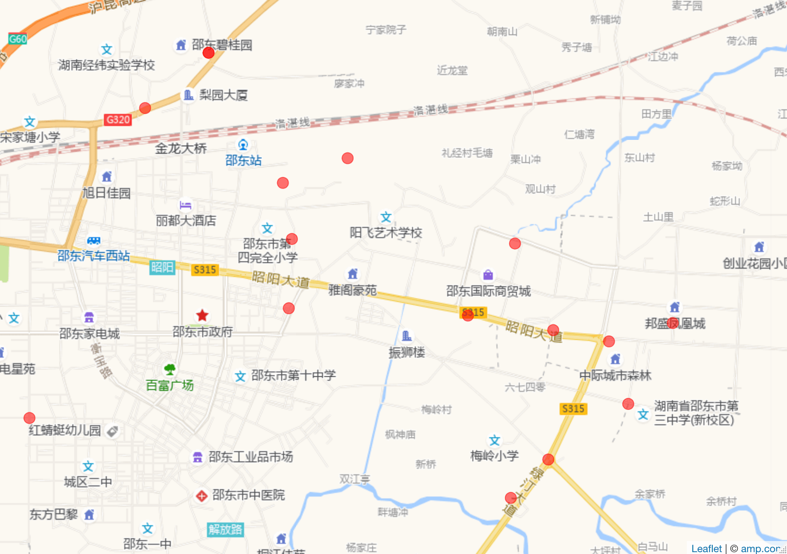

《爱情碟中谍》里宋丹丹说买房子最重要的是：Location、Location、Location（位置，位置，还是位置）！POI（Point of Interest 兴趣点）周围的商业价值，发展潜力，增值空间，如房子周边的学校、商场、交通，反映在时间距离、空间距离，最终体现在房价上。买房子、卖房子，中介和销售玩的就是**信息不对称**。如果能从不同层面，比如地区经济发展状况，和其它地区对比，和市内其它商圈对比，和其它楼盘房子对比，就可以做到不被轻易忽悠了。

```{r,echo=FALSE}
options(digits = 10)
```
```{r,eval=FALSE}
library(httr)
# 向高德地图 API 发 GET 请求
GetCoord <- function(address = "仁为峰邵东壹号", city = "邵东市") {
  tmp <- GET(
    url = "https://restapi.amap.com/",
    path = "v3/geocode/geo",
    query = list(
      # 原坐标，经纬度小数点后不得超过6位
      address = address,
      # 原坐标参考系，还支持 GPS 坐标，取值 'gps'
      city = city,
      # 返回数据格式，还支持 xml
      output = "json",
      # 高德地图 WEB 服务 API 访问令牌
      key = Sys.getenv("AMAP_KEY")
    )
  )
  as.numeric(strsplit(x = content(tmp)$geocodes[[1]]$location, split = ",")[[1]])
}
# 测试一下
GetCoord(address = "仁为峰邵东壹号", city = "湖南省邵阳市邵东市")
```
```
# [1] 111.751713  27.270619
```

接下来将函数向量化，以便批量解析地址，获取经纬度数据。可用 `Vectorize()` 函数实现，只需指定待向量化的参数向量。

```{r,eval=FALSE}
# 函数向量化
GetCoordVec <- Vectorize(FUN = GetCoord, vectorize.args = c("address", "city"), USE.NAMES = F, SIMPLIFY = F)
# 测试一下
GetCoordVec(address = "仁为峰邵东壹号", city = "湖南省邵阳市邵东市")
```

首先准备各个楼盘和地址信息，有的提供楼盘就能比较好的定位，有的定位不行，可见高德的数据不是百分百准确的。实际上任何数据都别想百分百精确，一些楼盘可能是新开的，周围配套还未建立，高德数据未及时更新等。

```{r,eval=FALSE}
# 批量解析地址
house <- c(
  "中际城市森林", "仁为峰邵东壹号", "龙熙府邸",
  "邦盛凤凰城（御玺）", "碧桂园·星钻", "泰丰城",
  "中驰晨曦桐江府", "悦富时代广场", "横科·佳润国际",
  "碧桂园·珑璟台", "中伟·国际公馆", "福星御景城",
  "中翔·龙玺", "金裕名都", "横科·金泉华府", "富景鑫城"
)
# 地址来自安居客 App
address <- paste0("湖南省邵阳市邵东市", c(
  "中际城市森林", "仁为峰邵东壹号", "梨园路与金石路交汇处",
  "邦盛凤凰城（御玺）", "绿汀大道与336省道交汇处", "泰丰城",
  "中驰晨曦桐江府", "悦富时代广场", "公园路与新辉路交汇处",
  "宋家塘梨园路168号", "建设北路与景秀路交互处", "福星御景城",
  "中翔·龙玺", "金裕名都", "横科·金泉华府", "兴和大道与光大路交叉口"
))
```

调用 `mapply()` 函数批量发送请求获取数据，返回的 list 列表数据对象，可用函数 `do.call()` 配合 `rbind()` 合并成 matrix 类型，再转为通用的 data.frame 类型。

```{r,eval=FALSE}
# 获取数据
dat <- mapply(FUN = GetCoordVec, address = address, MoreArgs = list(city = "湖南省邵阳市邵东市"))
# 整理数据
dat2 <- do.call("rbind", dat)
dat2 <- as.data.frame(dat2)
colnames(dat2) <- c("long", "lat")
dat2$house <- house
```

最后，调用 **leaflet** 包，将数据导入绘图函数即可。如图\@ref(fig:shaodong-house)所示，图中红点是邵东市各个在售楼盘的空间位置，仅考虑了安居客 App 的数据。

```{r,eval=FALSE}
library(leaflet)
library(leafletCN)
# 绘图
leaflet(options = leafletOptions(
  minZoom = 4, maxZoom = 18,
  zoomControl = FALSE
)) |>
  setView(lng = mean(dat2$long), lat = mean(dat2$lat), zoom = 14) |>
  leafletCN::amap() |>
  addCircles(
    data = dat2,
    lng = ~long, lat = ~lat, label = ~house,
    radius = 50, color = "red",
    fillOpacity = 0.55, stroke = T, weight = 1
  )
```
```{r,echo=FALSE}
# getOption("digits")
options(digits = 4)
```


{.full}

值得注意的是「龙熙府邸」和「碧桂园珑璟台」的定位重合了，地理位置上，二者确实也接近。经过这一番使用，可见高德开放平台给的经纬度地址解析服务一般。

图中信息比较丰富，简单说下：

1. 各个楼盘在城市主干道昭阳大道、绿汀大道两侧排开。
1. 高铁邵东站、国际商贸城、邦盛凤凰城地理位置价值依次降低，后者短期内发展不起来。
1. 百富广场、邵东工业品市场、邵东市中医院、邵东一中属于老城区。
1. 2019年邵东撤县划市，建设新城区，邵东高铁站开通，楼市炒贵族学校、区位优势，县政府推波助澜，房价已翻倍。
1. 建设新城区，碧桂园等头部房企进场，对房价有推动作用，但整体上供给充足。


另外，结合最近几年邵东市发布的统计年鉴数据，笔者了解到，邵东市最近几年人口增长为负，经济增长主要靠固定资产投资，换个说法，就是房地产投资。大城市各个行业，特别是产业互联网下沉战略促使三、四、五线城市消费升级，但是小城人民薪资待遇并没有升级，形成收入消费倒挂。因此，小城房地产价格近年猛增已到极限，没有足够配套建设，特别是没有大城市的高质量劳动力回流，城市发展会很慢。结合笔者对邵东市近年来人才引进政策、人力市场需求和薪资待遇的了解，特别是对公务员、中学教师、工程师等岗位的分析，对大城市高质量劳动力吸引不足，也承接不了。


目前，邵东房价整体在 5000至6000，如果资金充裕，不用选，找最贵的房子买，大家都不傻，地段越好，价格越高。未来城市资源配套都往这集中，等着升值，当下越贵的房子未来升值空间也越高，这就是马太效应！2021年房价基本稳定，国家出台系列政策调控，国家若不出手，房地产就只剩下泡沫了，楼市也将迟早崩盘，这对邵东经济发展是致命的。

