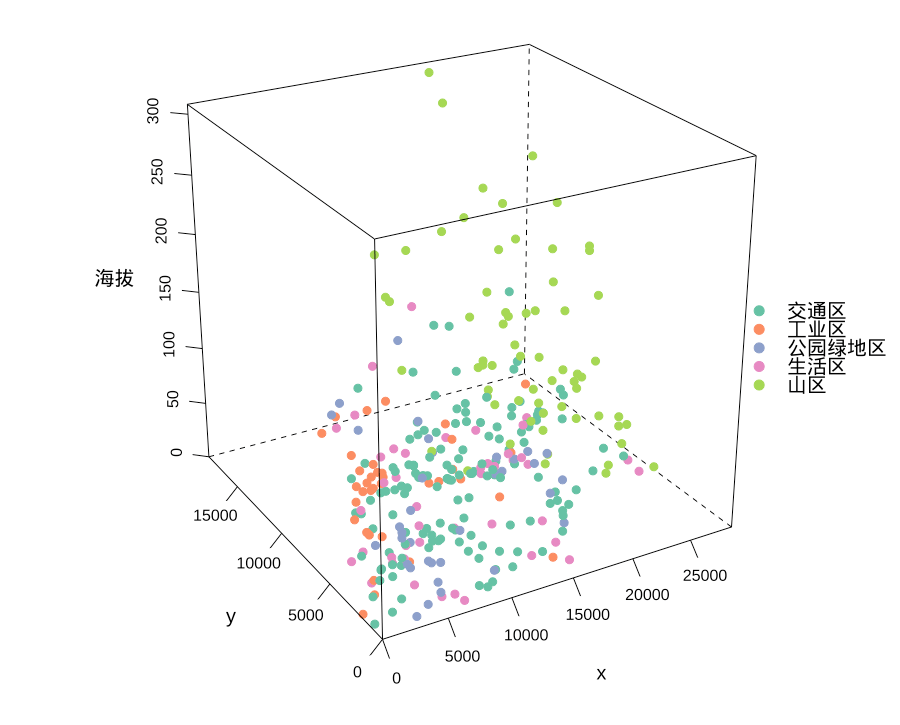
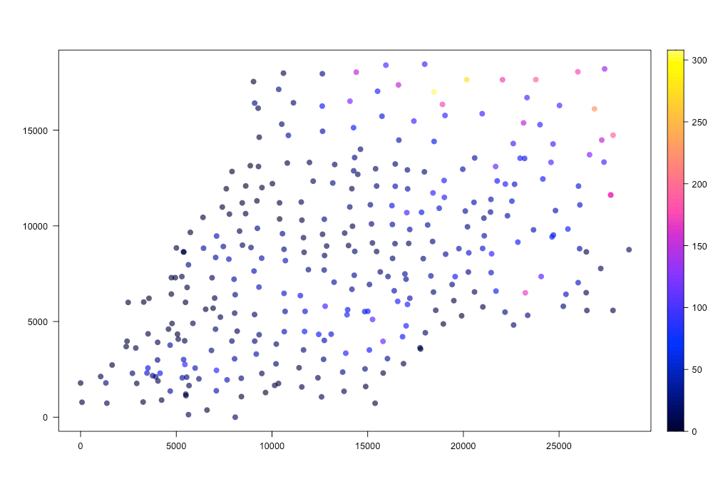

```{r setup, echo=FALSE}
knitr::opts_chunk$set(
  comment = "#",
    error = FALSE,
     tidy = FALSE,
    cache = FALSE,
 collapse = TRUE
)

# 修改输出的显示行数
# 代码修改自 https://github.com/yihui/knitr-examples/blob/5b69a8cce1a4cdcf43a3d17caae5b52669cf61b7/052-suppress-output.Rmd#L8-L19
knitr::knit_hooks$set(output = local({
  # the default output hook
  hook_output = knitr::knit_hooks$get('output')
  function(x, options) {
    if (!is.null(n <- options$out.lines)) { # out.lines
      x = xfun::split_lines(x)
      if (length(x) > n) {
        # truncate the output
        x = c(head(x, n), '....\n')
      }
      x = paste(x, collapse = '\n') # paste first n lines together
    }
    hook_output(x, options)
  }
}))
# 控制输出的宽度
options(width = 89)
```


数据来自 2011 年全国大学生数据[建模竞赛 A 题](http://www.mcm.edu.cn/html_cn/node/a1ffc4c5587c8a6f96eacefb8dbcc34e.html)，下载数据到本地后，首先读取城市地形数据，即采样点的位置及所属功能区。功能区代码 1 对应「生活区」，2 对应「工业区」，3 对应「山区」，4 对应「交通区」和 5 对应「公园绿地区」。

```{r out.lines=6}
library(readxl)
# 采样点的城市地形数据
dat1 <- read_xls(
  path = "data/cumcm2011A附件_数据.xls",
  col_names = TRUE, sheet = "附件1", range = "A3:E322"
)
dat1
```


```{r out.lines=6}
library(tibble)
tmp <- tribble(
  ~`功能区编号`, ~`功能区名称`,
  1, "生活区",
  2, "工业区",
  3, "山区",
  4, "交通区",
  5, "公园绿地区"
)
# 合并数据
dat2 <- merge(x = dat1, y = tmp, by.x = "功能区", by.y = "功能区编号", sort = FALSE)
dat2
```

读取地表土壤各种重金属浓度的数据，它在同一个Excel文件的另一个工作区里。

```{r out.lines=6}
# 土壤重金属浓度
dat3 <- read_xls(
  path = "data/cumcm2011A附件_数据.xls",
  col_names = TRUE, sheet = "附件2", range = "A3:I322"
)
# 篇幅所限，铅 Pb (μg/g) 和锌 Zn (μg/g) 两列未显示
dat3
```

将采样点的地形数据和土壤重金属浓度数据合并在一起。

```{r out.lines=6}
dat4 <- merge(x = dat2, y = dat3, by.x = "编号", by.y = "编号", sort = TRUE)
dat4
```

以上8种主要重金属元素的背景参考值如下：

```{r}
# 土壤重金属浓度的背景参考值
dat5 <- read_xls(
  path = "data/cumcm2011A附件_数据.xls",
  col_names = TRUE, sheet = "附件3", range = "A3:D11"
)
dat5
```

既然提供了各重金属浓度的背景参考值，可以先将原浓度数据标准化。

```{r out.lines=6}
# 相比于 transform 函数 within 更友好一些，特别是在列名处理上
# 详见 https://bugs.r-project.org/show_bug.cgi?id=17890
dat6 <- within(dat4, {
  `As (μg/g)` <- (`As (μg/g)` - 3.6) / 0.9
  `Cd (ng/g)` <- (`Cd (ng/g)` - 130) / 30
  `Cr (μg/g)` <- (`Cr (μg/g)` - 31) / 9
  `Cu (μg/g)` <- (`Cu (μg/g)` - 13.2) / 3.6
  `Hg (ng/g)` <- (`Hg (ng/g)` - 35) / 8
  `Ni (μg/g)` <- (`Ni (μg/g)` - 12.3) / 3.8
  `Pb (μg/g)` <- (`Pb (μg/g)` - 31) / 6
  `Zn (μg/g)` <- (`Zn (μg/g)` - 69) / 14
})
# 篇幅所限，仅展示部分列
dat6
```

为了方便后续数据处理和分析，重命名数据框各个列名。

```{r}
# 查看各个列名
colnames(dat6)
# 重命名各个列
colnames(dat6) <- c(
  "编号", "功能区", "x", "y", "海拔", "功能区名称",
  "As", "Cd", "Cr", "Cu", "Hg", "Ni", "Pb", "Zn"
)
```
```{r out.lines=6}
# 调色板
# RColorBrewer::brewer.pal(n = 5, name = "Set2")
# 查看颜色
# RColorBrewer::display.brewer.pal(n = 5, name = "Set2")
colorize_factor <- function(x) {
  # 注意因子水平个数
  scales::col_factor(palette = "Set2", levels = unique(x))(x)
}
# 给每个功能区设置一个颜色
dat6 <- transform(dat6, color = colorize_factor(`功能区名称`))
dat6
```

查看各个功能区采样点的数量，以及各个功能区的配色。

```{r}
aggregate(`编号` ~ color + `功能区名称`, data = dat6, FUN = function(x) length(unique(x)))
```

采样点在各个功能区的分布情况，如图\@ref(fig:elevation-cloud)所示，城市地势西南低东北高，西北边界主要分布工业区，交通连接城市各个功能区，东北方向主要是山区。

```{r,eval=FALSE}
library(lattice)
# 绘图涉及中文，调用 showtext 包处理
library(showtext)
showtext_auto()
# 三维分组散点图
cloud(`海拔` ~ x * y,
  data = dat6, pch = 19,
  col = dat6$color, # 散点颜色映射功能区
  # z 轴标签旋转 90 度
  scales = list(
    arrows = FALSE, col = "black",
    z = list(rot = 90)
  ),
  key = list( # 制作图例
    # space = "right",
    corner = c(1.0, 0.5), # 右侧居中
    points = list(col = c("#66C2A5", "#FC8D62", "#8DA0CB", "#E78AC3", "#A6D854"), pch = 19),
    text = list(c("交通区", "工业区", "公园绿地区", "生活区", "山区"))
  ),
  # 减少三维图形的边空
  lattice.options = list(
    layout.widths = list(
      left.padding = list(x = -.6, units = "inches"),
      right.padding = list(x = -1.0, units = "inches")
    ),
    layout.heights = list(
      bottom.padding = list(x = -.8, units = "inches"),
      top.padding = list(x = -1.0, units = "inches")
    )
  ),
  # 设置坐标轴字体大小
  par.settings = list(
    axis.line = list(col = "transparent"),
    fontsize = list(text = 15, points = 10)
  ),
  # 设置三维图的观察方位
  screen = list(z = 30, x = -65, y = 0)
)
```

{.full}

接下来，根据此数据框 data.frame 类型构造空间数据类型 **sp** （对应 **Sp**atial 类），以便后续调用空间数据分析方法。

```{r}
library(sp)
coordinates(dat6) <- ~ x + y
summary(dat6)
```
```{r,eval=FALSE}
spplot(dat6,
  zcol = c("海拔"),
  main = "",
  as.table = TRUE, # 面板自左上开始
  scales = list(
    draw = TRUE, # 坐标轴刻度
    # 去掉图形上边、右边多余的刻度线
    x = list(alternating = 1, tck = c(1, 0)),
    y = list(alternating = 1, tck = c(1, 0))
  ),
  colorkey = TRUE,
  alpha = 0.7,
  key.space = "right"
)
```

{.full}


由图\@ref(fig:elevation-spplot)不难看出，采样点的位置是以图中左下角的点为参照，城市整体上的地势是西南低东北高，城市中间间或有两座小山。


```{r,eval=FALSE}
As <- bubble(dat6, zcol = c("As"), col = c("#4dac26", "#d01c8b"), fill = F, key.space = "bottom")
Cd <- bubble(dat6, zcol = c("Cd"), col = c("#4dac26", "#d01c8b"), fill = F, key.space = "bottom")
Cr <- bubble(dat6, zcol = c("Cr"), col = c("#4dac26", "#d01c8b"), fill = F, key.space = "bottom")
Cu <- bubble(dat6, zcol = c("Cu"), col = c("#4dac26", "#d01c8b"), fill = F, key.space = "bottom")
Hg <- bubble(dat6, zcol = c("Hg"), col = c("#4dac26", "#d01c8b"), fill = F, key.space = "bottom")
Ni <- bubble(dat6, zcol = c("Ni"), col = c("#4dac26", "#d01c8b"), fill = F, key.space = "bottom")
Pb <- bubble(dat6, zcol = c("Pb"), col = c("#4dac26", "#d01c8b"), fill = F, key.space = "bottom")
Zn <- bubble(dat6, zcol = c("Zn"), col = c("#4dac26", "#d01c8b"), fill = F, key.space = "bottom")

# 4 列 2 行，图按列
print(As, split = c(1, 1, 4, 2), more = TRUE)
print(Cd, split = c(1, 2, 4, 2), more = TRUE)
print(Cr, split = c(2, 1, 4, 2), more = TRUE)
print(Cu, split = c(2, 2, 4, 2), more = TRUE)
print(Hg, split = c(3, 1, 4, 2), more = TRUE)
print(Ni, split = c(3, 2, 4, 2), more = TRUE)
print(Pb, split = c(4, 1, 4, 2), more = TRUE)
print(Zn, split = c(4, 2, 4, 2), more = FALSE)
```


{.full}

图中，绿色气泡表示重金属浓度低于背景值，红色气泡反之，气泡大小对应不同区间的浓度值，根据浓度值数据的五个分位点划分区间，以砷 As 为例，浓度的分位点如下：

```{r}
quantile(dat6$As)
```

现在数据准备好了，通过上述探索，也有了基本的了解，接下来的问题是如何找到城市的重金属污染源？

