```{r setup, echo=FALSE}
knitr::opts_chunk$set(
  comment = "#",
    error = FALSE,
     tidy = FALSE,
    cache = FALSE,
 collapse = TRUE
)
# 修改输出的显示行数
knitr::knit_hooks$set(output = local({
  # the default output hook
  hook_output = knitr::knit_hooks$get('output')
  function(x, options) {
    if (!is.null(n <- options$out.lines)) { # out.lines
      x = xfun::split_lines(x)
      if (length(x) > n) {
        # truncate the output
        x = c(head(x, n), '....\n')
      }
      x = paste(x, collapse = '\n') # paste first n lines together
    }
    hook_output(x, options)
  }
}))
# 控制输出的宽度
options(width = 89)
```

::: rmdinfo
本文引用的所有信息均为公开信息，仅代表作者本人观点，与就职单位无关。
:::

# 概览

本文首先以实际示例介绍三类典型的空间数据，希望读者能对不同类型的空间数据的特点和使用场景有个简单印象。紧接着，介绍各类地理空间数据的可视化方法及 R 包实现，笔者从个人经验出发详细介绍了4个，相信足够让读者应付大部分使用场景。之后，再介绍 R 语言中的空间数据类型及其基本操作，空间数据操作是基本功，也是比较难的，没放在空间数据可视化前面是怕吓跑了一些读者，笔者所知也十分有限，也怕写不好。再基于一个真实数据用不同的 R 包实现类似的可视化效果，是几代空间数据可视化方法的并列介绍，最后是一些心得、总结和展望。

本文有几个写作意图：

1.  如何用 R 语言调用**各类**地图服务实现**各类**空间数据的**各种**可视化方法。
2.  以丰富的实例数据和图形展示各类空间数据，帮助读者建立直觉。
3.  对比多个可视化 R 包，提供丰富的效果图，帮助读者选择合适的可视化图形。
4.  希望在这个颜值走遍天下的时代，能吸引更多的人入坑 R 语言，并感受 R 语言在数据可视化领域的魅力。

```{=html}
<!-- 
无需强调：笔者不是测绘专业出身，自学过一点地统计学（Geostatistics），很多地理信息和空间分析的领域知识是现学现卖，恐有错漏，还请多多指正。 
-->
```
# 空间数据

空间数据基本类型有点、线、面（或称多边形）等，还分矢量数据和栅格数据，地理可视化的展示形式有气泡图、热力图、瓦片图、地形图等。下面通过几个实际的空间数据，以图形的展示方式以期帮助读者建立数据直觉，陆续使用 **lattice** [@lattice]、**ggplot2** [@ggplot2]和 **leaflet** [@leaflet] 来绘制静态和交互图形。

## 示例：美国旧金山犯罪数据

下面以 **RgoogleMaps** 包内置的数据集 incidents 为例介绍空间点数据，并作一些简单的分析。

```{r}
library(RgoogleMaps)
# 加载 incidents 
data(incidents)
# 查看数据
head(incidents)
```

数据集 incidents 来自 2012 年旧金山的犯罪数据，更多数据见 [DataSF 项目](https://datasf.org/opendata/)，一些数据分析见 Github [项目](https://github.com/datasf)。数据集 incidents 随机抽取了 5000 行，16个观测变量，分别是犯罪数目 `IncidntNum`、犯罪类型 `Category`、犯罪行为描述 `Descript`、犯罪行为发生在周几 `DayOfWeek`、犯罪行为发生的日期 `Date`、犯罪行为发生的时间（hh::mm）`Time`、警局辖区 `PdDistrict`、警方处置方式 `Resolution`、位置 `Location`、经度 `lon`、纬度 `lat`、是否属于暴力行为 `violent`、发生时间（小时，以2位整数计） `HrOfDay`、发生时间（小时，以10进制计）`TimeOfDay`、发生时间（一周168个小时，0-168之间的数字）`HourOfWeek`、人口普查的区块标记 `censusBlock`。图\@ref(fig:incidents-map)展示警方出警地点，或者说犯罪行为发生地点，红点表示此处发生暴力冲突，黑点表示此处没有暴力冲突。

```{r,eval=FALSE}
plotmap(
  lat = lat, lon = lon, data = incidents, 
  col = 'violent', zoom = 12,
  pch = 20, cex = 0.5, API = "google",
  apiKey = Sys.getenv("GGMAP_GOOGLE_API_KEY")
)
```

{.full}

除了 **RgoogleMaps** 提供的 `plotmap()` 函数，当然，还可以用 **leaflet** 来绘制交互式的散点图，因为交互，可以放入更多的信息。如图\@ref(fig:incidents-leaflet)，鼠标悬浮在散点上可以看到事件发生的警区 PdDistrict，点击可以看到警方的处置方式 Resolution，这是设置 `addCircles()` 的参数 `label` 和 `popup` 实现的，实际上，它们还可以放入更加丰富的信息。

```{r,eval=FALSE}
library(leaflet)
# 分类变量映射成颜色
colorize_factor <- function(x) {
  # 设置颜色梯度数目
  scales::col_factor(palette = "plasma", domain = unique(x))(x)
}
# 警方处置方式 Resolution 映射成颜色变量
incidents <- transform(incidents, color = colorize_factor(Resolution))
# 绘制交互图形
leaflet(options = leafletOptions(
    minZoom = 4, maxZoom = 18, zoomControl = FALSE
  )) |> 
  addTiles() |> 
  setView(lng = -122.4, lat = 37.77, zoom = 13) |> 
  addCircles(
    data = incidents, popup = ~Resolution, 
    radius = 30, label = ~PdDistrict,
    lng = ~lon, lat = ~lat, color = ~color
  ) |> 
  addLegend("topright", pal = colorFactor(
    palette = "plasma", domain = unique(incidents$Resolution)
  ), values = incidents$Resolution, opacity = 1)
```

{.full}

接下来再细致一点地探索 incidents 数据集，各个警区出警次数的分布情况，

```{r,eval=FALSE}
library(data.table)
incidents <- as.data.table(incidents)
library(ggplot2)
# SOUTHERN 警区的犯罪记录显著高于其他警区
dat <- incidents[, .(cnt = length(IncidntNum)), by = c("PdDistrict", "violent")]

ggplot(data = dat, aes(x = PdDistrict, y = cnt, fill = violent)) +
  geom_col()
```

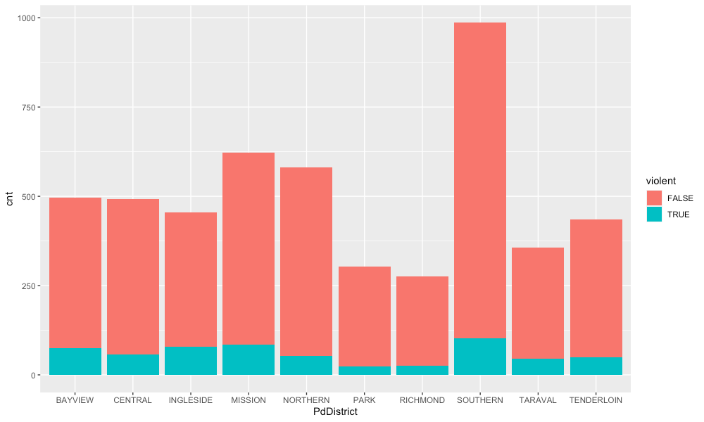{.full}

进一步，可将图\@ref(fig:incidents-pddistrict)所示分布绘制在地图上，如图\@ref(fig:incidents)展示事件发生次数随警区的空间分布。

```{r,eval=FALSE}
dat <- incidents[, .(cnt = length(IncidntNum), lat = mean(lat), lon = mean(lon)), by = c("violent", "PdDistrict")]
# RgoogleMapsPlot 函数合成了地图和 lattice 分面绘图的能力
RgoogleMapsPlot(cnt ~ lat * lon | violent,
  data = dat,
  pch = 19, col = "orangered",
  scales = list(
    # 去掉图形上边、右边多余的刻度线
    x = list(alternating = 1, tck = c(1, 0)),
    y = list(alternating = 1, tck = c(1, 0))
  ),
  panel = panel.loaPlot, show.axes = TRUE
)
```

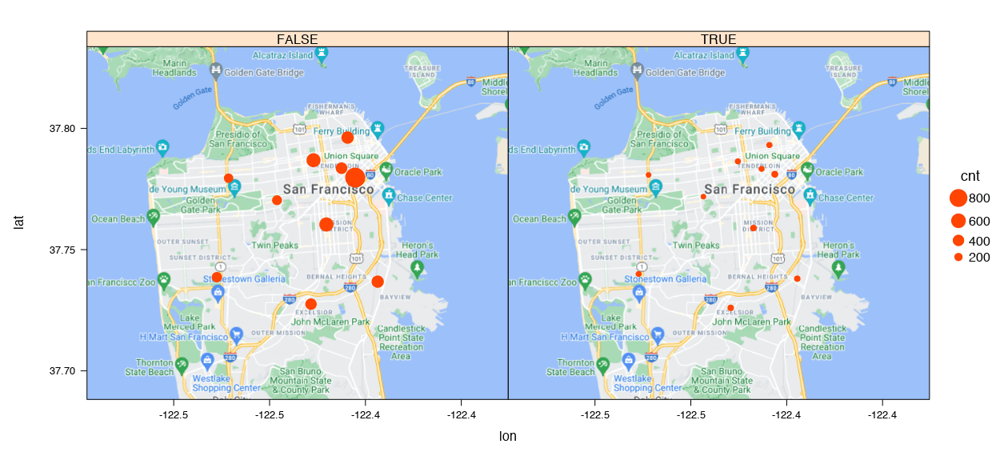{.full}

再从全年来看，事件发生的时间分布，发现犯罪的高峰时段从下午 5-6 点一直持续到午夜 12 点。

```{r,eval=FALSE}
dat <- incidents[, .(cnt = length(IncidntNum)), by = c("HrOfDay", "violent")]
ggplot(data = dat, aes(x = HrOfDay, y = cnt, fill = violent)) +
  geom_col()
```

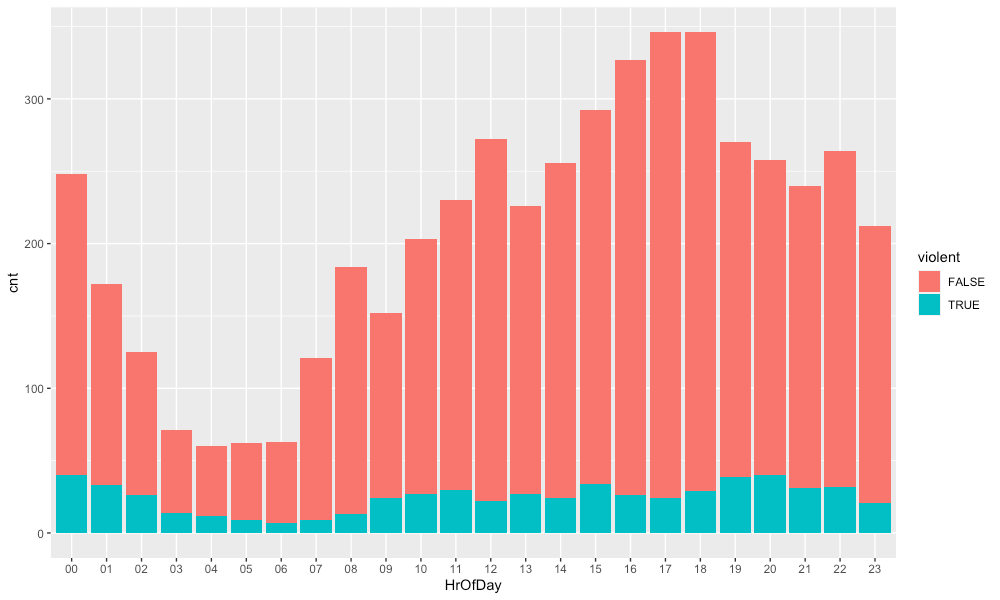{.full}

每次接报出警，警方会根据具体情况快速对事件定级分类，然后派出相应的警力以及处置方式。可以见事件性质 Category、是否发生暴力 violent 和警方处置方式 Resolution 应当有很强的关联。既然 Category， violent 和 Resolution 有很强的关联，展示关联关系非常重要，有的分类 Category 就应该给予足够的处置力度，特别对于暴力事件，关注警方的措施是否有不当或处置不力的？以此，还可以推测旧金山的治安状况。

```{r,eval=FALSE}
dat <- incidents[, .(cnt = length(IncidntNum)), by = c("Category", "violent", "Resolution")]

ggplot(data = dat, aes(x = reorder(Category, cnt), y = cnt, fill = Resolution)) +
  geom_col() +
  coord_flip() +
  facet_grid(rows = vars(violent), scales = "free", space = "free") +
  labs(x = "Category")
```

{.full}

从图\@ref(fig:incidents-resolution)看出，对于不同的事件 Category 有不同的执行措施 Resolution，执行措施和是否属于暴力有关系。一般来讲，暴力事件都应该有处置，发生暴力事件只有 5 类，按发生次数依次是打架斗殴、抢劫、性骚扰、绑架、盗窃，从图中也可看出盗窃是最多的犯罪事件。下表 \@ref(tab:incidents-category) 是对图中分类的中文翻译，笔者英文水平一般，翻译仅供参考。

```{r incidents-category,echo=FALSE}
dat <- data.frame(
  Category = c(
    "LARCENY/THEFT", "NON-CRIMINAL", "OTHER OFFENSES", "ASSAULT",
    "VANDALISM", "DRUG/NARCOTIC", "BURGLARY", "VEHICLE THEFT",
    "MISSING PERSON", "ROBBERY", "SUSPICIOUS OCC", "FRAUD",
    "TRESPASS", "FORGERY/COUNTERFEITING", "WEAPON LAWS", "DISORDERLY CONDUCT",
    "RECOVERED VEHICLE", "DRIVING UNDER THE INFLUENCE", "DRUNKENNESS", "SEX OFFENSES, FORCIBLE",
    "RUNAWAY", "KIDNAPPING", "LOITERING", "LIQUOR LAWS",
    "PROSTITUTION", "ARSON", "EMBEZZLEMENT", "EXTORTION",
    "STOLEN PROPERTY", "GAMBLING", "BAD CHECKS", "PORNOGRAPHY/OBSCENE MAT",
    "SUICIDE"
  ),
  Category_cn = c(
    "盗窃", "非犯罪", "其他罪行", "打架斗殴",
    "蓄意破坏", "毒品/麻醉品", "入室盗窃", "车辆盗窃",
    "人员失踪", "抢劫", "可疑的 OCC", "欺诈",
    "非法入侵", "伪造/假冒", "武器法", "扰乱秩序",
    "回收车辆", "非正常行驶", "醉酒", "性骚扰",
    "逃跑", "绑架", "游荡", "酒法", "卖淫",
    "纵火", "挪用公款", "勒索",
    "被盗财产", "赌博", "空头支票", "色情/淫秽", "自杀"
  )
)
knitr::kable(x = dat, caption = "事件性质")
```

## 示例：美国人口普查统计数据

**ggplot2** 提供的 `map_data()` 函数可以从 **maps** 包中提取和转化地图数据，而 `coord_map()` 函数结合 **mapproj** 包可以实现坐标转化。下面以 R 内置的数据集 state.x77 为例，它记录了美国 1977 年 50 个州的人口普查情况，Population 各州的人口数量 （1975 年 7 月 1 日估计），Income 人均收入（1974年），Illiteracy 文盲比例（人口百分比），平均寿命（1969-1971年统计），Murder 谋杀和非过失杀人率（单位：十万分之一，1976年统计），HS Grad 高中毕业生百分比（1970 年统计），Frost 首都或大城市最低气温低于冰点的平均天数（1931-1960年统计），Area 土地面积（单位：平方英里）。如图\@ref(fig:ggplot2-statex77)， **maps** 包内置的美国各州的地图数据缺少夏威夷和阿拉斯加州。

```{r,eval=FALSE}
library(ggplot2)
# 准备地图数据
# maps 包的地图数据提取转为 data.frame 数据类型
states_map <- map_data(map = "state")
# 准备观测数据
state.x77 <- data.frame(region = tolower(rownames(state.x77)), state.x77)

# 将观测数据合并进地图数据
states_map <- merge(states_map, state.x77, by = "region", all.x = TRUE, sort = FALSE)
# 地图数据排序保证地图绘制顺序
states_map <- states_map[order(states_map$order), ]
# 绘图
ggplot(states_map, aes(x = long, y = lat, group = group)) +
  geom_polygon(aes(group = group, fill = Population)) +
  scale_fill_binned(
    type = "viridis",
    guide = guide_colourbar(
      barwidth = 25, barheight = 0.4,
      title.position = "top" # 图例标题位于图例上方
    )
  ) +
  coord_map(projection = "albers", lat0 = 45.5, lat1 = 29.5) +
  labs(x = "Longitude", y = "Latitude", fill = "State Population (1975)") +
  theme_void() +
  theme(legend.position = "bottom") # 图例位置图形下方
```

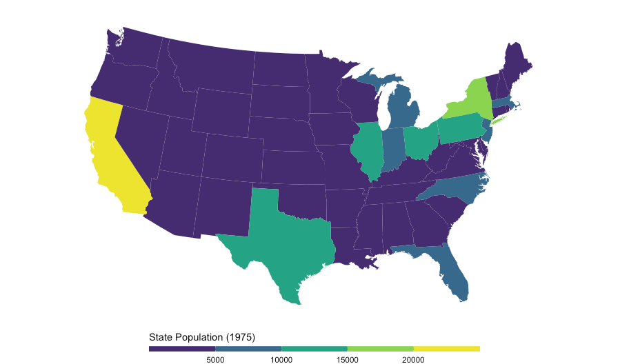{.full}

[**usmap**](https://github.com/pdil/usmap/) 提供 `plot_usmap()` 函数可谓专门用来绘制美国各州县的地图，包含夏威夷和阿拉斯加州，不包含波多黎各，参数 `data` 需要传入一个数据框，且必须有一列可以和地图提供的区域名称映射上，即需要有一列的列名是 state 或 fips。实际上，**usmap** 包 还内置有区县级地图数据，也支持抽取特定的州县，更多介绍见[这里](https://usmap.dev/)。

```{r,eval=FALSE}
library(ggplot2)
state_x77 <- data.frame(state = tolower(rownames(state.x77)), state_x77)

usmap::plot_usmap(data = state_x77, values = "Population", labels = TRUE) +
  scale_fill_gradientn(
    colours = hcl.colors(10), na.value = "grey90",
    guide = guide_colourbar(
      barwidth = 25, barheight = 0.4,
      title.position = "top" # 图例标题位于图例上方
    )
  ) +
  labs(fill = "State Population (1975)") +
  theme(legend.position = "bottom") # 图例位置图形下方
```

{.full}

## 示例：美国锡安公园地形数据

美国西南部犹他州锡安国家公园的高程珊格数据 elevation，该数据集由 [Jakub Nowosad](https://nowosad.github.io/) 收集于 [spDataLarge](https://github.com/Nowosad/spDataLarge) 包内，由于该 R 包收集的地理信息数据很多又很大，超出了 [CRAN](https://cran.r-project.org/) 对 R 包的大小限制，因此，需要从作者制作的 drat 站点下载。

```{r check-spDataLarge, eval=FALSE}
install.packages("spDataLarge", repos = "https://nowosad.github.io/drat/")
```

elevation 数据集通过雷达地形测绘 SRTM (Shuttle Radar Topography Mission) 获得，其分辨率为 90m $\times$ 90m，属于高精度地形网格数据，更多细节描述见 <http://srtm.csi.cgiar.org/>，下图\@ref(fig:raster-elevation)将公园的地形清晰地展示出来了，读者不妨再借助维基百科词条 (<https://en.wikipedia.org/wiki/Zion_National_Park>) 从整体上了解该公园的情况，结合丰富的实景图可以获得更加直观的感受。

```{r}
#| elevation-zion,
#| fig.cap="锡安国家公园的高程珊格数据",
#| fig.height=5,fig.width=5.5, 
#| eval=FALSE,
#| echo=FALSE

data("elevation", package = "spDataLarge")
terra::plot(elevation, asp = NA)
```

{.full}

::: rmdtip
R 软件内置的调色板 `terrain.colors()` 专用于地形图配色，从翠绿色、土黄色、沙白色，无不暗示海拔变化，读者不妨想象一下，山上的树呈翠绿色，山腰的砂石土块呈土黄色，山脚的河床小路呈沙白色，十分符合我国南方的丘陵山地印象。
:::

# 可视化包

本节主要介绍几个 R 语言社区提供的地理可视化 R 包，分别是绘制交互式地图的 **echarts4r** 包 [@echarts4r]、**leaflet** 包和 **plotly** 包。它们各有千秋， **echarts4r** 背靠 [Apache Echarts](https://github.com/apache/echarts) 功能覆盖面比较广，但是还不够精纯，在易用性和性能上还有较大提升空间，此外，在统计方面有些弱，比如分组线性回归很难实现。**leaflet** 专注于交互式地理可视化，支持常见的矢量和栅格数据对象。**plotly** 背后的支持来自商业公司，上游依赖是开源的JavaScript 库[plotly](https://github.com/plotly)，深耕多年，功能全面，使用的体感是性能比较差。

地理可视化的 R 包是有很多的，本文无法穷尽。[choroplethr](https://github.com/trulia/choroplethr) 和[choroplethrMaps](https://github.com/trulia/choroplethrMaps) 主要用来制作地区分布图，需要的区域数据，**choroplethrMaps** 包提供三份地图数据，分别是美国州、县地图和世界地图，相关介绍材料见[这里](https://arilamstein.com/open-source/)。[tmap](https://github.com/r-tmap/tmap) 制作交互地图，[mapsf](https://github.com/riatelab/mapsf) 制作符号地图、等值地图、拓扑地图，关于各类地图的可视化示例见[AntV 官网](https://antv.vision/zh)。[mapsapi](https://github.com/michaeldorman/mapsapi) 可以连接 4 种 Google 提供的 Web 地图服务。

地理可视化的展示形式有多种，散点图、气泡图、峰窝图和热度图等，还可以有更加复合的专题地图，如在地图上省、市、区、县一级别，显示各个年龄段的人口比例，类似将饼图贴在地图上。为简单起见，主要以散点图为例介绍入门级别的内容。

## echarts4r

**echarts4r** 支持使用多种地图服务，包括 OSM（OpenStreetMap）、Mapbox、谷歌、高德等，只要提供引用瓦片服务数据模版即可。**echarts4r** 内置了一份矢量地图数据，如图\@ref(fig:quakes-echarts4r)所示。简单起见，这里使用了 R 内置的数据集 quakes，它描述了太平洋岛国斐济及周边自 1964 年以来的四级以上的地震活动。从图中不难看出有两个非常清晰的地震带。结合背景材料，一个在主要板块交界处，另一个是新西兰附近的汤加海沟。火山爆发和地震不是一回事，但紧密相连。2022年1月14日，汤加海底火山爆发，引发海啸等一系列自然灾害，中国地震局也发布新闻资讯---[汤加火山喷发，会造成哪些影响？](https://www.cea.gov.cn/cea/xwzx/fzjzyw/5647231/index.html)详细介绍了这一事件。

```{r,eval=FALSE}
library(echarts4r)
# 使用默认的地图
quakes |>
  e_charts(x = long) |>
  e_geo(
    roam = TRUE,
    map = "world",
    boundingCoords = list(
      c(165.67, -38.59),
      c(188.13, -10.72)
    )
  )  |>
  e_scatter(
    serie = lat, size = mag, name = "Fiji",
    coord_system = "geo"
  ) |>
  e_visual_map(mag, scale = e_scale)
```

{.full}

**echarts4r** 提供地理图层 `e_geo()` 专门用来加载地图数据，在这个例子中，只需要展示局部地图，因此基于数据集 quakes 提取经纬度范围，获取了边界信息，设置了参数 `boundingCoords`，即矩形的左上顶点和右下顶点的两个坐标，关于其它参数更加详尽的介绍，见 Apache Echarts 官方文档里 [地理图层](https://echarts.apache.org/en/option.html#geo.boundingCoords)。下面做一些更加细致的调整，最终效果如图\@ref(fig:quakes-chalk)。

-   `e_effect_scatter()` 替换 `e_scatter()` 实现一些动态特效，和地震的震波建立一些视觉联系，不过会增加渲染压力；设置 `scale = NULL` 去掉默认对 size 变量的尺度变换；
-   `e_title()` 添加一些文字介绍斐济地震带背后的数据背景；
-   `e_tooltip()` 参考 Apache Echarts 官方文档[tooltip](https://echarts.apache.org/zh/option.html#geo.tooltip.formatter)在气泡上定制悬浮提示，补充震点位置和震级信息，定性和定量结合；
-   `e_visual_map()` 设置透明度缓解数据点覆盖，设置颜色和气泡大小的变化范围，设置组件两端的文本，设置组件的位置为右下角，更多设置详见[视觉映射组件](https://echarts.apache.org/zh/option.html#visualMap)；
-   `e_legend()` 隐藏图例，已用 `e_visual_map()` 替代；
-   `e_theme()` 参考[主题配置页面](https://echarts.apache.org/zh/theme-builder.html)挑选黑色背景主题。

```{r,eval=FALSE}
# 使用默认的地图
annotation_point <- c(-21.0744, 183.7499, 0, 7, 0)
quakes <- rbind(quakes, annotation_point) # 把这个点加到数据集里面
# 新加一列专用于文本注释
quakes$annotation <- ' '
quakes[which(quakes$lat == -21.0744 & quakes$long == 183.7499), ]$annotation <- '汤加火山'

# 绘图
quakes |>
  e_charts(x = long) |>
  e_geo(
    roam = TRUE,
    map = "world",
    boundingCoords = list(
      c(165.67, -38.59),
      c(188.13, -10.72)
    )
  ) |>
  e_effect_scatter(
    serie = lat,
    scale = NULL, # 去掉尺度变换
    bind = annotation, # 用于 params.name
    size = mag, 
    name = "地震点",
    coord_system = "geo"
  ) |>
  e_visual_map(
    serie = mag, # 震级图例
    right = 0, bottom = 0, # 图例的位置，离容器右侧和下侧的距离
    text  = c("高", "低"), # 定义两端的文本
    textStyle = list(color = "white"),
    inRange = list(
      color = hcl.colors(10), # 填充颜色
      colorAlpha = 0.7, # 设置透明度
      symbolSize = c(1, 15) # 设置气泡大小
    )
  ) |>
  e_labels(
    position = 'top',
    formatter = htmlwidgets::JS("function(params){return( params.name )}")
  ) |> 
  e_tooltip(
    formatter = htmlwidgets::JS("
        function(params) {
          return('<strong>' + params.seriesName + '</strong>' + 
          '<br>经度：' + params.value[0] + 
          '<br>纬度：' + params.value[1] + 
          '<br>震级：' + params.value[2])
        }
      ")
  ) |>
  e_title(
    text = "斐济地震带",
    subtext = "斐济是南太平洋上的一个岛国",
    left = "center",
    sublink = "https://echarts4r.john-coene.com/"
  ) |> 
  e_legend(show = FALSE) |>  # 隐藏图例
  e_theme(name = "chalk")
```

{.full}

下面介绍在瓦片地图数据的基础上展示 quakes 数据，如图\@ref(fig:quakes-osm) 所示，这里采用地理图层 `e_leaflet()` 调用开放的 OpenStreetMap 瓦片服务。

```{r,eval=FALSE}
# OSM
quakes |>
  e_charts(long) |>
  e_leaflet(center = c(175, -20), zoom = 4) |>
  e_leaflet_tile() |>
  e_scatter(lat, size = mag, coord_system = "leaflet")
```

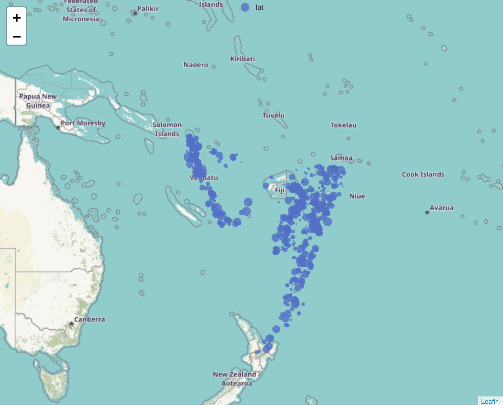{.full}

只要提供瓦片地图服务的模版，就可以切换地图底图数据，图\@ref(fig:quakes-ggmap)使用了谷歌的地图服务。

```{r,eval=FALSE}
# 谷歌地图
quakes |>
  e_charts(long) |>
  e_leaflet(center = c(175, -20), zoom = 4) |>
  e_leaflet_tile(
    template = "http://mt2.google.cn/vt/lyrs=m@167000000&hl=zh-CN&gl=cn&x={x}&y={y}&z={z}&s=Galil",
    options = list(tileSize = 256, minZoom = 3, maxZoom = 17)
  ) |>
  e_scatter(lat, size = mag, coord_system = "leaflet")
```

{.full}

类似谷歌的要求，使用 Mapbox 地图服务也需要先申请个人访问令牌，申请下来后，也把它设置到 R 语言环境变量里 `MAPBOX_TOKEN`，以便后续使用。

```{r,eval=FALSE}
# MAPBOX 地图
quakes |>
  e_charts(long) |>
  e_mapbox(
    # MAPBOX 的访问令牌
    token = Sys.getenv("MAPBOX_TOKEN"),
    # 地图风格样式
    style = "mapbox://styles/mapbox/dark-v9",
    # 视角：地图中心
    center = c(175, -20),
    # 缩放等级
    zoom = 4
  ) |>
  e_scatter_3d(lat, mag, coord_system = "mapbox") |>
  e_visual_map(mag)
```

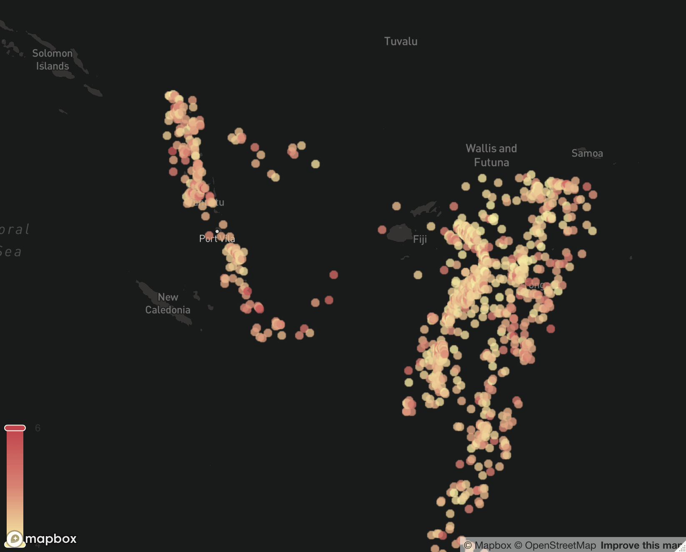{.full}

在国内，最好使用百度、高德这样的国家认可的地图服务提供商，这也很容易，只需用高德的 tile 服务数据替换 OSM 的。

```{r,eval=FALSE}
# 高德地图
quakes |>
  e_charts(long) |>
  e_leaflet(center = c(175, -20), zoom = 4) |>
  e_leaflet_tile(
    template = "https://webrd02.is.autonavi.com/appmaptile?lang=zh_cn&size=1&scale=1&style=8&x={x}&y={y}&z={z}",
    options = list(tileSize = 256, minZoom = 3, maxZoom = 17)
  ) |>
  e_scatter(lat, size = mag, coord_system = "leaflet")
```

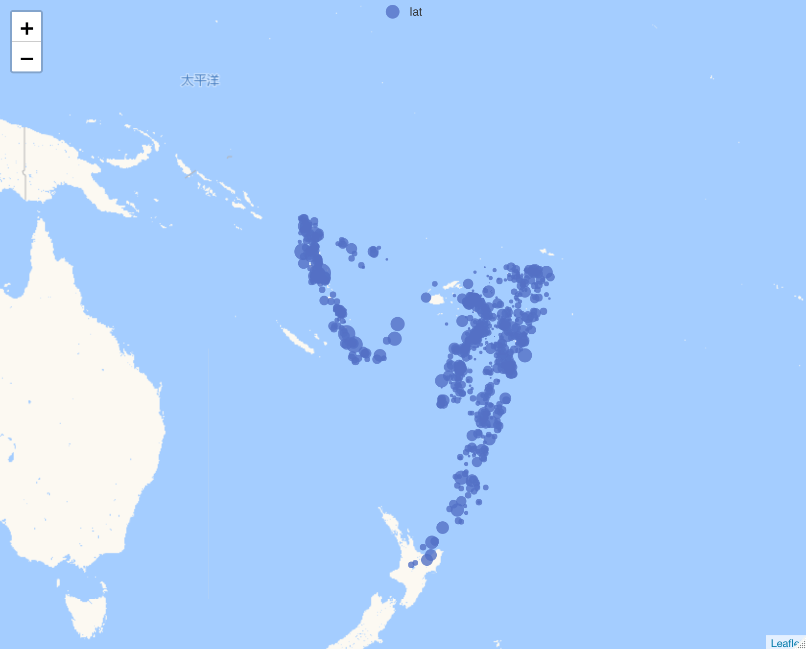{.full}

另外，袁凡整理的材料 --- [**echarts4r**: 从入门到应用](https://cosx.org/2021/12/introduction-to-echarts4r/)，详细介绍了如何用 **echarts4r** 绘制各种各样的常用图形，如何引入外部地图数据制图，文章完全基于用 R Markdown 编译，图文并茂，内容可重复。苏玮制作的 [日本新冠疫情看板](https://github.com/swsoyee/2019-ncov-japan) 也大量使用 **echarts4r**，可见 **echarts4r** 能力之强，此看板适合比较高阶的 R 语言读者学习，地理可视化的定制化程度比较高。

百度、阿里、腾讯等公司都提供大量面向不同场景的地图服务，一些软件也内置了地图，如[tableau](https://www.tableau.com/products/desktop)、[GRASS GIS](https://grass.osgeo.org/) 和[QGIS](https://www.qgis.org/)等，下图\@ref(fig:qgis) 展示 QGIS 软件使用在线的 OpenStreetMap 地图。

{.full}

## leaflet

**leaflet** [@leaflet] 包借助 [**htmlwidgets**](https://github.com/ramnathv/htmlwidgets) 封装了鼎鼎大名的开源交互式可视化地图库 [leaflet](https://leafletjs.com/)。注意，leaflet 只是一个渲染 GIS 数据的可视化库，并不提供 GIS 数据服务。类似的可视化库还有[OpenLayers](https://github.com/openlayers/openlayers)，及其 R 接口[openlayers](https://github.com/crazycapivara/openlayers)，另一个紧密相关的空间数据处理工具是[GeoServer](https://github.com/geoserver/geoserver)，它遵循 Open Geospatial Consortium (OGC) Web Feature Service (WFS) 和 Web Coverage Service (WCS) 标准，支持各种 GIS 数据源。

在可视化的过程中，配色是非常重要的一个环节，准确地表达地图上各个区域或位置的数据信息，负责体现分类、层次、大小等信息。常见的操作是将一组数据映射成一组颜色值，还是以 quakes 数据集为例，下面将连续型的地震震级数据映射成一组颜色值。这方面的工作已经有非常成熟的 R 包来做了，比如[**scales**](https://github.com/r-lib/scales)包和[**colourvalues**](https://github.com/SymbolixAU/colourvalues) 包。如图 \@ref(fig:quakes-viridis)，默认情况下 `viridis` 调色板，颜色越黄值越大。

```{r,eval=FALSE}
# 将连续型数据向量转化为颜色向量
colorize_numeric <- function(x) {
  scales::col_numeric(palette = "viridis", domain = range(x))(x)
}
# 在数据集 quakes 上添加新的一列数据 color
quakes <- transform(quakes, color = colorize_numeric(mag))
# 绘制散点图
plot(data = quakes, lat ~ long, col = color, pch = 19)
```

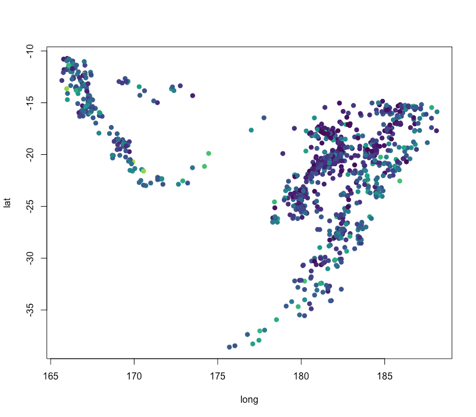{.full}

另一种情况是将分类型的变量映射上颜色，这通常采用分类型的调色板，比如 `Set2`。所有常用的调色板可见 **RColorBrewer** 包，在命令行中直接运行 `RColorBrewer::display.brewer.all()` 即可预览。稍微值得注意的是当分类太多，超出了调色板的数量，需要自己构造一下，比如 `Set2` 只有8种颜色，但是需要10种，可通过如下方法插值构造：

```{r}
colorRampPalette(colors = RColorBrewer::brewer.pal(n = 8, name = "Set2"))(10)
```

如图 \@ref(fig:quakes-set2) 所示，用不同颜色表示不同种类的鸢尾花。

```{r,eval=FALSE}
# 注意因子水平个数
colorize_factor <- function(x) {
  scales::col_factor(palette = "Set2", levels = unique(x))(x)
}
# 给每个点设置一个颜色
iris <- transform(iris, color = colorize_factor(Species))
# 绘图
plot(data = iris, Petal.Length ~ Petal.Width, col = color, pch = 19)
```

{.full}

实际上，还可以将地震震级分段，用梯度变化的颜色表示震级的大小，如图\@ref(fig:quakes-leaflet)所示。

```{r,eval=FALSE}
library(leaflet)
data(quakes)
# 构造 Pop 提示
quakes$popup_text <- lapply(paste(
  "编号:", "<strong>", quakes$stations, "</strong>", "<br>",
  "震深:", quakes$depth, "<br>",
  "震级:", quakes$mag
), htmltools::HTML)
# 构造调色板
pal <- colorBin("Spectral", bins = pretty(quakes$mag), reverse = TRUE)
# 绘图可视化
leaflet(quakes, options = leafletOptions(attributionControl = FALSE)) |>
  addProviderTiles(providers$CartoDB.Positron) |>
  # 添加带颜色的散点图
  addCircles(lng = ~long, lat = ~lat, color = ~ pal(mag), label = ~popup_text) |>
  # 在右下角添加图例
  addLegend("bottomright", pal = pal, values = ~mag, title = "地震震级") |>
  # 在左下角添加地图比例尺
  addScaleBar(position = c("bottomleft"))
```

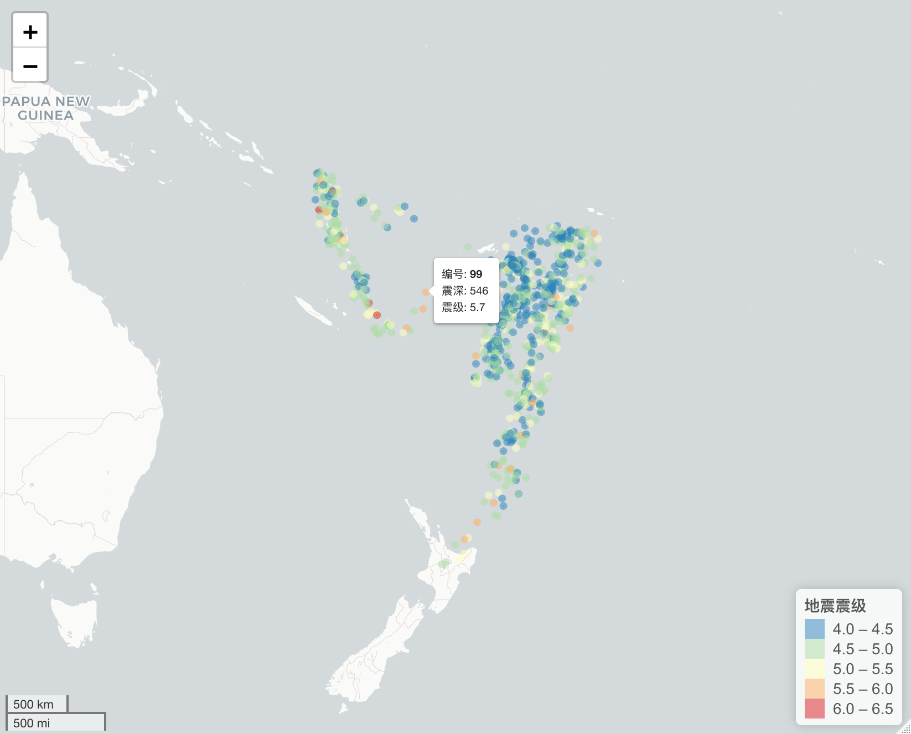{.full}

[**leaflet.extras**](https://github.com/bhaskarvk/leaflet.extras) 提供绘制热力图的扩展，另一个与之类似的包是[**leaflet.extras2**](https://github.com/trafficonese/leaflet.extras2) 包，前者虽已停止开发了，但是目前看来还可以用。

```{r,eval=FALSE}
#  提供 addHeatmap 函数绘制热力图 
library(leaflet.extras) 

leaflet(quakes) |> 
  addProviderTiles(providers$CartoDB.Positron) |> 
  addCircles(lng = ~long, lat = ~lat, color = ~ pal(mag), label = ~popup_text) |> 
  setView(178, -25, 5) |> 
  addHeatmap(
    lng = ~long, lat = ~lat, intensity = ~mag,
    blur = 20, max = 0.05, radius = 15
  ) |>  
  addLegend("bottomright", pal = pal, values = ~mag, title = "地震震级") |> 
  addScaleBar(position = "bottomleft")
```

绘制热力图就这么简单，如图 \@ref(fig:quakes-heatmap) 所示，在图\@ref(fig:quakes-leaflet)的基础上添加了热力图，实际上就是根据点的密度添加色彩，密度值根据核密度估计算法统计出来。

{.full}

## plotly

**plotly** [@plotly] 包在地理可视化方面提供散点图 [scattergeo](https://plotly.com/r/reference/scattergeo/) 和等值图 [choropleth](https://plotly.com/r/reference/choropleth/) 两种基础类型。**plotly** 还为 [mapbox](https://mapbox.com/) 地图服务添加三个专门的绘图函数，分别是散点图[scattermapbox](https://plotly.com/r/reference/scattermapbox/)、等值图[choroplethmapbox](https://plotly.com/r/reference/choroplethmapbox/)和热力图[densitymapbox](https://plotly.com/r/reference/densitymapbox/)。

```{r,eval=FALSE}
plotly::plot_mapbox(
  data = quakes, colors = "Spectral",
  lon = ~long, lat = ~lat, color = ~mag,
  type = "scattermapbox", mode = "markers",
  marker = list(size = 10, opacity = 0.5)
) |>
  plotly::layout(
    title = "斐济地震带",
    # mapbox 地图设置 https://plotly.com/r/reference/layout/mapbox/
    mapbox = list(
      # style = 'dark', # 暗黑主题
      zoom = 4, # 缩放级别
      center = list(lat = -20, lon = 175)
    )
  ) |>
  plotly::colorbar(title = "震级") |>
  plotly::config(
    mapboxAccessToken = Sys.getenv("MAPBOX_TOKEN"),
    displayModeBar = FALSE
  )
```

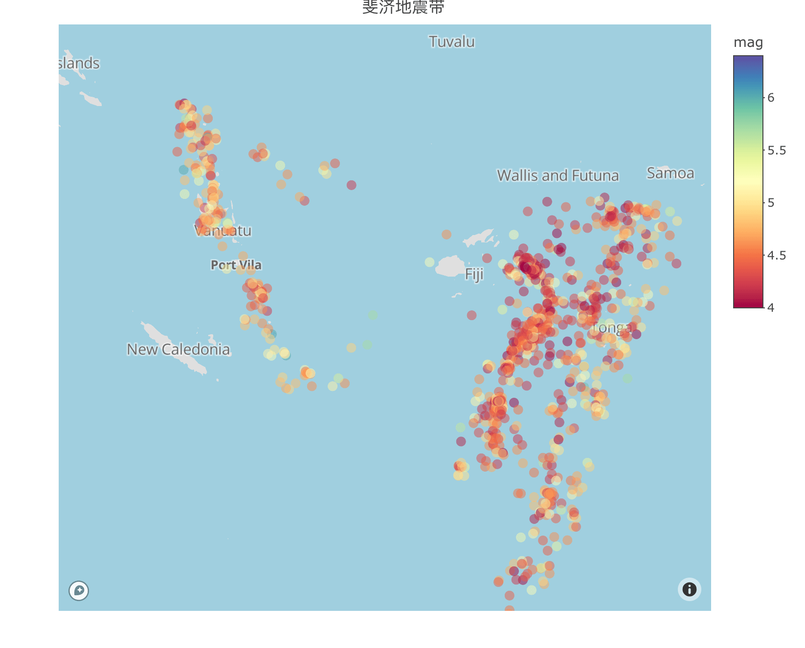{.full}

接下来介绍布局设置，以 `layout(mapbox = ...)` 内的 style 参数为例， 它是用来设置地图风格样式的，除了默认的参数值 `basic`，还可以设置为夜晚暗黑 `dark`，卫星地图 `satellite` 等。若设置`open-street-map`，调 OpenStreetMap 服务，则无需 `MAPBOX_TOKEN`，具体哪些用到 `MAPBOX_TOKEN` 哪些不需要用到 `MAPBOX_TOKEN`，读者可以根据需要选择，详见[mapbox-layers 文档](https://plotly.com/r/mapbox-layers/)，其他参数设置见[mapbox 文档](https://plotly.com/r/reference/layout/mapbox/)。

{.full}

```{r,eval=FALSE}
plotly::plot_ly(
  data = quakes,
  type = "densitymapbox",
  lat = ~lat,
  lon = ~long,
  coloraxis = "coloraxis",
  radius = 10
) |> 
  plotly::layout(
    mapbox = list(
      style = "stamen-terrain",
      zoom = 4,
      center = list(lat = -25, lon = 178)
    ), coloraxis = list(colorscale = "Viridis")
  ) |> 
  plotly::config(displayModeBar = FALSE)
```

{.full}

**plotly** 包内置了两个地图数据集，一个是美国州级多边形数据`"USA-states"`，另一个是国家级多边形数据，来自 Natural Earth，需要3个字母的国家代码传给参数 `locations`。

```{r,eval=FALSE}
dat <- data.frame(state.x77,
  stats_abbr = state.abb
)
# 地理单元名称要和 stats_abbr 保持一致
plotly::plot_ly(
  data = dat,
  type = "choropleth",
  locations = ~stats_abbr, # 两个字母的州名缩写
  locationmode = "USA-states", # 地理几何地图数据
  colorscale = "Viridis", # 其它调色板如 "RdBu"
  z = ~Population
) |>
  plotly::colorbar(title = "人口") |> 
  plotly::layout(
    geo = list(scope = "usa"),
    title = "1974年美国各州的人口"
  ) |>
  plotly::config(displayModeBar = FALSE)
```

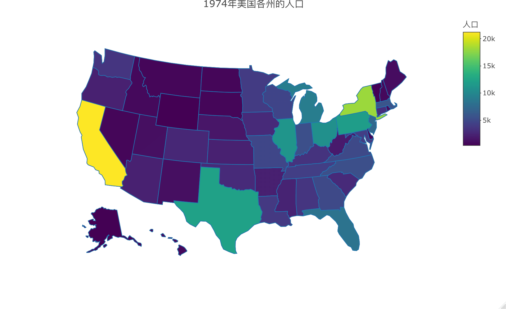{.full}

多边形矢量地图数据，多边形的边界常常是行政区域，choropleth 地图是填充颜色的多边形，颜色深浅表示数据指标，地图的作用在于展示指标的空间变化，在美国，郡县一级的行政区大致相当于咱们市一级行政单位，比如图\@ref(fig:mapbox-choropleth-counties) 展示美国各个县的失业率，大城市失业率相对较高。值得注意，数据量较大的时**plotly**渲染速度较慢。

```{r,eval=FALSE}
# 示例修改自 https://plotly.com/r/choropleth-maps/
library(plotly)
# 数据集来自 https://github.com/plotly/datasets
# 下载保存至本地目录
data_dir <- "~/Documents/Github/plotly-datasets"
# 准备地图数据
map_url <- paste(data_dir, "geojson-counties-fips.json", sep = "/")
# 读取 GeoJSON 格式地图数据
counties <- rjson::fromJSON(file = map_url)
# 准备观测数据
data_url <- paste(data_dir, "fips-unemp-16.csv", sep = "/")
# 导入行政编码和失业率数据
df <- read.csv(data_url, colClasses = c(fips = "character"))
# 绘图
plotly::plot_ly(
  data = df,
  type = "choropleth", # 图形种类
  geojson = counties,  # GeoJSON 地图数据
  locations = ~fips,   # 类似行政编码
  z = ~unemp,  # 失业率
  colorscale = "Viridis", # 调色板
  zmin = 0,  # 有颜色映射的失业率下限
  zmax = 12,
  marker = list(line = list(
    width = 0 # 去掉每个县的边界线
  ))
) |> 
  plotly::colorbar(title = "失业率 (%)") |> 
  plotly::layout(
    title = "2016 年美国各个县的失业率",
    # 参数设置详见 https://plotly.com/r/reference/layout/geo/
    geo = list(
      scope = "usa", 
      # 地图聚焦到 USA，其它取值有 "africa" 和 "asia" 等
      projection = list(type = "albers usa"), 
      # 投影方式，常用的还有 "mercator" 等
      showlakes = TRUE, # 显示湖
      lakecolor = plotly::toRGB("white") # 湖以白色填充
    )
  ) |> 
  plotly::config(displayModeBar = FALSE)
```

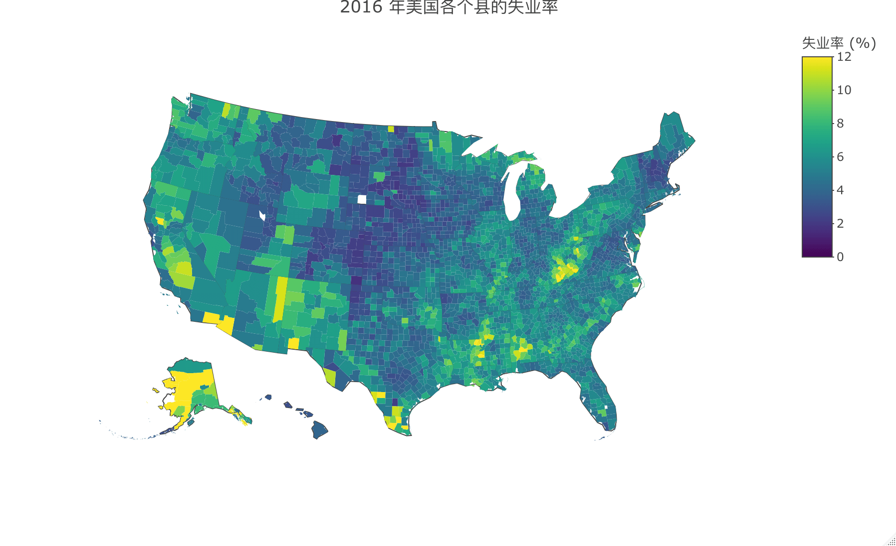{.full}

函数 `plot_ly(locations = ~fips,...)` 传进去的参数值 fips（Federal Information Processing Standards，即联邦信息处理标准，简称 FIPS）。FIPS 类似我国的行政区划编码，美国地图上每一块区域都有唯一的一个代码对应，详见[FIPS 代码](https://en.wikipedia.org/wiki/FIPS_county_code)。观测数据需要和地图数据 GeoJSON 里每个 feature（代表一个地理单元）的 id 或 properties （地理单元的各个属性值）下的主键性质的属性值映射。进一步，读者可参考[choropleth-maps](https://plotly.com/r/choropleth-maps/)文档中的示例。

## lattice

2001 年 **lattice** 包就发布到 CRAN 了，已经过去20多年了，功能相当全面成熟稳定，内置于 R 软件。下面介绍 **lattice** 包的数据可视化能力，继续以 quakes 数据集为例展开介绍。

```{r,eval=FALSE}
library(lattice)
# 散点图
xyplot(lat ~ long,
  data = quakes,
  scales = list(
    draw = T,
    # 去掉图形上边、右边多余的刻度线
    x = list(alternating = 1, tck = c(1, 0)),
    y = list(alternating = 1, tck = c(1, 0))
  ),
  pch = 19, alpha = 0.3, 
  cex = 1.5, col = "darkgreen",
  grid = TRUE # 添加背景网格线
)
```

{.full}

```{r,eval=FALSE}
# 仅保留低密度区域上的散点
xyplot(lat ~ long,
  data = quakes,
  scales = list(
    draw = T,
    # 去掉图形上边、右边多余的刻度线
    x = list(alternating = 1, tck = c(1, 0)),
    y = list(alternating = 1, tck = c(1, 0))
  ),
  panel = function(x, y, ...) {
    panel.smoothScatter(x, y, ...,
      colramp = hcl.colors, # 可用其它调色板，比如 terrain.colors
      pch = 19
    )
  }
)
```

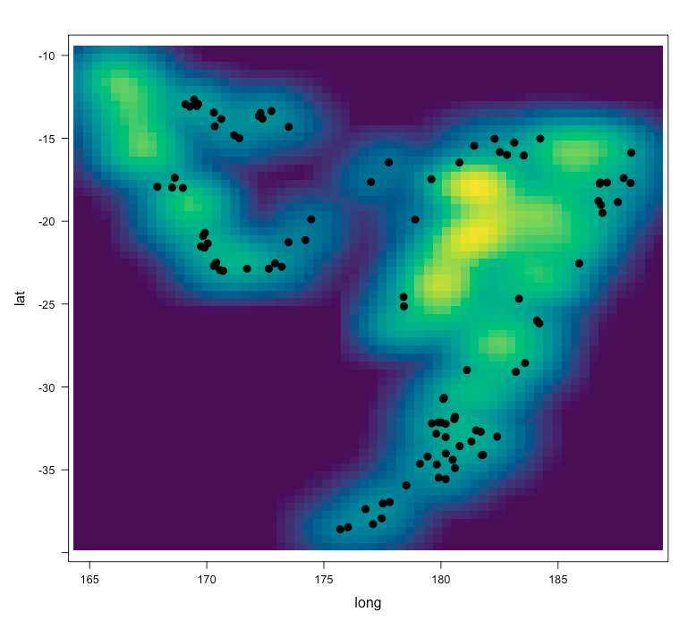{.full}

```{r,eval=FALSE}
library(loa)
# 气泡图
loaPlot(mag ~ long * lat,
  data = quakes,
  col.regions = "Spectral",
  alpha = 0.6, 
  scales = list(
    draw = T,
    # 去掉图形上边、右边多余的刻度线
    x = list(alternating = 1, tck = c(1, 0)),
    y = list(alternating = 1, tck = c(1, 0))
  )
)
```

{.full}

```{r,eval=FALSE}
# 蜂窝图
loaPlot(mag ~ long * lat,
  data = quakes,
  panel = panel.binPlot, 
  breaks = 30, 
  statistic = max,
  col.regions = "Spectral",
  scales = list(
    draw = T,
    # 去掉图形上边、右边多余的刻度线
    x = list(alternating = 1, tck = c(1, 0)),
    y = list(alternating = 1, tck = c(1, 0))
  )
)
```

{.full}

```{r,eval=FALSE}
# 等高图
loaPlot(mag ~ long * lat,
  data = quakes,
  panel = panel.surfaceSmooth, 
  too.far = 0.1,
  col.regions = "Spectral",
  scales = list(
    draw = T,
    # 去掉图形上边、右边多余的刻度线
    x = list(alternating = 1, tck = c(1, 0)),
    y = list(alternating = 1, tck = c(1, 0))
  )
)
```

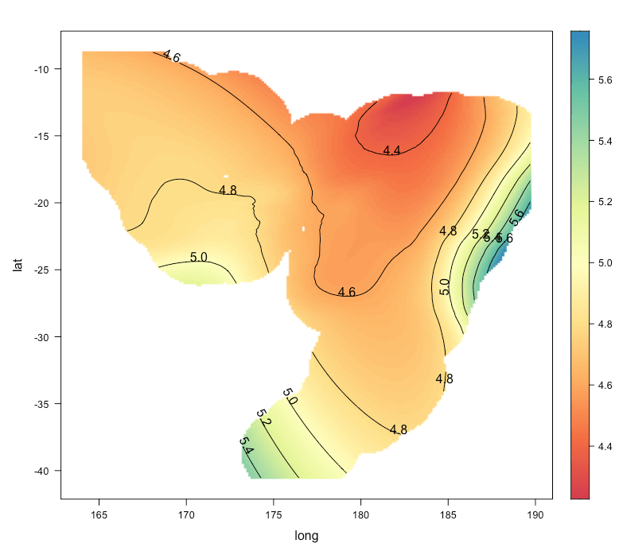{.full}

就地震数据集 quakes 来说，它还有地震深度变量，实际上，完整地描述一个地震的位置，当然需要震深，想要立体化地呈现出来必须借助三维图形。**lattice** 包就具备绘制三维图形的能力，如图\@ref(fig:quakes-cloud)所示，此外，[**rgl**](https://github.com/dmurdoch/rgl) 包[@rgl]可以绘制交互式的**真三维**图形，如图\@ref(fig:quakes-rgl)。

```{r,eval=FALSE}
quakes <- transform(quakes, cex = mag - 4)
# 三维气泡图
cloud(-depth ~ long * lat,
  data = quakes, pch = 19,
  col = quakes$color, # 气泡颜色映射震级
  cex = quakes$cex, # 气泡大小映射震级
  # z 轴标签旋转 90 度
  scales = list(
    arrows = FALSE, col = "black",
    z = list(rot = 90)
  ),
  # 减少三维图形的边空
  lattice.options = list(
    layout.widths = list(
      left.padding = list(x = -.6, units = "inches"),
      right.padding = list(x = -1.0, units = "inches")
    ),
    layout.heights = list(
      bottom.padding = list(x = -.8, units = "inches"),
      top.padding = list(x = -1.0, units = "inches")
    )
  ),
  # 设置坐标轴字体大小
  par.settings = list(
    axis.line = list(col = "transparent"),
    fontsize = list(text = 15, points = 10)
  ),
  # 设置三维图的观察方位
  screen = list(z = 30, x = -65, y = 0)
)
```

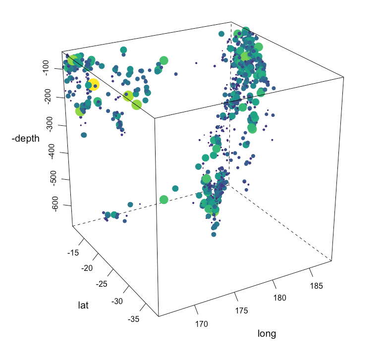{.full}

```{r,eval=FALSE,echo=FALSE}
# 三维散点云图，基于 Base R 图形
library(scatterplot3d)
scatterplot3d(
  x = quakes$long, y = quakes$lat, z = -quakes$depth,
  highlight.3d = F, color = quakes$color,
  pch = 20, cex.symbols = quakes$mag - 4
)
```

```{r,eval=FALSE}
# 设置 WebGL 渲染
options(rgl.useNULL = TRUE)
options(rgl.printRglwidget = TRUE)
library(rgl)
with(quakes, {
  plot3d(
    x = long, y = lat, z = -depth,
    col = color, size = mag - 4, type = "s"
  )
})
```

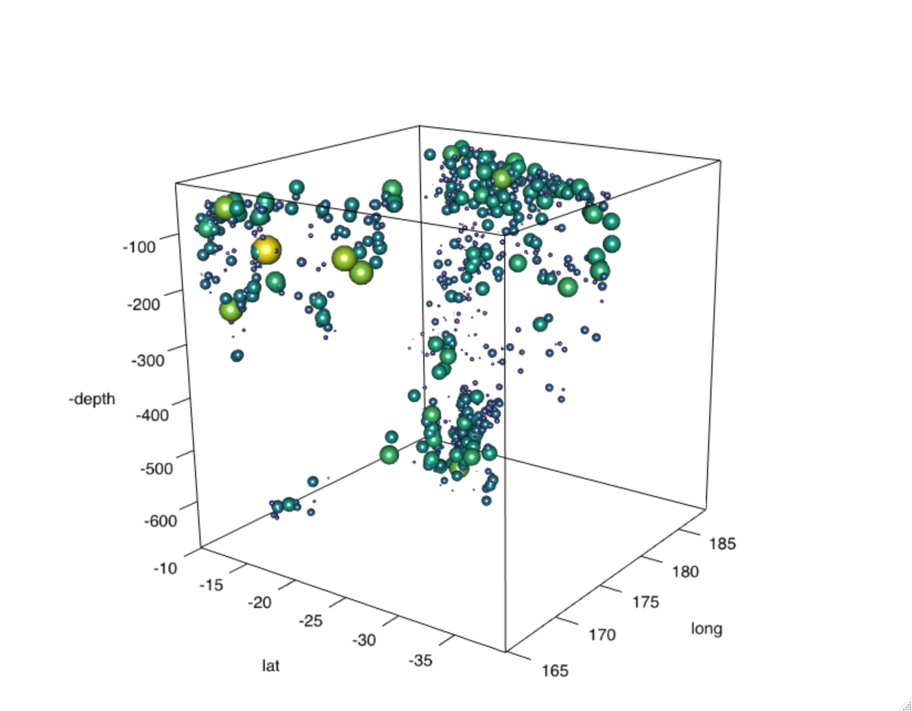{.full}

结合三维气泡图，也许读者已经发现震级和震深有一些关系，不妨再看看仔细它们之间关系，如图\@ref(fig:quakes-mag)。

```{r,eval=FALSE}
# 数据抖动和透明度是为了减轻数据点的覆盖情况
stripplot(depth ~ factor(mag),
  data = quakes,
  jitter.data = TRUE, alpha = 0.6,
  main = "Depth of earthquake epicenters by magnitude",
  xlab = "Magnitude (Richter)",
  ylab = "Depth (km)",
  col = "black",
  grid = TRUE
)
```

{.full}

无论震级如何，地震似乎集中发生在表层或深层的位置，中间带反而比较稀疏，可见震级和地震的位置关系不大，地不地震、震级如何主要是由地质条件决定的。

# 数据结构

本节开始介绍一些空间数据相关的基础知识，R 语言有一些扩展包是专门处理空间数据的，提供基础数据结构和类型，了解这些是为空间数据操作、分析、建模打基础。空间数据操作（Spatial Data Manipulation），如计算空间区域的面积、空间点的路径、区域叠加、基于空间关系的数据查询等。空间数据分析（Spatial Data Analysis），空间数据的描述性分析和探索性分析，帮助发现数据中的模式规律。空间统计分析（Spatial Statistical Analysis），传统的统计模型认为观测值之间常常是独立的，而空间数据自带空间相关性，需要专门的统计分析方法。空间数据建模（Spatial Data Modeling），面对不同的空间数据类型需要不同的建模方法，比如空间点模式分析（Spatial Point Pattern Analysis）、格网/面状数据分析（Area Data/Grid Data/lattice Data Analysis）、地统计分析（Geostatistics）等。

## 矢量数据 sp

**sp** [@sp] 是一个 R 包，提供一种存储和操作空间数据的对象类型，具体地，提供点 SpatialPoints / SpatialMultiPoints、线 SpatialLines、多边形 SpatialPolygons、栅格 SpatialGrid / SpatialPixels 等基础空间数据类型以及相应构造方法，还有聚合 `aggregate()`，合并 `merge()`，转化 `spTransform()` 和绘图 `spplot()` / `bubble()` / `image()` 等空间数据操作和可视化函数。

```{r}
library(sp)
getClass("Spatial")
```

可以看出 **sp** 打造的一套空间数据基础类型及其衍生类型，知道数据类型才知道后续该怎么对其进行操作，调用合适的方法。比如最常使用的绘图函数 `plot()` 已经汇集很多方法了，它也是一个绘图对象，对于不同类型的数据对象，它会调用相应的绘图方法。在 R 语言内，一切都是对象，一切操作都是函数调用。

```{r methods-plot, echo=FALSE}
knitr::kable(matrix(methods(plot), ncol = 2),
  caption = "plot 绘图方法"
)
```

**sp** 提供最基础的空间数据类是 Spatial 类，下面是一个实例。

```{r}
# 构造最基础的 Spatial 类
S <- Spatial(
  bbox = matrix(c(
    165.67, 188.13, # 经度区间
    -38.59, -10.72  # 纬度区间
  ),
  ncol = 2, byrow = TRUE,
  dimnames = list(NULL, c("min", "max"))
  ),
  # 不推荐 proj4string = CRS("+proj=longlat +datum=WGS84") 
  proj4string = CRS("EPSG:4326")
)
# 查看数据 S 类型
class(S)
```

空间对象 S 有两个重要的部分，地理边界和坐标参考系，这两个信息可以分别用函数 `bbox()` 和 `slot(, "proj4string")` 单独提取。

```{r}
bbox(S)
slot(S, "proj4string")
```

实际上，除了函数 `bbox()` 和 `slot(, "proj4string")`，Spatial 类还有很多方法。

```{r}
methods(class = "Spatial")
```

接下来，介绍如何从 data.frame 类型构造 sp 类型，还是以 R 内置的 quakes 数据集为例，过程很简单，只需三步将 quakes 转化为 SpatialPointsDataFrame 类型。

```{r}
# 加载数据
data("quakes")
# 指定坐标
coordinates(quakes) <- ~long+lat
# 指定坐标参考系
proj4string(quakes) <- CRS("EPSG:4326") # 不推荐 CRS("+proj=longlat +datum=WGS84")
```

查看转化后的数据情况：

```{r out.lines=6}
# 查看类型
class(quakes)
# 查看数据
quakes
# 查看边界
bbox(quakes)
```

直接调用 `plot()` 方法，获取图\@ref(fig:quakes-sp)。实际上，会调用 SpatialPoints 类的 `plot()` 方法，`plot()` 本身也是一个泛型函数，R 语言中的泛型有点类似面向对象编程中的多态。

```{r,eval=FALSE}
plot(quakes)
```

{.full}

调 sp 数据对象特有的方法 `spplot()`，获取图\@ref(fig:quakes-spplot)。

```{r,eval=FALSE}
p1 <- spplot(quakes, "depth", main = "Depth",
  as.table = TRUE, # 面板自左上开始
  scales = list(
    draw = TRUE, # 坐标轴刻度
    # 去掉图形上边、右边多余的刻度线
    x = list(alternating = 1, tck = c(1, 0)),
    y = list(alternating = 1, tck = c(1, 0))
  ),
  colorkey = TRUE,
  alpha = 0.7,
  key.space = "right"
)
p2 <- spplot(quakes, "mag", main = "Mag",
  as.table = TRUE, # 面板自左上开始
  scales = list(
    draw = TRUE, # 坐标轴刻度
    # 去掉图形上边、右边多余的刻度线
    x = list(alternating = 1, tck = c(1, 0)),
    y = list(alternating = 1, tck = c(1, 0))
  ),
  colorkey = TRUE, # 添加颜色条
  alpha = 0.7, # 散点透明度
  key.space = "right" # 颜色条放图右边
)
print(p1, split = c(1, 1, 2, 1), more = TRUE)
print(p2, split = c(2, 1, 2, 1), more = FALSE)
```

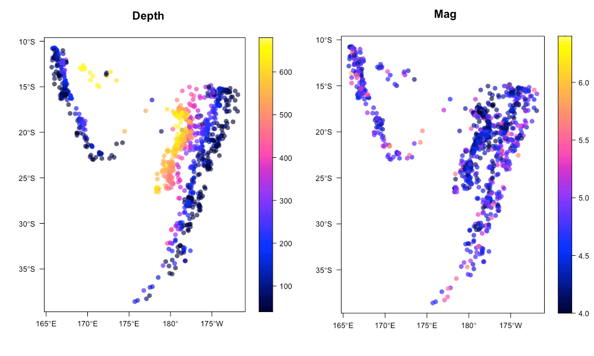{.full}

地震主要是由于地壳运动产生的，两条地震带由内圈到外圈，地震深度有明显的阶梯变化，暗示着断层的方向和位置。

::: rmdnote
**sp** 会逐步退出空间数据领域，Roger Bivand 已经在为他的著作《Applied Spatial Data Analysis with R》迁移升级[代码](https://github.com/rsbivand/sf_asdar2ed)，推荐读者尽快转移到 **sf** 上。考虑到一些读者大概率还会遇到基于 **sp** 的空间数据处理、分析和可视化的案例代码，因而做一些介绍，毕竟生态的迁移过程还要一段时间。
:::

## 矢量数据 sf

**sf** 包依赖三个基础的地理空间数据处理库，分别是制图投影库 [proj](https://proj.org/)（Cartographic **Proj**ections Library，简称 proj），开源几何计算引擎 [geos](https://trac.osgeo.org/geos)（ **G**eometry **E**ngine, **O**pen **S**ource，简称 geos），地理空间数据抽象库 [gdal](https://www.gdal.org/) （**G**eospatial **D**ata **A**bstraction **L**ibrary，简称 gdal）。**sf** [@sf] 可以看作是继 **sp** 后的第二代空间数据处理和分析的框架。

```{r}
library(sf)
```

```{r}
data(alaska, package = 'spData')
alaska
```

数据集 alaska 只有1行6列，使用的坐标参考系是 Alaska Albers (EPSG:3467)。各个变量分别是 GEOID 地理标识符（geographic identifiers），NAME 州的名称，REGION 区域的名称，AREA 面积（平方千米），total_pop_10 2010 年人口，total_pop_15 2015 年人口，geometry 表示 sf 多边形类 MULTIPOLYGON 的集合属性，阿拉斯加地区是由多个多边形组成的，通过图\@ref(fig:sf-alaska)可以直观地看出来。

```{r,eval=FALSE}
plot(alaska["total_pop_15"])
```

{.full}

```{r}
data(world, package = 'spData')
world
```

world 包含 177 个国家和地区的人口数据，area_km2 面积、pop 人口（2014 年）、lifeExp 人均寿命（2014 年）和 gdpPercap 人均 GDP （2014 年）。地理信息相关的数据有 iso_a2 国标 ISO 的国家编码，name_long 国家名字，continent 大洲名字，region_un 区域名称，subregion 子区域名称和 type 类型。数据收集自美国国家地理网站[Natural Earth](https://www.naturalearthdata.com/) 和世界银行 [World Bank](https://data.worldbank.org/)，Jakub Nowosad 整理在 **spData** 包里。

```{r,eval=FALSE}
plot(world["gdpPercap"])
```

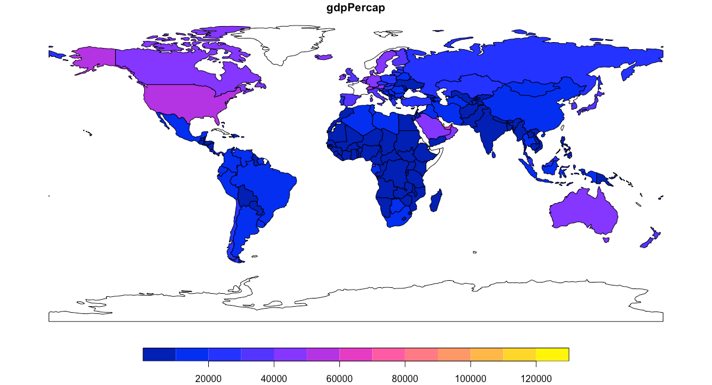{.full}

::: rmdnote
**spData** 包内置的 world 数据集将台湾和中国大陆的地区用不同的颜色标记，严格来讲，这是不符合国家地图规范的，不能出现在期刊、书籍等正式的出版物里。
:::

# 数据操作

先简要介绍 Base R 内置的一般数据操作，也是最常见的，然后介绍 **sf** 包和空间数据操作。**sf** 包对 Base R 内置的一些函数做了扩展以支持空间数据的合并、聚合等。

## 一般数据操作

通过排列组合 R 软件内置的一些基础数据操作函数能够满足大部分使用场景，这些基础函数都来自 **base** 包和 **stats** 包，由 R 语言 核心团队维护，约**10**来个函数：

1.  函数 `subset()` 提取数据框中的某些列和行，也可以用 `$` 或 `[` 实现。

2.  函数 `transform()` 可以在原来的数据框上添加新的一列，这个新的列通常是根据已有的列加减乘除等计算而来。

3.  函数 `order()` 按照数据框的某个（些）列排序，如先按照第一列从小到大排序，再按照第二列从小到大排序。

4.  函数 `aggregate()` 分组聚合函数，也是很常用的。

5.  函数 `reshape()` 将长格式的数据框变形为宽格式的数据框，反之亦可。

6.  函数 `merge()` 合并两个数据框，有内关联、左关联、右关联等合并方式，合并操作可以和 SQL 中的关联操作对应。

7.  函数 `split()` 将数据框按照某个分类变量拆分为列表，后续常常可以接 `lapply()` 实现分组计算，最后调用 `do.call()` / `Reduce()` 等合并计算结果。

8.  函数 `duplicated()` 查出是否有**重复**的记录，后续可以决定是否去掉。

9.  函数 `complete.cases()` 查出是否有**不完整**的记录，后续考虑是否要去掉。

下面以 R 软件内置的数据集 mtcars 为例，介绍数据操作的一个典型过程，拆分、计算、合并，早年Hadley Wickham 创建 **plyr** 包 [@plyr] 就是干这个事情，后来，陆续出现很多 R 包，如 **reshape** 包（已退休）、**reshape2**（已退休）、**dplyr**（活跃）、**purrr**（活跃）、**tidyr**（活跃），一直处于不太稳定的状态，此处不再细说。

```{r out.lines=6}
data("mtcars")
mtcars
```

```{r eval=base::getRversion()>='4.1.0'}
# 拆分
mtcars_cyl <- split(x = mtcars, f = ~cyl) # 从 R >= 4.1.0 开始 split 支持公式语法
# 计算
mtcars_fit <- lapply(mtcars_cyl, lm, formula = mpg ~ disp) # 求解回归模型
mtcars_coef <- lapply(mtcars_fit, coef) # 提取回归系数
# 合并
dat <- do.call("rbind", mtcars_coef)
dat
```

如果读者对**data.table**语法比较熟悉，这个过程将是一气呵成！

```{r}
library(data.table)
# data.frame 转化为 data.table 类型
mtcars <- as.data.table(mtcars)
# 分组线性回归
mtcars[, as.list(coef(lm(mpg ~ disp))), by = .(cyl)]
```

如果想要自己的代码稳定、高效、简洁、易维护，那就先学习一下 Base R 的基本数据操作吧！熟悉之后，可以再深入学习一下 **data.table** 提供的高级数据操作，熟练掌握之后，配合 SQL，可以成为真正的生产力工具，从 Base R 到 **data.table** 可以加深理解 R 语言的精要，从而真正地提升编码水平。最后总结一点，新手都在做高难度动作[^1]，高手都在练基本动作[^2]。为了让自己的编码更加有效率，更加符合语言本身的特点，先从数据操作开始，一点一点从头练习。

[^1]: 各种花里胡哨引入一堆 R 包和函数，直接告诉你答案，又不告诉你为什么，三天不学习就跟不少变化。

[^2]: 基本动作就是内功心法，无论面对的数据操作如何复杂，最终都能一一化解，以不变应万变。

## 空间数据操作

**sf** 内置了一些基础的空间数据操作函数，在此基础上，绝大多数复杂的空间数据操作都可以拆解为这些基础动作，更多详情见**sf**包[帮助文档](https://r-spatial.github.io/sf/articles/sf1.html)。

```{r}
library(sf)
# 基础数据操作函数
methods(class = "sf")
```

```{r,echo=FALSE}
options(digits = 10)
```

下面举个简单的例子，计算两点之间的距离，首先构造几何对象「点」，然后计算两点之间的距离。

```{r}
st_distance(st_point(c(-71.0882, 42.3607)), st_point(c(-74.1197, 40.6976)))
```

默认采用的是笛卡尔坐标系，二维、三维、四维都可以，两个点的情况下，相当于计算平面上两个点的距离，平面上两个点之间直线最短，即欧式距离：

$$
d = \sqrt{(x_1 - x_2)^2 + (y_1-y_2)^2}
$$

就这个例子而言，`st_distance()` 函数的作用相当于：

```{r}
sqrt((-71.0882 - (-74.1197))^2 + (42.3607 - 40.6976)^2)
```

假设这个点是球面上的一个点，球面的参照系为[世界大地测量系统](https://en.wikipedia.org/wiki/World_Geodetic_System)（World Geodetic System），1984 年由美国国家地理空间情报局（National Geospatial-Intelligence Agency）建立和维护，简称 WGS 84，被全球定位系统采用。WGS 84 另一个响亮的名字是 EPSG:4326，EPSG 是欧洲石油调查组织（European Petroleum Survey Group）的简称。在 Web 电子地图上，常将 WGS 84 下的经纬度映射为平面上的点，即将坐标系映射到 EPSG:3857，相应地，坐标单位从经纬度转为米。

```{r}
# 设置点所处的参照系 WGS 84
# 此时 -71.0882 表示经度 42.3607 表示纬度
st_sfc(st_point(c(-71.0882, 42.3607)), crs = 4326)
```

**sf** 包提供的函数 `st_crs()` 可以非常方便地检索坐标系的信息，以 WGS 84 为例。

```{r}
st_crs("EPSG:4326")
```

可知 WGS 84 坐标系采用的基准面是椭球面，椭球的赤道半径为 6378137米，扁率为 1/298.257223563。

```{r}
st_distance(
  st_sfc(st_point(c(-71.0882, 42.3607)), crs = 4326),
  st_sfc(st_point(c(-74.1197, 40.6976)), crs = 4326)
)
```

```{r,echo=FALSE}
options(digits = 4)
```

空间数据对象常常围绕点、线、多边形或多维数组（用来表示卫星图像、时空数据）等展开，可以把这些几何对象看作是主键一样的东西，在同一坐标参考系下，一个地理位置或一块区域是不会有两个相同的地理标记的，其它观测变量是维度或指标，也可以看作这块区域的属性，比如说邵东市地区（一个多边形区域），地区拥有的人口数量、土地面积、人均 GDP等。

对于大规模的空间数据，需要借助专门的数据库处理，无论是构建在[PostgreSQL](https://postgresql.org/)之上的[PostGIS](http://postgis.net/) 还是构建在 Hadoop 之上[Presto](https://prestodb.io/docs/current/functions/geospatial.html)，SQL 查询引擎都提供了一系列空间数据操作函数，且和[**sf**](https://github.com/r-spatial/sf) 包提供的操作函数是十分相似的。下面以 Presto 为例，分别计算欧式平面和椭球面上两点之间的距离。

平面几何，两点之间直线最短，距离就是欧氏距离。

``` sql
ST_Distance(ST_Point(-71.0882, 42.3607), ST_Point(-74.1197, 40.6976))
```

```         
3.457729581676387
```

球面几何，两点之间最短距离是大圆的弧长，点的坐标视为经纬度参与计算。

``` sql
ST_Distance(to_spherical_geography(ST_Point(-71.0882, 42.3607)), to_spherical_geography(ST_Point(-74.1197, 40.6976)))
```

```         
312822.1793690028
```

可见，R 包 **sf** 和 Presto 计算的结果完全一致，Presto 采用的空间坐标参考系也是 WGS 84。

# 案例：美国北卡婴儿猝死综合征数据

再看一个稍微复杂的例子，涉及数据读取、操作和绘图，数据集 SIDS (Sudden Infant Death Syndrome，简称 SIDS)来自 **sf** 包，更早些时候收集在 **sp** 包内，更多细节见 Edzer Pebesma 开发的 **sp** 包[帮助文档](https://edzer.github.io/sp/)，描述 1974 年和 1979 年美国北卡罗来纳州各个区县的婴儿猝死综合征的情况。

```{r}
# 读取数据，且读取后不要转化为 tibble 数据类型
nc <- read_sf(system.file("gpkg/nc.gpkg", package = "sf"), as_tibble = FALSE)
# 提取部分列
nc2 <- subset(x = nc, select = c("SID74", "SID79"))
# 查看数据
nc2
```

```{r,echo=FALSE,eval=FALSE}
# Base R 方式的变形操作 https://gis.stackexchange.com/questions/381112/
# 如下变形操作亦可用 tidyr::pivot_longer 实现
# nc2 <- tidyr::pivot_longer(
#   data = nc2, c("SID74", "SID79"),
#   names_to = "VAR", values_to = "SID"
# )
```

nc2 是一种宽格式数据，有两列 SID74 和 SID79，现在希望在地图上以 ggplot2 的分面绘图方式同时展示两个变量的空间分布，因此，需要先将数据由「宽格式」转为「长格式」。转化前，先来看下 nc2 的数据类型：

```{r}
class(nc2)
```

它是一个非常复杂的数据类型，集合了 `sf` 和 `data.frame` 两种基本类型，在数据操作和绘图时，会根据类型的先后顺序依次查找和调用对应类型下的方法。

```{r}
# 将 nc2 强制转化为简单的 data.frame 类型
nc3 <- as.data.frame(nc2)
# 对 nc2 做「宽格式」转「长格式」的变形操作
nc3 <- reshape(
  data = nc3,
  varying = c("SID74", "SID79"), # 需要转行的列，也可以用索引位置代替
  times = c("SID74", "SID79"),
  v.names = "SID", # 列转行 列值构成的新列，指定名称
  timevar = "VAR", # 列转行 列名构成的新列，指定名称
  idvar = "geom",
  new.row.names = 1:(2 * 100), # 2 列拉长，每列有 100 个值，长格式有 2*100 行
  direction = "long"
)
# 变形完成后，恢复原来的数据类型
nc3 <- st_as_sf(nc3, sf_column_name = "geom")
class(nc3)
```

## ggplot2 & sf

**ggplot2** 提供的几何图层 `geom_sf()` 是专门为 sf 数据对象准备的，`facet_wrap()` 和 `facet_grid()` 都可以用来实现分面，布局样式稍有不同，更多绘图细节介绍见《ggplot2: Elegant Graphics for Data Analysis》[@Wickham2022] 第三版的地图章节，如图 \@ref(fig:sf-nc)。在地图上绘制栅格图形，有个专业的制图术语 --- [Choropleth Map](https://en.wikipedia.org/wiki/Choropleth_map)，翻译过来，大致叫填充地图、等值域图、瓦片图、围栏图、面量图、断层图等，可以非常直观地展示观测变量在地理区域内的变化情况。

```{r,eval=FALSE}
library(ggplot2)
ggplot() +
  geom_sf(data = nc3, aes(fill = SID)) +
  facet_wrap(~VAR, ncol = 1)
# 或
# ggplot() +
#   geom_sf(data = nc3, aes(fill = SID)) +
#   facet_grid(rows = vars(VAR))
```

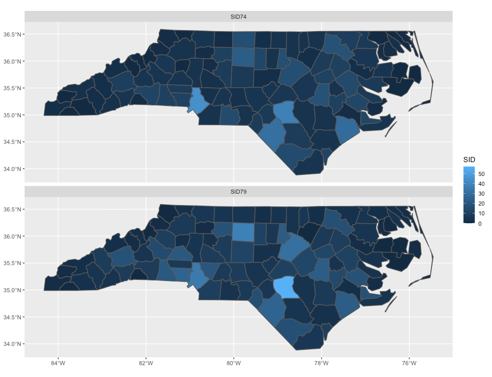{.full}

## leaflet & mapdeck

而 **leaflet** 支持绘制交互式的图形，如图 \@ref(fig:leaflet-nc) 所示。稍微注意的是，需要先将数据映射到坐标参考系 EPSG:4326 上，而后 **leaflet** 会负责将数据转化映射到 EPSG:3857，详见[文档](https://rstudio.github.io/leaflet/projections.html)。

```{r,eval=FALSE}
# https://stackoverflow.com/questions/57223853/
# 转化坐标和 leaflet 的坐标系保持一致
nc2 <- sf::st_transform(nc2, crs = 4326)
library(leaflet)
# 调色板
pal <- colorNumeric("plasma", domain = NULL)
# 绘图
leaflet(nc2) |>  
  addTiles() |> 
  addPolygons(
    stroke = FALSE, smoothFactor = 0.3, fillOpacity = 1.0,
    fillColor = ~ pal(SID74)
  ) |> 
  addLegend(pal = pal, values = ~SID74, opacity = 1.0)
```

{.full}

实现类似功能的还有 **mapdeck** 包。

```{r,eval=FALSE}
library(mapdeck)
mapdeck() |> 
  add_polygon(
    data = nc2, 
    fill_colour = "SID74",
    fill_opacity = 0.5,
    palette = "spectral"
  )
```

## sp::spplot

在 **sf** 包出来前，**maptools** 曾经是空间数据操作的主力，是读取 `*.shp` 文件的主要方式。配合 **sp** 包，是实现空间数据分析和可视化的主要帮手。

```{r,eval=FALSE}
library(maptools)
nc <- readShapePoly(
  fn = system.file("shapes/sids.shp", package = "maptools"),
  proj4string = CRS("EPSG:6267") # 不推荐 CRS("+proj=longlat +datum=NAD27")
)
```

::: rmdwarn
用 **maptools** 包提供的 `readShapePoly()` 函数读取 shp 文件的方式已经过时，将在 2023 年底不可用，推荐使用 `sf::st_read()` 方式读取，部分功能会迁移到 **sp** 包。**sf** 包内置的 nc.shp 数据文件和 **maptools** 包内置的 sids.shp 数据文件是一样的。下面是替代方案：

```{r,eval=FALSE}
# 读取数据
nc <- sf::st_read(system.file("shape/nc.shp", package = "sf"))
# 将数据对象从 sf 类型转化为 sp 类型
nc <- sf::as(nc, "Spatial")
```
:::

**sp** 包提供的函数 `spplot()` 方法绘制类似的分面图，这其中借助了 **lattice** 包的绘图能力，效果如\@ref(fig:lattice-nc)所示。

```{r,eval=FALSE}
spplot(nc, c("SID74", "SID79"),
  as.table = TRUE,
  scales = list(draw = T, 
    # 去掉图形上边、右边多余的刻度线
    x = list(alternating = 1, tck = c(1, 0)),
    y = list(alternating = 1, tck = c(1, 0))
  ),
  sp.layout = list("SpatialPolygonsRescale",
    layout.north.arrow(2),
    offset = c(-76, 34), scale = 0.5, which = 2
  )
)
```

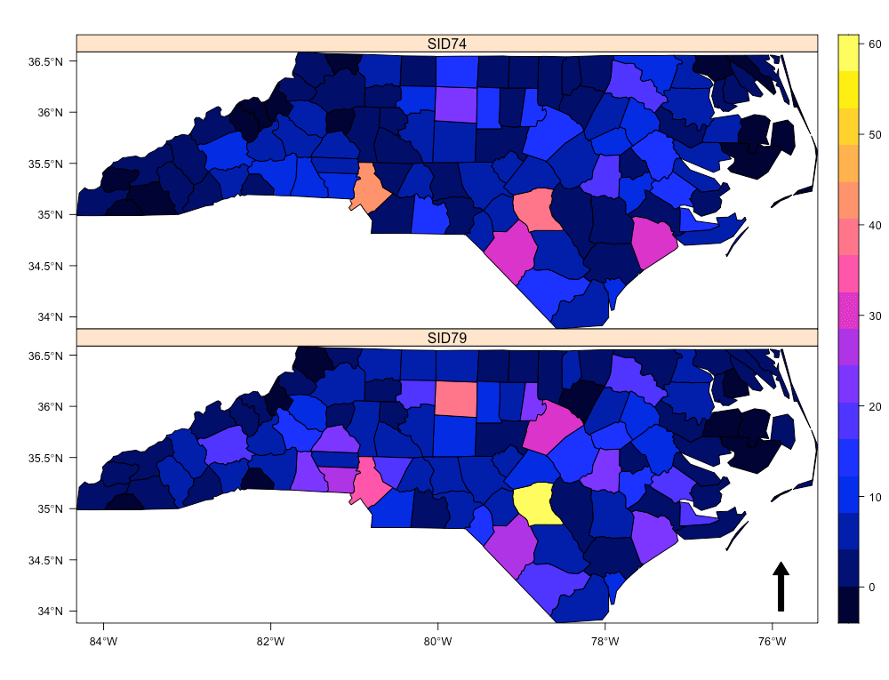{.full}

**ggmap** 包获取的 Google 瓦片地图和 **leaflet** 包 使用的 OpenStreetMap 地图在坐标参考系上是一样的，都是 EPSG:3857，想把数据绘制到地图上，需要先将数据的坐标参考系转换到 EPSG:3857，坐标单位从经纬度随之变为米。

```{r,eval=FALSE}
library(ggmap)
bgMap = get_map(as.vector(bbox(nc)), source = "google", zoom = 8) 
spplot(spTransform(nc, CRSobj = CRS("EPSG:3857")),
  c("SID74", "SID79"),
  as.table = TRUE,
  scales = list(
    draw = T,
    # 去掉图形上边、右边多余的刻度线
    x = list(alternating = 1, tck = c(1, 0)),
    y = list(alternating = 1, tck = c(1, 0))
  ),
  sp.layout = list(panel.ggmap, bgMap, first = TRUE)
)
```

{.full}

## latticeExtra::mapplot

**latticeExtra** [@latticeExtra] 在 **lattice** 的基础上，封装了一些高级函数，围绕本篇主题，下面介绍一下 `mapplot()` 函数，读者不妨类比 `spplot()` 函数，可知它是专门为 map 数据类型提供绘图服务。 map 数据类型在 R 语言中存在很多年了，算得上是古老了，很久以前绘制地图的 R 包主要有：提供基础地图数据的 **maps**包， 提供更多常用地图数据的 **mapdata** 包， 实现坐标投影转化的 **mapproj** 包 和数据读写、操作的 **maptools** 包。

```{r,eval=FALSE}
mapplot(x, data, map,
  outer = TRUE,
  prepanel = prepanel.mapplot,
  panel = panel.mapplot,
  aspect = "iso",
  legend = NULL,
  breaks, cuts = 30,
  colramp = colorRampPalette(hcl.colors(n = 11, palette = "Spectral")),
  colorkey = TRUE,
  ...
)

prepanel.mapplot(x, y, map, ...)
panel.mapplot(x, y, map,
  breaks, colramp,
  exact = FALSE, lwd = 0.5,
  ...
)
```

参数 `x` 提供符合 R 语言语法的公式，比如 `y ~ x1 + x2`。参数 `data` 提供数据集，包含观测变量。参数 `map` 提供地理边界信息，地理单元的名称必须和公式中变量 y 的值匹配。

```{r,eval=FALSE}
# 加载 maps 包
library(maps)
# 将 sp 多边形类型 SpatialPolygons 转化为 map 类型
# 每个多边形单元的名字（郡县）都是唯一的
# 原数据 nc 里面标识每个单元的字段 NAME
nc_map <- SpatialPolygons2map(nc, namefield = "NAME")
# 查看转化后的数据类型
class(nc_map)
```

```{r,eval=FALSE}
# 提取原数据中的观测变量
dat <- nc@data
library(latticeExtra)
# 绘图
mapplot(NAME ~ SID79 + SID74,
  data = dat, border = NA,
  map = nc_map,
  colramp = viridisLite::plasma, # hcl.colors,
  scales = list(
    draw = T,
    # 去掉图形上边、右边多余的刻度线
    x = list(alternating = 1, tck = c(1, 0)),
    y = list(alternating = 1, tck = c(1, 0))
  ),
  xlab = "Long", ylab = "Lat"
)
```

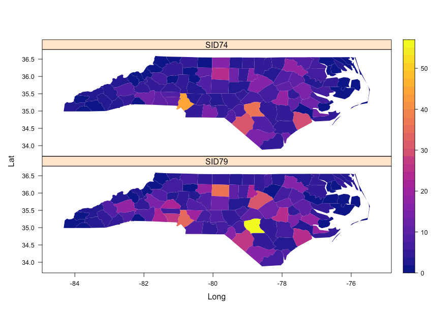{.full}

# 总结归纳

本文意在提供一个基于 R 语言的空间数据结构、可视化的简单概览，帮助读者了解空间数据可视化的轮廓，提供 R 语言在此领域的探索和实践。

本文创作过程中使用了大量的 R 包，感谢 R 语言社区的各个维护者，是他们开源共享的精神建立了如今繁荣的局面。总的来说，分两块，其一提供基础的空间数据类型，以及相应的数据操作方法，包括导入各种各样格式的空间数据，其二是空间数据分析和可视化方法，支持接入各种各样的地图服务，渲染静态和交互图形。空间数据方面，特别是 **sp** [@sp] 和 **sf**[@sf] 包的开发者 [Edzer Pebesma](https://www.r-spatial.org/)，**raster** [@raster]和 **terra** 包[@terra]的开发者 [Robert J. Hijmans](https://github.com/rhijmans)，数据可视化方面，特别是 **lattice** 包 [@lattice] 的开发者 [Deepayan Sarkar](https://deepayan.github.io/)，**ggplot2** 包[@Wickham2022]的开发者 [Hadley Wickham](https://hadley.nz/) 和 [Thomas Lin Pedersen](https://www.data-imaginist.com/)，**RgoogleMaps** 包的开发者 [@Loecher2015] [Markus Loecher](https://blog.hwr-berlin.de/codeandstats/)，**ggmap** 包[@Kahle2013]的开发者 [David Kahle](https://www.kahle.io/)，**leaflet** 包[@leaflet]的开发者 [Joe Cheng](https://github.com/jcheng5)，**echarts4r** 包[@echarts4r]的开发者 [John Coene](https://john-coene.com/)，**plotly** 包[@Sievert2020]的开发者 [Carson Sievert](https://cpsievert.me/)。这些开发者只是 R 语言社区的冰山一角，截止写作时间，CRAN 上的开发者已经超过**10000**人。表\@ref(tab:spatial-deps)列出了基础的空间数据处理、分析和可视化的 R 包，也是本文直接或间接使用的一些 R 包，更多详情见 CRAN 上关于空间数据的[任务视图](https://cran.r-project.org/view=Spatial)。

```{r spatial-deps, message=FALSE, echo=FALSE}
# 获取 R 包元数据
Sys.setenv(R_CRAN_WEB = "https://mirrors.tuna.tsinghua.edu.cn/CRAN")
# 返回 data.frame
pdb <- tools::CRAN_package_db()
library(data.table)
pdb <- as.data.table(pdb)
pdb <- unique(pdb, by = "Package")
# CRAN 上的 R 包
pkgs <- c(
  "sp", "rgeos", "rgdal", "maps", 
  "mapdata", "mapproj", "maptools",
  "sf", "raster", "terra", "stars", "loa",
  "lattice", "latticeExtra", "rasterVis",
  "leaflet", "mapview", "mapedit", "mapsf",
  "ggmap", "RgoogleMaps", "echarts4r",
  "ggplot2", "plotly"
)
# 提取 R Shiny 应用使用的 R 包及其基本描述
sub_pdb <- subset(
  x = pdb, subset = Package %in% pkgs,
  select = c("Package", "Title", "Maintainer")
) |>
  transform(Title = gsub("(\\\n)", " ", Title)) |>
  transform(Maintainer = gsub("<([^<>]*)>", "", Maintainer)) |> 
  transform(Package = paste0("**", Package, "**", " ", "[@", Package, "]"))

# 展示表格
knitr::kable(sub_pdb[order(sub_pdb$Maintainer), ],
  row.names = FALSE,
  caption = "空间分析的 R 包（排名不分先后）",
  col.names = c("R 包", "简介", "维护者")
)
```

从 **sp** 到 **sf**，从 **raster** 到 **terra**，是 R 语言在空间数据领域前进的一大步，在使用的直观感受上，数据读写、操作的性能得到极大的提升，整个空间数据处理领域的 R 包依赖也将大为减少。

**rgeos** [@rgeos]、**rgdal** [@rgdal] 和 **maptools** [@maptools] 都将于 2023 年底移出 CRAN，不再维护，它们主要用来读取和操作空间数据，相比于 **sf** [@sf] 加 **terra** [@terra] 的新方案，它们都落后了。部分功能会迁移到 **sp** 包[@sp]，而 **raster** 包[@raster]也不推荐使用，大迁移背景介绍见[这里](https://github.com/r-spatial/evolution)，几十年过去了，维护者退休了，代码的历史包袱很重，很难维护，功能和性能也没新的好。2019 年出版的开源书籍[《Geocomputation with R》](https://geocompr.robinlovelace.net/) 已经在紧锣密鼓地升级了，感兴趣的读者不妨看看新旧[详细比较](https://keen-swartz-3146c4.netlify.app/older.html)。

**ggplot2** 及其生态是很好的，可能大家不知道的是，**lattice** 在绘图能力上丝毫不逊色于 **ggplot2**，甚至还有超越。本篇主要介绍空间数据，下面以 R 软件内置的地形数据 volcano 为例。

```{r}
#| volcano-shade, 
#| fig.cap="Auckland Maunga Whau 火山地形图 $10m\times 10m$。火山的实况地形图", 
#| fig.width=5, fig.height=5, 
#| out.width="75%",
#| eval=FALSE,
#| echo=FALSE

library(lattice)

wireframe(volcano,
  shade = TRUE, # 灯光渲染
  xlab = expression(x[1]),
  ylab = expression(x[2]),
  zlab = list(expression(italic(f) ~ group("(", list(x[1], x[2]), ")")), rot = 90),
  # 刻度
  scales = list(arrows = FALSE, col = "black"),
  # 减少三维图形的边空
  lattice.options = list(
    layout.widths = list(
      left.padding = list(x = -.6, units = "inches"),
      right.padding = list(x = -1.0, units = "inches")
    ),
    layout.heights = list(
      bottom.padding = list(x = -.8, units = "inches"),
      top.padding = list(x = -1.0, units = "inches")
    )
  ),
  # 轴线
  par.settings = list(
    axis.line = list(col = "transparent"),
    shade.colors = list(
      # 调整 shade 的色彩，研究色彩构造
      # 设置什么样的值可以让色彩接近 terrain.colors()
      # 设置来自 lattice::trellis.par.get()
      palette = function(irr, ref, height, saturation = .5) {
        hsv(h = height, s = 1 - saturation * (1 - (1 - ref)^0.5), v = irr)
      }
    )
  ),
  # 视角
  screen = list(z = -45, x = -50, y = 0)
)
```

三维地形图 $10m\times 10m$](img/lattice-volcano-shade.png){.full}

仅是图 \@ref(fig:lattice-volcano-shade) 就已经让 **ggplot2** 自愧不如了，更别说实现图\@ref(fig:lattice-volcano-contour)这样的组合图形，此例摘自 [Deepayan Sarkar](https://deepayan.github.io/) 的书《**lattice**: Multivariate Data Visualization with R》[@Sarkar2008]。

```{r,eval=FALSE,echo=FALSE}
library(lattice)
panel.3d.contour <- function(x, y, z, rot.mat, distance, nlevels = 20, zlim.scaled, ...) {
  add.line <- trellis.par.get("add.line")
  panel.3dwire(x, y, z, rot.mat, distance,
    zlim.scaled = zlim.scaled, ...
  )
  clines <- contourLines(x, y, matrix(z, nrow = length(x), byrow = TRUE), nlevels = nlevels)
  for (ll in clines) {
    m <- ltransform3dto3d(rbind(ll$x, ll$y, zlim.scaled[2]), rot.mat, distance)
    panel.lines(m[1, ], m[2, ],
      col = add.line$col, lty = add.line$lty, lwd = add.line$lwd
    )
  }
}

wireframe(volcano,
  shade = TRUE, # 灯光渲染
  xlab = expression(x[1]),
  ylab = expression(x[2]),
  zlab = list(expression(italic(f) ~ group("(", list(x[1], x[2]), ")")), rot = 90),
  # 增加高度，让轮廓线更加突出
  zlim = c(90, 250),
  # 刻度
  scales = list(arrows = FALSE, col = "black"),
  # 减少三维图形的边空
  lattice.options = list(
    layout.widths = list(
      left.padding = list(x = -.6, units = "inches"),
      right.padding = list(x = -1.0, units = "inches")
    ),
    layout.heights = list(
      bottom.padding = list(x = -.8, units = "inches"),
      top.padding = list(x = -1.0, units = "inches")
    )
  ),
  # 比例
  aspect = c(61/87, .3), panel.aspect = 0.6,
  panel.3d.wireframe = "panel.3d.contour",
  # 轴线
  par.settings = list(
    axis.line = list(col = "transparent"),
    shade.colors = list(
      # 调整 shade 的色彩，研究色彩构造
      # 设置什么样的值可以让色彩接近 terrain.colors()
      # 设置来自 lattice::trellis.par.get()
      palette = function(irr, ref, height, saturation = .5) {
        hsv(h = height, s = 1 - saturation * (1 - (1 - ref)^0.5), v = irr)
      }
    )
  ),
  # 视角
  screen = list(z = 20, x = -60)
)
```

{.full}

顺便一提，Python 语言社区关于空间数据操作的流行模块有[shapely](https://github.com/shapely/shapely)和[geopandas](https://github.com/geopandas/geopandas)，后者还包含基于[matplotlib](https://github.com/matplotlib/matplotlib)的地理可视化，而做空间数据可视化的有[bokeh](https://github.com/bokeh/bokeh)、[pyecharts](https://github.com/pyecharts/pyecharts)和[plotly](https://github.com/plotly/plotly.py)等。[basemap](https://github.com/matplotlib/basemap) 基于 matplotlib 提供地图坐标映射，作用类似 R 包 **mapproj**。[geoplot](https://github.com/ResidentMario/geoplot) 提供高级易用的使用接口，扩展 [cartopy](https://github.com/SciTools/cartopy) 和 matplotlib 在地理可视化方面的能力。[rasterio](https://github.com/rasterio/rasterio) 读写栅格数据，更多 Python 语言相关的地理可视化见[地理资源列表](https://github.com/sacridini/Awesome-Geospatial)。

# 未来展望

本文只涉及空间数据领域的皮毛，说白了就是导入几种格式的空间数据画点小地图，也未涉及百万乃至百亿级的大规模空间数据的可视化，以及支持可视分析需要的空间数据存储、检索、操作、分析、建模和应用的知识和技术。此外，对于不同类型的空间数据有不同的分析方法和统计模型，比如点数据的模式分析，面数据的层次分析，栅格数据的图像分析等，本文亦未涉及。再有，面向具体业务问题，从问题发现到数据模型的转化、界定、拆解、优化和应用所需要的领域知识，本文也未涉及。笔者所知所学有限，空间数据领域是如此广阔，需要大家一起发力。

在大规模空间数据可视化和计算方面，[Kepler.gl](https://github.com/keplergl/kepler.gl) 是一款开源的大规模地理数据分析工具。[deck.gl](https://github.com/visgl/deck.gl) WebGL2 加持的高性能大规模空间数据可视化框架，支持灵活的自定义。Uber 开发的[h3](https://github.com/uber/h3) 提供六边形分层时空索引，[GeoMesa](https://github.com/locationtech/geomesa) 提供点、线、多边形的时空索引，支持分布式时空数据查询分析，结合 kafka 提供近实时的时空数据流处理能力，支持自定义 [Apache Spark](https://github.com/apache/spark) 作为分布式地理分析计算引擎，要知道 Spark 本身是不提供针对空间数据操作的 SQL 函数，因此，使用成本是很高的。更进一步，[Apache Sedona](https://github.com/apache/incubator-sedona)专门应用于大规模空间数据处理的集群计算系统，扩展了 Apache Spark / SparkSQL 的能力，提供一组开箱即用的套件 SpatialSQL，支持 Python 和 R 等多种编程接口。[Presto](https://github.com/prestodb/presto) 作为一款分布式 SQL 查询引擎，内置了常用空间数据操作的函数，和 R 包 **sf** 提供的函数名基本是一致的，迁移学习成本低。更加老牌的 GIS 数据库当属站在[PostgreSQL](https://www.postgresql.org/)肩膀上的[PostGIS](http://postgis.net/)，PostgreSQL提供基础的空间数据类型，作为存储设施，PostGIS 提供空间数据特有的系列操作。

# 环境信息

本文的 R Markdown 源文件是在 RStudio IDE 内编辑的，用 **blogdown** [@Xie2017] 构建网站，[Hugo](https://github.com/gohugoio/hugo) 渲染 **knitr** 之后的 Markdown 文件，得益于 **blogdown** 对 R Markdown 格式的支持，图、表和参考文献的交叉引用非常方便，省了不少文字编辑功夫。文中使用了多个 R 包，为方便复现本文内容，下面列出详细的环境信息：

```{r}
xfun::session_info(packages = c(
  "knitr", "rmarkdown", "blogdown",
  "ggmap", "ggplot2", "data.table",
  "lattice", "loa", "latticeExtra",
  "baidumap", "RgoogleMaps",
  "maps", "mapproj", "usmap",
  "mapdata", "maptools", "spData",
  "leaflet.extras", "rjson", "rgl",
  "raster", "terra", "sp", "sf",
  "leaflet", "echarts4r", "plotly"
), dependencies = FALSE)
```

```{r write-bib, include=FALSE}
pkgs <- c(
  "knitr", "rmarkdown", "blogdown",
  "ggmap", "ggplot2", "plyr",
  "leaflet", "leafletCN", 
  "echarts4r", "plotly",
  "baidumap", "RgoogleMaps",
  "mapview", "mapedit", 
  "lattice", "loa", "latticeExtra", "rasterVis",
  "geohashTools", "lwgeom", "rgeolocate",
  "terra", "sf", "sp", "stars",
  "maps", "mapdata", "mapproj",
  "rgl", "raster", "mapsf",
  "rgeos", "rgdal", "maptools"
)
bib <- knitr::write_bib(
  x = pkgs, file = NULL, prefix = ""
)
bib <- unlist(bib)
bib <- gsub("(\\\n)", " ", bib)
xfun::write_utf8(bib, "packages.bib")
```

# 参考文献 {#refer}

::: {#refs}
:::
