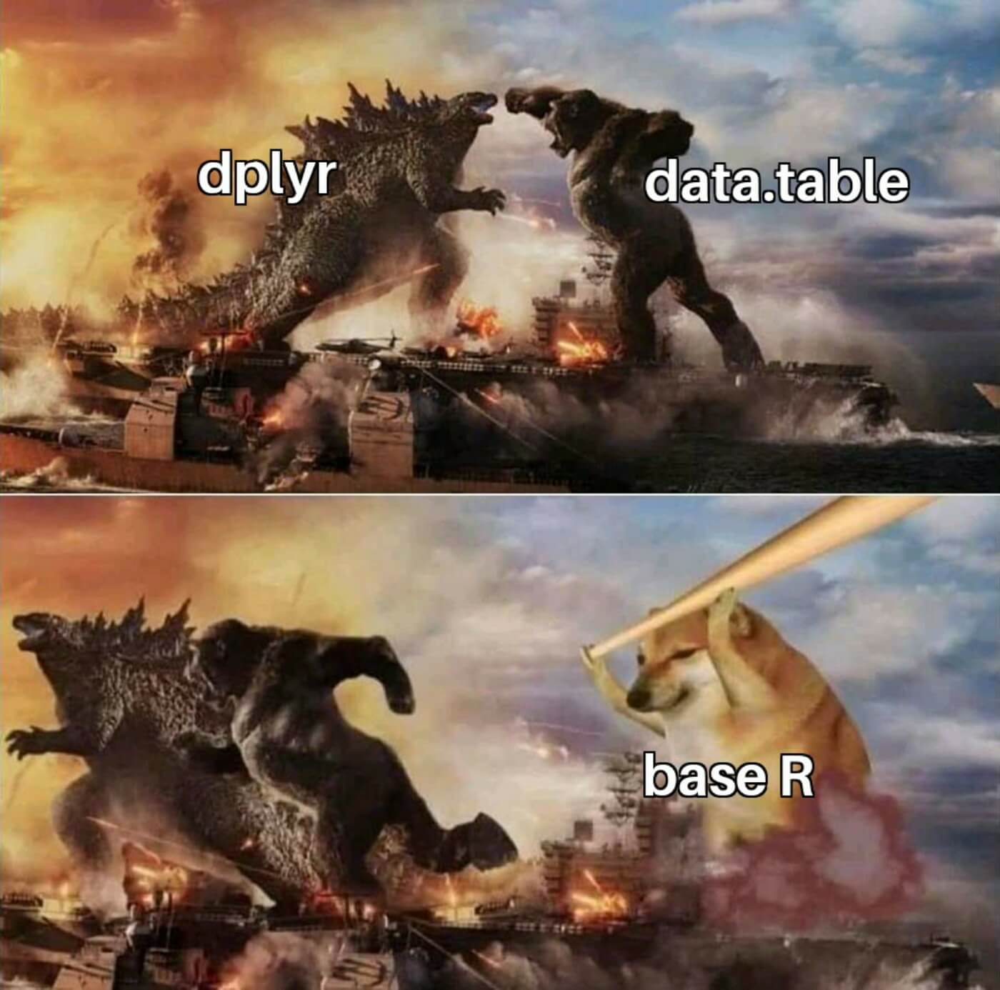

```{css}
#| echo: false

.sidebar {
  border: 1px solid #ccc;
  border-left-width: 5px;
  border-radius: 5px;
  padding: 1em;
  margin: 1em 0;
}

.full-width {
  width: 100vw;
  margin-left: calc(50% - 50vw);
}

.full-width .caption {
  text-align: center;
}

figure {
  text-align: center;
}

div.img {
  text-align: center;
  display: block; 
  margin-left: auto; 
  margin-right: auto;
}

blockquote > p:last-child {
  text-align: right;
}
blockquote > p:first-child {
  text-align: inherit;
}
```
```{r}
#| label: setup
#| echo: false

# 修改输出的显示行数
knitr::knit_hooks$set(output = local({
  # the default output hook
  hook_output = knitr::knit_hooks$get('output')
  function(x, options) {
    if (!is.null(n <- options$out.lines)) { # out.lines
      x = xfun::split_lines(x)
      if (length(x) > n) {
        # truncate the output
        x = c(head(x, n), '....\n')
      }
      x = paste(x, collapse = '\n') # paste first n lines together
    }
    hook_output(x, options)
  }
}))
```


# 写作背景


有的文章关注单个小功能、小模块地逐一介绍，非常类似某些 R 包的帮助文档，而有的需要企业级探索和实践，这就需要踩坑填坑，多方对比，总结经验，摸索出一条好实现、好维护、好效果的路。[《地区分布图及其应用》](/2022/04/choropleth-map/)就属于后者，它的定位是面向入门到进阶的读者。在开头没有交代清楚目标读者，而笔者**想当然**地认为读者一看内容便知定位。


下面分四个部分写《地区分布图及其应用》的番外篇：

1. **何谓专题地图**：面向初次接触空间区域数据可视化的读者，阐明原文覆盖的内容。
1. **又一**绘图方案：以**极其详细**的方式介绍 **ggplot2** + **maps** 绘图方法，其前置的数据探查、数据处理的过程也值得借鉴，这些都是原文没有展开的内容。
1. **数据操作杂谈**：个人经验之谈甚多，内容是有偏的。
1. **部分**写作历程：对原文写作过程的回顾，一些背后的所思所想。


# 何谓专题地图


目前，R 语言社区可以用来绘制地区分布图（Choropleth map）的 R 包有 **maps** 包[@maps]，**sf** 包[@Pebesma2018]，**tmap** 包[@Tennekes2018]和 **mapsf** 包[@mapsf]等等。**tmap** 包的标题为 Thematic Maps（专题地图），
**mapsf** 包的标题为 Thematic Cartography（专题制图），
**maps** 包的标题为 Draw Geographical Maps（绘制地理地图），从这些标题不难看出，它们不止可以绘制地区分布图，还可以绘制其它常见的地理统计图形，每个 R 包的帮助文档都有详尽的介绍，如比例符号气泡图（Proportional symbol map）、核密度地图（Kernel density map）和变形地图（Cartogram）等等。统计之都主站发布的文章[《地区分布图及其应用》](https://cosx.org/2022/05/choropleth-map/)在末尾还介绍了多种地区分布图的变体，它们都可以叫专题地图（Thematic Maps），可想而知，何其繁多。除了专题统计地图，还有遥感卫星地图、电子导航地图、海拔地形地图等。


{ width=75% }


# 又一绘图方案


在文章[《地区分布图及其应用》](https://cosx.org/2022/05/choropleth-map/)的小结部分，留了一些尾巴，其中还有**两种**原文提及但未给出具体代码实现和详细介绍的绘图方案，本节介绍其中一种，即用 **ggplot2** 包和 **maps** 包绘制地区分布图。仍然以 **latticeExtra** 包[@latticeExtra]内置的美国各郡年平均癌症死亡率数据集 USCancerRates 为例，详细介绍制作地区分布图的过程。


## 数据准备

### 观测数据

首先加载癌症死亡率数据集 USCancerRates 到 R 运行环境中。

```{r}
data(USCancerRates, package = "latticeExtra")
```

接下来查看数据集的基本信息。

```{r}
#| label: us-cancer-rates

str(USCancerRates)
head(USCancerRates)
```

这是一个 3041 行 8 列的数据框，每一行代表一个郡的癌症死亡率情况，各列分别是 rate.male （男性死亡率）、LCL95.male （男性死亡率的下限）、UCL95.male（男性死亡率的上限）、rate.female （女性死亡率）、LCL95.female（女性死亡率下限）、 UCL95.female（女性死亡率上限）
state（州名）和 county（郡名），一共 8 个字段。

为方便用 **ggplot2** 包分面绘图，将数据集 USCancerRates 从「宽格式」转「长格式」，R 语言内置的 `reshape()` 函数是专门用来做数据重塑操作的。

```{r}
us_cancer_rates <- reshape(
  data = USCancerRates,
  varying = c(
    "LCL95.male", "rate.male", "UCL95.male",
    "LCL95.female", "rate.female", "UCL95.female"
  ),
  times = c("男性", "女性"),
  v.names = c("LCL95", "rate", "UCL95"), 
  timevar = "sex", 
  idvar = c("state", "county"), 
  new.row.names = 1:(2 * 3041),
  direction = "long"
)
```

重塑之后，再来看看数据集的样子，行数正好符合预期的增加一倍。

```{r}
str(us_cancer_rates)
head(us_cancer_rates)
```

### 地图数据

接下来，需要准备地图数据，**maps** 包内置了美国州级、郡级两个多边形边界地图数据，下面以郡级数据为例

```{r}
library(maps)
county_map <- map(database = "county", fill = TRUE, plot = FALSE)
str(county_map)
```

county_map 的数据类型是 `map`，是由 R 语言内置的基本数据类型 list **列表**构造出来的，它有 4 个元素，分别是 x 经度、 y 纬度、 range 矩形边界和 names 每一块地理单元的名称。每一对经纬度代表一个点，多个点按照一定顺序可以形成线或封闭的多边形，从数据集 county_map 来看，美国 **3085** 个郡的多边形边界用 **91033** 个点表示，坐标点的数量是刻画地理边界精度的。

用 **ggplot2** 包绘制地图，需要将原 `map` 数据类型转化为 data.frame 数据框类型，**ggplot2** 包有函数 `map_data()` 来做转化。

```{r}
library(ggplot2)
# 获取州、郡级地图数据
us_state_map <- map_data(map = "state")
us_county_map <- map_data(map = "county")
```

查看转化后的数据集 us_county_map，发现有 **87949** 行 **6** 列，group 变量表示郡分组编号，order 变量表示经纬度坐标点编号，region 和 subregion 变量分别表示州、郡名称。

```{r}
str(us_county_map)
head(us_county_map)
```

从地图数据集 us_county_map 取出阿拉巴马州的情况，按郡县统计一下各个字段的数量。篇幅所限，下面仅展示部分数据记录，一共有 **67** 个郡县，其中用 51 个坐标点表示了 autauga 奥陶加郡的边界。这从原来的 **91033** 个点，经 **ggplot2** 包转化后，变成了 **87949** 个点，去掉了 county_map 中坐标为 NA 的 **3084** 个点。

```{r}
#| out.lines: 6

aggregate(
  data = us_county_map,
  x = . ~ region + subregion,
  FUN = length,
  subset = region == "alabama"
)
```

再看一下数据转化后，group（郡）的数量，是 **3085** 个，没错！

```{r}
length(unique(us_county_map$group))
length(unique(us_county_map$order))
```


### 数据合并

接下来，需要将观测数据以**左关联**的方式合并到地图数据上，通常来说，地图数据是完整的，或者说地理范围是覆盖观测数据的。注意到 us_cancer_rates 中郡名称 county 字段和 us_county_map 中郡名称 subregion 字段的联系，先对 us_cancer_rates 做一些小小的数据变换操作，转小写和去掉郡名称中的 「county」。

```{r}
us_cancer_rates <- within(us_cancer_rates, {
  state <- tolower(state)
  county <- tolower(county)
  county <- gsub(pattern = "( county)", replacement = "", x = county)
})
```

下面开始合并观测数据和地图数据，指定需要合并的两个数据集，以及按照哪些列合并，注意数据集和字段的顺序，让 region 对应 state，subregion 对应 county。

```{r}
us_cancer_rates2 <- merge(
  x = us_county_map,
  y = us_cancer_rates,
  by.x = c("region", "subregion"),
  by.y = c("state", "county"),
  all.x = TRUE,
  sort = FALSE
)
```

然后恢复地图数据中各个坐标点的顺序。

```{r}
# 排序
us_cancer_rates2 <- us_cancer_rates2[order(us_cancer_rates2$order), ]
```

再来看看合并和排序后的数据集。

```{r}
str(us_cancer_rates2)
head(us_cancer_rates2)
```

发现，原地图数据集 us_county_map 的行数增加近一倍，但又不是一倍。$169496 / 2 = 84748$ 距离原 us_county_map 数据集的行数 87949，差了整整 3201，这是为什么呢？观测数据集 us_cancer_rates2 并没有覆盖美国本土连续的 48 州的所有郡，其实一开始，就知道原观测数据集 USCancerRates 只有 3041 行记录，最多 3041 个郡有数据。但，不知道的是缺失的分布情况，哪些郡县有缺失，以及分男女的缺失情况。

```{r}
# 检查原数据集 USCancerRates 是否有缺失
us_cancer_rates_na <- subset(x = us_cancer_rates, subset = is.na(rate))
```


```{r}
str(us_cancer_rates_na)
head(us_cancer_rates_na)
```


```{r}
# 分性别统计缺失数据的分布
table(us_cancer_rates_na$sex)
```

由此可知，63 个郡的女性癌症死亡率数据缺失，而其男性癌症死亡率数据未缺失；有 10 个郡的男性癌症死亡率数据缺失，而其女性癌症死亡率数据未缺失；如果一个郡的男、女性癌症死亡率数据**都**缺失，那就不会记录到原数据集 USCancerRates 里。因 USCancerRates 缺失了一部分郡的数据，没关联上 us_county_map 的不会加倍。

最后，将癌症死亡率以等间距的方式简单分级。

```{r}
us_cancer_rates2$rate_d <- cut(us_cancer_rates2$rate, breaks = 50 * 0:13)
```

再去掉缺失完全没有死亡率数据的记录，不然分面绘图要出现 NA 的一面。

```{r}
us_cancer_rates2 <- subset(x = us_cancer_rates2, subset = !is.na(sex))
```


## 数据展示

终于来到画图的阶段了，**ggplot2** 包 + **maps** 包 + **mapproj** 包[@mapproj]的组合，意即在 **maps** 包和 **mapproj** 包的支撑下，**ggplot2** 包封装了两个函数，分别是地理几何图层 `geom_map()` 和坐标投影图层 `coord_map()`。主要绘图步骤如下：

1. 以郡级地图数据 us_county_map 为基础，绘制地图底图，各郡填充灰色。

1. 将观测数据 us_cancer_rates2 映射到地图上，收集到癌症死亡率数据的郡填充上颜色，覆盖掉默认的灰色，边界线也去掉。

1. 以州级地图数据 us_state_map 为基础，绘制各州边界线，线条调细一些。

1. 将坐标投影方式设置为方位角投影，视角中心设置在美国，视角中心可参考 `county_map$range` 设定的范围。

1. 调色板设置为 plasma，缺失值填充为灰色，和背景底图一样。

1. 添加主、副标题和图例标题，设置主题，字体样式和大小，主、副标题位置等细节。

```{r}
#| label: ggplot2-maps
#| fig.cap: "1999-2003 年美国各个郡的年平均癌症死亡率分布"
#| fig.width: 8
#| fig.height: 8
#| fig.align: "center"
#| dev: "ragg_png"

ggplot(data = us_cancer_rates2, aes(long, lat, group = subregion)) +
  geom_map(aes(map_id = region),
    map = us_county_map,
    fill = "grey80"
  ) +
  geom_polygon(aes(group = group, fill = rate_d), color = NA) +
  geom_map(aes(map_id = region),
    map = us_state_map,
    colour = "gray80", fill = NA, size = 0.15
  ) +
  coord_map("orthographic", orientation = c(39, -98, 0)) +
  scale_fill_viridis_d(option = "plasma", na.value = "grey80") +
  facet_wrap(~sex, ncol = 1, strip.position = "top") +
  labs(
    fill = "死亡率", title = "1999-2003 年美国各个郡的年平均癌症死亡率",
    caption = "数据源：美国国家癌症研究所"
  ) +
  theme_void(base_size = 13) +
  theme(
    title = element_text(family = "Noto Serif CJK SC"),
    plot.title = element_text(hjust = 0.5),
    plot.caption = element_text(hjust = 0)
  )
```

又有神奇的事情发生了，从图\@ref(fig:ggplot2-maps)不难看出，地图东南角缺了一块，路易斯安那州的地图数据都缺失了。而实际上，路易斯安那州是有收集到癌症死亡率数据的，且看：

```{r}
#| out.lines: 6

# 篇幅所限仅展示部分数据
subset(x = us_cancer_rates, subset = state == "louisiana")
```

可见，问题出在地图数据和观测数据的关联环节，再看路易斯安那州的地图数据：

```{r}
#| out.lines: 6

# 篇幅所限仅展示部分数据
subset(x = us_county_map, subset = region == "louisiana")
```

仔细对比一下 county 字段，发现观测数据集里郡名称都带着 parish（教区），而 **ggplot2** 地图数据中没有。

```{r}
#| out.lines: 6

# 篇幅所限仅展示部分数据
subset(x = us_county_map, subset = region == "louisiana") |>
  aggregate(. ~ region + subregion, length)
```

再看原 **maps** 包的地图数据集 county_map 中路易斯安那州的情况。

```{r}
#| out.lines: 6

# 篇幅所限仅展示部分数据
grep("louisiana", x = county_map$names, value = T)
```


原来，在观测数据集里，路易斯安那州下属各行政单元不叫某某郡县 County 而叫某某教区 Parish。因此，缓解办法是在观测数据的处理一节，county 字段中取值包含 parish 的做一些替换。

```{r}
#| eval: false
#| echo: true
us_cancer_rates <- within(us_cancer_rates, {
  state <- tolower(state)
  county <- tolower(county)
  # 既要去掉 county 又要去掉 parish 还要去掉什么呢？
  county <- gsub(pattern = "( county)|( parish)", replacement = "", x = county)
})
```

为什么文章《地区分布图及其应用》没有出现图\@ref(fig:ggplot2-maps)的缺失情况？因为用的是原始数据集 USCancerRates 的行名做匹配，且看路易斯安那州的情况：

```{r}
#| echo: true
#| out.lines: 10

# 篇幅所限仅展示部分数据
subset(x = USCancerRates, subset = state == "Louisiana", select = c("state", "county"))
```

像这样的数据情况，除非你有很好的数据探查工具，否则，在初始的数据探查阶段很难发现，更不会一开始就进行**行级别**的**细粒度**探查，数据可视化可以帮助我们了解数据质量，好的数据探查工具可以帮助我们提效，比如 @Cheng2015 用带图形用户界面的工具 可视化探索数据缺失情况。


## 经验总结


1.  行政区划的名称在不同的体系下各有一套，美国人口调查局官方发布一套，美国国家癌症研究所发布癌症死亡率数据带一套， R 包 **maps** 二次加工一套，**ggplot2** 包在 **maps** 包基础上三次加工，又是一套，这种层层加工将地理单元的唯一编码 [GEO_ID](https://www.census.gov/programs-surveys/geography/guidance/geo-identifiers.html) （Geographic Identifiers，地理单元标识，简称 GEO_ID）/ [FIPS](https://en.wikipedia.org/wiki/Federal_Information_Processing_Standards)（**F**ederal **I**nformation **P**rocessing **S**tandards，联邦信息处理标准，简称 FIPS） 丢掉了，导致数据上难以关联准确，**数据一致性**丢失了，最终导致数据处理、分析和应用变复杂甚至不可行了。

1.  行政区划的名称、辖区范围为适应社会经济发展做调整，国内每年行政区域的名称都有一些更改，比如撤县划市，区县、村镇、、街道合并等等，越靠近基层的行政单元更改的量越大。此外，在历史上，很多西方国家，调查统计人口、土地等基本国情的数据在各教区、教会、教堂，很多洗礼、结婚、丧葬由当地的牧师主持，教权影响力甚至大于政权 [@Chen1987]。

1.  在文章[《地区分布图及其应用》](https://cosx.org/2022/05/choropleth-map/)中，地图数据的获取从 **maps** 包到 **usmapdata** 包[@usmapdata]，再到 2019 年美国人口调查局，已经出现一些小问题。不同数据源或方法绘制的地图，仔细观察角角落落会发现路易斯安那州有些问题。**maps** 包和 **latticeExtra** 包绘图共用一份地图数据，它们地图上每个郡的数据是一样，而较新的地图数据，郡名称和 2003 年时可能有所不同。因此，地图数据的年份最好和观测数据采纳的一致，观测数据中关于地理单元，最好使用 GEO_ID/FIPS 之类的国家统一编码。

1.  [《R Graphics Cookbook》](https://r-graphics.org/recipe-miscgraph-choropleth)[@Chang2018]第二版仍然在介绍 **ggplot2** 包组合 **maps** 包制作地图的方法。[《ggplot2: Elegant Graphics for Data Analysis》](https://ggplot2-book.org/maps.html)[@Wickham2022]在最新的第三版中开始考虑到制作地图的准确性问题，并大篇幅介绍 **sf** 包。 **lattice** 包[@Sarkar2008]及其生态扩展包 **latticeExtra** 稳定成熟，[没啥要改的了](https://github.com/deepayan/lattice/issues/11)，内置的一些风格主题，效果也不错，比如经济学人杂志主题。

    ::: {.full-width}
    ```{r}
    #| label: sunspot-year
    #| fig.cap: "太阳黑子数量变化趋势"
    #| fig.align: "center"
    #| dev: "ragg_png"
    #| fig.width: 12
    #| fig.height: 5
    #| echo: false
    
    library(lattice)
    trellis.par.set(par.xlab.text = list(fontfamily = "Noto Serif CJK SC"), par.ylab.text = list(fontfamily = "Noto Serif CJK SC"), par.sub.text = list(fontfamily = "Noto Serif CJK SC"), par.main.text = list(fontfamily = "Noto Serif CJK SC"))
    xyplot(window(sunspot.year, start = 1700),
      xlab = "年份",
      main = "太阳黑子活动周期约11.2年",
      sub = "数据源：R 软件内置的 datasets 包",
      ylab = "数量",
      par.settings = latticeExtra::theEconomist.theme(box = "transparent", with.bg = TRUE),
      lattice.options = latticeExtra::theEconomist.opts()
    )
    ```
    :::

1.  最后，关于图形配色，简单谈一点，根据需要选择，R 内置了丰富的调色板，应有尽有，详见帮助文档`?hcl.pals()`！

    ::: {.full-width}
    ```{r}
    #| label: colorspace-hcl-palettes
    #| fig.width: 15
    #| fig.height: 6
    #| fig.align: "center"
    #| echo: false
    #| fig.cap: "R 内置的 HCL 系调色板"
    library(colorspace)
    hcl_palettes(plot = T)
    ```
    :::


# 数据操作杂谈

>  我还是从前那个少年  
 没有一丝丝改变  
 时间只不过是考验  
 种在心中信念丝毫未减
>  
> --- 梦然·《少年》


Base R 是指 R 软件正常运行所必须的一组 R 包集合，共有 14 个 R 包，[R 核心团队](https://www.r-project.org/foundation/members.html)负责长期维护和开发。

```{r}
#| echo: false
#| comment: 
tools:::.get_standard_package_names()[["base"]]
```

## 长宽格式要怎么转

大部分的数据可视化和统计建模函数要求「长格式」的数据，所以，从「宽格式」到「长格式」是更常见的变形操作。以上对数据集 USCancerRates 从「宽格式」到「长格式」的变形操作是非常典型的，读者可对照帮助文档 `?reshape()` 和如下两种方式理解其他传参方式对结果的影响，以加深对变形操作的理解。

``` r
# 方式二
reshape(
  data = USCancerRates,
  varying = list(
    LCL95 = c("LCL95.male", "LCL95.female"),
    rate = c("rate.male", "rate.female"),
    UCL95 = c("UCL95.male", "UCL95.female")
  ),
  times = c("男性", "女性"), # 可选，最好填
  v.names = c("LCL95", "rate", "UCL95"), # 可选，最好填
  timevar = "sex", # 可选，最好填
  idvar = c("state", "county"), # 必填
  new.row.names = 1:(2 * 3041), # 可选，最好填
  direction = "long"
)
# 方式三
reshape(
  data = USCancerRates,
  varying = list(
    LCL95 = c("LCL95.male", "LCL95.female"),
    rate = c("rate.male", "rate.female"),
    UCL95 = c("UCL95.male", "UCL95.female")
  ),
  # times = c("男性", "女性"),
  # v.names = c("LCL95", "rate", "UCL95"),
  timevar = "sex",
  idvar = c("state", "county"),
  new.row.names = 1:(2 * 3041),
  direction = "long"
)
```

R 软件内置的函数 `reshape()` 有很丰富的解释。所谓的「宽格式」和「长格式」数据来源于纵向数据分析领域 longitudinal data analysis --- 对同一对象的同一特征在不同时间点重复测量分析（假定对象没有随时间发生变化），也可以是对多个特征在不同时间点重复测量，这些特征就是所谓的时间变量（随时间变化的变量）timevar（time-varying variables），具体地，测量一个人的头发长度，有的特征随时间不会变化，比如性别、种族等，称之为时间常量（time-constant variables）。函数 `reshape()` 的参数就采用纵向数据分析的术语。R 是一个用于统计计算和绘图的编程语言和环境，主要由统计学家开发和维护，很多重要的函数要回归到统计上去理解，才会豁然开朗。


## Base R 永远是 Base R


> 你大妈已经不是你六年前那大妈了，你大爷永远是你大爷。
>
> --- 2006年春晚小品《说事儿》


Base R 定义了基础的数据类型，最常见的要数 vector 向量、 data.frame 数据框和 matrix 矩阵，也同时提供了很多相应的数据操作函数，没有什么数据操作是一个 Base R 函数搞不定的，有，就用两个！

常用数据操作的基本动作无非还是那么几个：

1.  筛选行子集 `subset()` / `[`
1.  选择列子集 `subset()` / `[`
1.  新增/改变列 `within()`
1.  按列分组排序 `order()`
1.  按列分组聚合 `aggregate()`
1.  数据形状重塑 `reshape()`
1.  数据关联合并 `merge()`/`rbind()`

其它常用的辅助数据操作函数有：

1.  数据查重替换 `duplicated()` / `replace()`
1.  数据记录完整性 `complete.cases()`
1.  判空、缺失值 `is.na()` / `is.nan()` / `is.integer()` 等
1.  向量化操作函数，如 `vapply()` / `tapply()`/ `lapply()` 等

熟悉这些函数的方式就是找个真实数据集，做一番数据分析，几乎可以肯定会使用以上大部分函数，举例来说，本文以及之前发布的[《地区分布图及其应用》](/2022/04/choropleth-map/)、[《R 语言制作地区分布图及其动画》](/2022/05/choropleth-map-animation/)等。

统计之都论坛每隔几天就有数据操作相关的问题冒出来，比如：

-   [Base R 数据操作的一致性问题](https://d.cosx.org/d/420763)
-   [我竟然可以将数据框的列名保持一样](https://d.cosx.org/d/421107)
-   [函数 `transform()` 自动转化列名是 feature 还是 bug](https://d.cosx.org/d/421035)
-   [如何对数据框中的每行数据进行累加](https://d.cosx.org/d/420697/15)
-   [如何做分组回归提取斜率和截距](https://d.cosx.org/d/422889)
-   [如何根据自定义函数排序](https://d.cosx.org/d/423059)
-   [列表转化为数据框](https://d.cosx.org/d/423101)
-   [潜水论坛很久，有种感觉大家不是很喜欢tidyverse那一套的，可以问问为什么吗？](https://d.cosx.org/d/423134)
-   [把数据框的每行按照某列拆分不同的行，只能用循环吗？](https://d.cosx.org/d/423141)
-   [怎样把一段 **tidy** 版本的代码改写成 **data.table** 版本的](https://d.cosx.org/d/423198)
-   ......


## 此 filter 非彼 filter

Base R 函数 `filter()` 的功能是非常强大的，本意是对时间序列应用一个线性滤波器，以前在大学物理实验课上见过这玩意，它可以让输入波经过特定的变换得到加强或减弱，看到的波都是被加强的，滤波器实际上是一个选频装置，让特定频段的波过滤出来。接下来，抛开物理背景知识（笔者知之甚少，基本还给物理老师了），只要知道 filter 会对原始数据做一个变换即可，这不正是数据操作中常用的 transform 吗！

根据函数帮助文档 `?filter`，参数 `sides = 1` 意味着 `method = "convolution"`，参数 `filter = c(2/3, 1/6, 1/6)` 是权重向量，按由近及远的顺序。先看个简单示例：

$y_i = \frac{2}{3} x_{i} + \frac{1}{6} x_{i - 1} + \frac{1}{6} x_{i - 2}, \quad i \geq 3$

```{r}
x = 1:10
filter(x, filter = c(2/3, 1/6, 1/6), sides = 1)
```

下面以分组计算移动平均为例介绍函数 `filter()` 的妙用，毕竟时间序列平滑还是很常用的。

```{r}
# 按某列分组对另一列移动平均
library(data.table)
dat <- data.table(x = 1:12, y = rep(c("a", "b"), each = 3))
dat[, moving_average1 := filter(x, filter = rep(1 / 3, 3), sides = 1), by = "y"]
# 或者使用 data.table 提供的函数 frollmean
dat[ , moving_average2 := frollmean(x, n = 3), by = "y"]
# 或者使用更一般的函数 frollapply
dat[ , moving_average3 := frollapply(x, n = 3, FUN = mean), by = "y"]
dat
```


## 经验总结


tidyverse [大主教](https://d.cosx.org/d/421573-hugodown/4)在 Mango Solutions 组织的一场活动中给了主题为[《Tidyverse: The **greatest** mistakes》](https://www.youtube.com/watch?v=vYwXMnC03I4)的报告，笔者认为本应是 「biggest」被换成了「greatest」，一字之差，天壤之别，还旁征博引，甚是有理！


> The cost of never making a mistake is very often never making a change at all. It's just too incredibly hard to be sure. [^1]  
永不犯错的代价是一成不变。
>
> --- GeePaW Hill

[^1]: <https://www.geepawhill.org/2019/07/16/try-different-not-harder/>


过度[喧嚣](https://yihui.org/cn/2019/07/tidy-noise/)引来不少反抗，比如 [Norm Matloff](https://heather.cs.ucdavis.edu/matloff.html) 的 [An opinionated view of the Tidyverse "dialect" of the R language](https://github.com/matloff/TidyverseSkeptic)，Reece Goding 的 [Frustration: One Year With R](https://github.com/ReeceGoding/Frustration-One-Year-With-R)，[Dirk Eddelbuettel](https://dirk.eddelbuettel.com/) 等联合写的 [Lightweight is the right weight](https://www.tinyverse.org/) 等等，都是实名实据地反抗。我只谈一点，tidyverse 之风已经吹入 R 语言社区的角角落落，即使读者像我一样在代码里不显式地使用它，却不得不考虑它的影响，有时要写一些额外的代码来应付。

{ width=75% }


关于数据操作，在不影响效率的情况下，笔者会优先选择 Base R 来做数据操作，若遇到小规模数据会考虑调用 **data.table** 来处理，若遇到大规模数据肯定是用 SQL 来处理，聚合完继续用 Base R 或 **data.table** 处理。工作几年下来，任凭窗外云卷云舒，在稳定和效率面前，我自岿然不动，看过不少[净土代码](https://yihui.org/cn/2019/07/tidy-noise/)，也写过一些，所知有限，不敢示人，常晓其大意，[换之以 Base R](https://d.cosx.org/d/423198/4)。


处理数百 GB 乃至 TB 级的海量数据，聚合计算通常都是由写 SQL 完成的，不太可能直接用 R 语言或 Python 语言去处理，什么牛逼的工具包都不行！SQL 聚合计算后得到的数据集就 KB 或 MB级，大约几千，几万或几十万，即使遇到几百万条记录，也是用 SQL 再按需聚合。只在最后，为了可视化和分析建模，对 SQL 查询后的数据做各种适应性变换，这变形重塑的数据操作是最常见的，也是最复杂的，并且在SQL中实现复杂而在R中非常简单。用户最大的痛点是非常难记住 reshape（变形） 的到底是谁，长变宽还是宽变长。R 语言社区陆续出现一些工具，从 `reshape()` 函数到 **reshape** 包[@Wickham2007]，再到 **reshape2** 包，再到 **tidyr** 包[@tidyr]，一路折腾，还是应该回归到出发点来看待 `reshape()` 函数，其实不缺工具，就缺一些深入浅出、喜闻乐见、通俗易懂的文档介绍和广告宣传。


# 也谈写作历程 {#review}

《地区分布图及其应用》创作过程中经历了很多重要的节点：[起心动念](https://d.cosx.org/d/422907)、选择方向、设定目标、收集数据、数据探查、数据分析、文章写作、完成初稿、[收集反馈](https://d.cosx.org/d/423119)、初次修改、[正式投稿](https://github.com/cosname/cosx.org/pull/1027)、评审反馈、反复修改、最终发布、交流反馈等。从起心动念到本《番外篇》发出止，历时正好**四**个月。当然不是四个月都干这么一件事，只是想把这个事情的来龙去脉都讲清楚，对整个事情做一些回顾，争取总结一些经验教训。


## 预期目标 {#target}


就这篇《地区分布图及其应用》来说，大方向的选择没有太多犹疑。研究生阶段学习[「地统计学」](https://en.wikipedia.org/wiki/Geostatistics)（Geostatistics），以空间广义线性混合效应模型在空间点数据（Point-referenced data or Geostatistics data）的分析和建模为主，属于空间数据分析的内容[@Banerjee2016]。遗憾的是为了自己的学业无暇他顾，更别说空间统计是如何在现实世界应用的。前沿的论文搜集了很多，也根据学业需要读了不少，虽做了粗糙的分类，但是缺乏精细的组织和整理，最后，没能将一篇综述写出来，有点可惜。去年末开始捡时空统计的内容，重新捡起来和新学知识花费的时间是差不多的，三年过去，重读空间统计，有不一样的体会。有更多的目的性，要完成一篇文章，要熟悉几个方面的东西，比如空间区域数据（Areal data）及其可视化和分析等，同时也为了兴趣，也为了职业规划，也为了给软件工具栏目投稿。


## 内容设想 {#plan}


文章《地区分布图及其应用》最初的设想：

1.  对我个人有足够的挑战，从头到尾地做一个稍大一点的数据项目，从找数据开始，看看自己是如何搞砸的，又是如何把它扶起来的，要经历怎样的痛苦挣扎。回过头来看，若对数据项目不感兴趣，极有可能半途而废。

1.  为了在实际工作中更有借鉴意义，特意找了两个真实数据集：美国癌症研究所发布的 1999-2003 年度各郡年平均癌症死亡率数据，美国人口调查局发布的 2015-2019 年度家庭年收入数据。第一个准备用来介绍数据可视化及相关实现问题；第二个准备用来介绍数据分析和数据解读过程。

1.  原计划一周完成写作，一周完成修改，实际做的过程中，发现屡屡超出预期，项目时间越拖越长，其实是项目管理的经验不足，不断改变项目的范围，下面列举一些具体事项：

    1.  癌症死亡率数据虽已存在于 **latticeExtra** 包，但数据质量、数据指标及其计算过程都未能介绍清楚，它的作用仅是用于展示制作地区分布图（Choropleth map）的函数 `mapplot()`。按照笔者一贯的写作风格，肯定要刨根问底的，特别是它包含的年龄调整的年平均癌症死亡率究竟是个什么死亡率？怎么年龄调整的？为什么这么调整？因此，在[美国国家癌症研究所](https://statecancerprofiles.cancer.gov/)（National Cancer Institute，简称 NCI）网站上花了不少时间去搞计算过程和逻辑。笔者在网站上没有找到癌症死亡率的区间估计过程，心有不甘，就去[美国疾控预防中心](https://www.cdc.gov/)（Centers for Disease Control and Prevention，简称 CDC）找线索，理由是癌症死亡率和新冠死亡率在分地域、性别、年龄调整等维度上，指标统计口径应该类似，果不其然，详见 CDC 发布的报告 @Xu2021，其技术细节相当复杂，笔者只是略懂就不再细说了。

    1.  癌症死亡率数据在美国本土、阿拉斯加、夏威夷都有不少缺失，男、女死亡率数据各自有部分缺失，**maps** 包内置的美国郡级地图数据缺失阿拉斯加和夏威夷。为了完整的美国州、郡级地图数据，以及展示已有的全部癌症死亡率数据，就需要去找地图数据，这其实已经在和数据质量战斗了。本文前半部分重笔介绍 **ggplot2** 和 **maps** 包绘制地区分布图的过程，读者看完，想必已然明了。可以说，最初想的蛮好，实际上，并不简单，坑了自己一把。
    
    1.  用 **latticeExtra** 包制作地区分布图，为了加上州级边界线等细节，像只八爪章鱼在网上各种找材料，虽不想啃 Deepayan Sarkar 的书《Lattice: Multivariate Data Visualization with R》[@Sarkar2008]，但要从整体上了解 Lattice 的轮廓，还是只有靠这本书。
    
    1.  为了代码稳定性、文章可重复性，有自信和能力避免任何和 **dplyr** 相关的代码，但项目时间上又有所延长。此外，文章合并入主站仓库没几天，**ggplot2** 的衍生包 **biscale** 包发布[重大版本 1.0.0](https://chris-prener.github.io/biscale/)，二元地区分布图的代码[不得不升级一下](https://github.com/cosname/cosx.org/commit/e4346a56eb36c861b449dbb233796c078f81df7b)。

    1.  地图数据获取上，有现成的 R 包 **tidycensus**，本来是很简单的事， 因[神奇的网络问题](https://d.cosx.org/d/422985)，走了不少弯路，不过，最终装了 Docker，拉了基于 Ubuntu 的[容器镜像](https://github.com/rocker-org/rocker-versioned2)，还是[把路趟直了](https://github.com/cosname/cosx.org/pull/1027/commits/efb3673ebb3ed3215f0ded636efeadebb41952cf)。

    1.  《地区分布图及其应用》的初稿在数据解读方面做得很不好，更可笑的是家庭收入是月收入还是年收入都没搞清楚，足见数据背景知识的匮乏。好在数据整理的过程都有代码，重读指标含义，搜罗网上的材料，一对比就清楚了，顺带挖了一下美国人口调查局发布的指标体系的存储结构，后来，又看了世界银行的[数据 API](https://datahelpdesk.worldbank.org/knowledgebase/articles/889392-about-the-indicators-api-documentation)和美国人口调查局发布的[其它数据 API](https://www.census.gov/data/developers/data-sets/international-database.html)，指标体系都是按照某种形式的「长格式」存储。


## 读者反馈 {#reader-feedback}


> Statistik ist stillstehende geschichte, Geschichte ist fortlanfende statistik.  
统计学是静态的历史，历史是动态的统计学。
> 
> --- August Ludwing von Schlözer (1735-1809) 国势学派代表人物**斯勒滋**


在探查年龄调整的癌症死亡率指标的计算过程时，发现美国人口的年龄结构数据，美国老年人口比例从 1940 年的 10% 左右增加到 2000 年的 15% 左右，60 年时间才增加 5% 左右，惊呆了！因此，写下了这一段内容，不过有些发散了，最终作罢。

> 纵观过去，美国是没有老龄化现象的，惊不惊讶，意不意外！笔者初看有点意外，想了会儿又觉得是情理之中。有些基本问题无论从前还是未来，无论发达国家还是发展中国家，都要给出自己的解法。笔者不准备讨论与国家政策相关的敏感话题，仅推荐一本正儿八经的人物传记---现代统计学家《Neyman》[@Reid1982]，有相应中译版《耐曼》[@Yao1985]，里面给出了一些线索。
笔者英文水平有限，看的是中文版，推荐有条件的读者尝试看英文版，应该会舒服得多。《Neyman》书中多次提及另一本卡尔·皮尔逊（Karl Person）的著作《The Grammar of Science》[@Person1911]，也有中译本《科学的规范》[@Person1998]，值得一读。众所周知，耐曼在波兰和英国时期和爱根·皮尔逊（E. S. Person）在假设检验和置信区间理论方面有大量合作，一起奠定了统计学严格的数学基础。耐曼的早期工作从卡尔·皮尔逊时代开始，研究了大量实际问题，所以，了解一些生活中实在的具体问题，就不会被 N-P 引理折磨了。于我个人而言，毕业以后，第一阶段应用，从书中来到工作中去，第二阶段理论，从工作中来到书中去。我的第一阶段正在进行中，第二阶段不知道什么时候开始。

原文表 1 对应的美国人口年龄结构，如图\@ref(fig:us-pop-structure)所示，数据来自美国国家癌症研究所。

```{r}
#| label: us-pop-structure
#| echo: false
#| fig.cap: "1940-2000年美国人口的年龄结构变化"
#| dev: "ragg_png"
#| fig.height: 7
#| fig.width: 6
#| fig.align: "center"

# 读取数据
us_std_pop <- readRDS(file = "data/us_std_pop.rds")
# 去掉汇总列
us_std_pop <- subset(x = us_std_pop, subset = Age != "Total", select = setdiff(colnames(us_std_pop), "2000 U.S. Standard Population (Census P25-1130)"))
# 继续清理表头
colnames(us_std_pop) <- gsub(x = colnames(us_std_pop), pattern = "( U.S. Standard Million)", replacement = "", perl = T)
# 清理 Age 列
us_std_pop$Age <- gsub(x = us_std_pop$Age, pattern = "( years)", replacement = "", perl = T)
# 干掉 tibble 包的影响
us_std_pop <- as.data.frame(us_std_pop)
# 数据重塑，宽格式变长格式，准备用 ggplot2 绘图
us_std_pop_reshape <- reshape(
  data = us_std_pop, varying = c(
    "2000", "1990", "1980", "1970",
    "1960", "1950", "1940"
  ),
  times = c(
    "2000", "1990", "1980", "1970",
    "1960", "1950", "1940"
  ),
  v.names = "Pop", # 人口数量
  timevar = "Year", # 年份
  idvar = "Age", # 年龄段
  new.row.names = 1:(7 * 19),
  direction = "long"
)
# 去掉所有的逗号
us_std_pop_reshape$Pop <- gsub(x = us_std_pop_reshape$Pop, pattern = "(,)", replacement = "")
# 人口数转为整型
us_std_pop_reshape$Pop <- as.integer(us_std_pop_reshape$Pop)
library(ggplot2)
# 人口年龄结构图
ggplot(data = us_std_pop_reshape, aes(x = Year, y = Pop / 1000000)) +
  geom_col(aes(fill = Age), position = "stack") +
  scale_y_continuous(labels = scales::label_percent(), n.breaks = 10) +
  labs(x = "年份", y = "比例", fill = "年龄组") +
  theme_minimal() +
  theme(
    title = element_text(family = "Noto Serif CJK SC")
  )
```

Kyle Walker 开发的 R 包 [**idbr**](https://github.com/walkerke/idbr)[@idbr]封装了美国人口调查局[国际数据库 API](https://www.census.gov/data/developers/data-sets/international-database.html)，这里使用 **idbr** 包再补充一个来自美国人口调查局的数据。国际数据库提供 1990 年至今分年龄、性别的历史人口数据，并周期性更新。如图\@ref(fig:population-age-structure)所示，从 1990 年至 2020 年，短短 30 年时间，以现在的人口发展趋势，即将迎来金字塔向倒金字塔的大逆转，惊奇于中国老龄化速度，某些人称之为「未富先衰」！2021 年 5 月中国国家统计局发布第七次人口普查结果，发布后仅三周，中共中央政治局会议宣布，改变现有人口控制政策，允许一对夫妇生育三个子女。而美国又是如何保持人口年龄结构稳定？从2010年到2020年，老年人口比例缩小，青年人口突然增加，或与移民政策有关。

```{r}
#| eval: false
#| echo: false

## 下载数据
library(idbr)
dat <- get_idb(c("US", "China"),
  year = 1960:2030,
  sex = c("male", "female")
)
```
```{r}
#| echo: false

china_usa_pop <- readRDS(file = "data/idbr_china_usa.rds")
china_usa_pop <- within(china_usa_pop, {
  pop = ifelse(sex == "Male", -pop, pop)
})
```

::: {.full-width}
```{r}
#| label: population-age-structure
#| fig.width: 12
#| fig.height: 10
#| fig.cap: "1990、2000、2010 和 2020 年中美两国人口年龄结构对比，图中灰色三条背景虚线分别代表 20 岁、40 岁和 60 岁"
#| echo: false
#| fig.align: "center"

china_usa_pop_sub <- subset(
  x = china_usa_pop,
  subset = year %in% c(1990, 2000, 2010, 2020)
)

ggplot(data = china_usa_pop_sub, aes(x = pop, y = age, fill = sex)) +
  geom_hline(
    yintercept = c(20, 40, 60), colour = I("gray80"),
    size = 1, linetype = 2
  ) +
  geom_col() +
  scale_y_discrete(drop = FALSE) +
  facet_wrap(vars(year, name), scales = "free_x", nrow = 2) +
  theme_void(base_size = 13)
```
:::

Jesse Piburn 开发的[**wbstats**](https://github.com/gshs-ornl/wbstats) 包 [@wbstats] 封装了世界银行开放的数据 API，本文通过 **wbstats** 包获取中国 1960 年至今的人口总量数据。如图\@ref(fig:china-pop-trend)所示，笔者不便解释，请大家直接看图，注意波峰波谷，联系时代背景，总量、变化、变化率结合看。

```{r}
#| eval: false
#| echo: false

library(wbstats)
# 只有 1960 年至今的数据
world_pop <- wbstats::wb(
  indicator = c(
    "SP.DYN.LE00.IN", # 预期寿命
    "NY.GDP.PCAP.CD", # 人均 GDP
    "SP.POP.TOTL" # 人口总数
  ),
  country = "countries_only", 
  startdate = 1960, enddate = 2021
)
# 保存
saveRDS(world_pop, file = "wb_world_pop.rds")
```


::: {.full-width}
```{r}
#| label: china-pop-trend
#| fig.align: "center"
#| fig.cap: "1960-2020 年中国人口总量、变化、变化率"
#| fig.showtext: true
#| fig.width: 15
#| fig.height: 5
#| echo: false

# 准备数据
world_pop <- readRDS(file = "data/wb_world_pop.rds")
# 加载 data.table 包
library(data.table)
# 转化类型
world_pop <- as.data.table(world_pop)
# 1960-2020 年中国人口总量的变化
china_pop <- world_pop[country == "China" & indicator == "Population, total"]
# 数据重塑：长格式转宽格式
china_pop2 <- reshape(
  data = china_pop,
  v.names = "value",
  idvar = c("date", "country"),
  timevar = "indicator",
  varying = "pop",
  direction = "wide"
)
# 计算年增长率
china_pop3 <- china_pop2[, date := as.integer(date)
                         ][order(date)
                           ][, yoy := pop - shift(pop, 1)
                             ][, yoy_rate := (pop - shift(pop, 1)) / shift(pop, 1)]

library(patchwork)
library(ggplot2)
p1 <- ggplot(data = china_pop3, aes(x = date, y = pop / 10^8)) +
  geom_line() +
  scale_y_continuous(n.breaks = 10) +
  scale_x_continuous(n.breaks = 10) +
  labs(x = "年份", y = "人口总数（亿）", title = "中国人口总量变化（1960-2020）") +
  theme_minimal(base_size = 13)

p2 <- ggplot(data = china_pop3, aes(x = date, y = yoy / 10^6)) +
  geom_line(na.rm = T) +
  scale_y_continuous(n.breaks = 10) +
  scale_x_continuous(n.breaks = 10) +
  labs(x = "年份", y = "人口数（百万）", title = "中国人口增减量（1960-2020）") +
  theme_minimal(base_size = 13)

p3 <- ggplot(data = china_pop3, aes(x = date, y = yoy_rate)) +
  geom_line(na.rm = T) +
  scale_y_continuous(labels = scales::label_percent(), n.breaks = 10) +
  scale_x_continuous(n.breaks = 10) +
  labs(x = "年份", y = "年增长率（%）", title = "中国人口增减率（1960-2020）") +
  theme_minimal(base_size = 13)
p1 + p2 + p3
```
:::


> 简单数据校验（补充）：美国人口调查局和世界银行的数据交叉验证，与中国国家统计局发布的年鉴再校验。以美国 2020 年的人口数为例，累加各个年龄段和性别的人口数，比较接近[2020 年美国人口普查数字](https://www.census.gov/newsroom/press-releases/2020/2020-demographic-analysis-estimates/2020-demographic-analysis-estimates-chinese-simplified.html)---332,601,000（下限330,730,000，上限335,514,000）。根据谷歌搜索，来自世界银行的美国人口数字是 3.295 亿。本文主要是看看趋势，只要量级不差就行。根据中国国家统计局发布的第七次全国人口普查数据，2020 年的中国人口数量达到 14.1178 亿，数据是一致的。


---

原文中另一个重要但没有谈的内容是坐标投影，正确的绘图姿势里是必须要交代的，原文在北卡州社区级家庭年收入分析中以提示形式插入了如下一段，后又删除，笔者考虑是过于强调细节。

> **sf** 包内置的北卡州郡级地图数据集 `nc.gpkg` 坐标参考系为 [`EPSG:4267`](https://epsg.io/4267)，而通常使用的 **leaflet** 包[@leaflet]和 **mapdeck** 包[@mapdeck]需要地图数据集转化到 [`EPSG:4326`](https://epsg.io/4326)，其细微差别详见 Hiroaki Yutani 的博客 [@Yutani2018]。若使用国内的 Web 地图服务，一般需要地图数据转化到[火星坐标系](https://en.wikipedia.org/wiki/Restrictions_on_geographic_data_in_China)，其间会存在一定的[漂移](https://gis.stackexchange.com/questions/234202)。

---

原文在 R 包依赖引入上比较谨慎，稳定高效地把活干了比什么都好，也趁此机会吐槽了一把 tidyverse ，见下文。应坛友的建议，此举可能伤害文章的内容，引起不必要的争论，因此，最终作罢。尽管 **dplyr** 及其 **tidyverse** 家族可能通过直接或间接的方式影响文章的可重复性，笔者也忍了，躲在一边静静地看 **tidyverse** 的粉丝们与他（她）们的教主一起共振。


> 在写作过程中查找了不少材料，发现一个事实，即使在空间统计领域，崇拜 **tidyverse** [@Wickham2019]的人也对 Base R 充满敌视，措辞非常严厉。笔者曾请教 **tidycensus** 包作者[一些问题](https://github.com/walkerke/tidycensus/issues/439)，尽管问题本身和 Base R 没有太多关系，但人家会毫无理由地严厉地批评 `base::merge()` 而后推荐 `dplyr::left_join()`，读者遇到此类问题，请辩证地看待。据笔者深入了解，**sf** 及整个空间数据处理的基础框架都没有偏向 **tidyverse** 的意思，Edzer J. Pebesma 在 RStudio 2019 年会上的报告 --- [Spatial data science in the Tidyverse](https://resources.rstudio.com/rstudio-conf-2019/spatial-data-science-in-the-tidyverse) --- 被很多人当作 **sf** 生态偏向 **tidyverse** 的标志。**sf** 是中立的，最初支持 Base R 数据操作和统计作图，后来支持部分净土操作，实际上 **data.table** [@Dowle2021]也将在[下个版本](https://github.com/Rdatatable/data.table/pull/5224)更好地支持 **sf** 的空间数据类型。此外，若将本文中的代码替换为[净土代码](https://yihui.org/cn/2019/07/tidy-noise/)，将引入很多的 R 包依赖，并在不久的将来有丧失可重复性的风险。

---

原文列出了一些未直接引用但有价值的材料，部分已经被笔者吸收，无法一一体现在文章中，毕竟需要取舍，否则，容易陷入汪洋大海，没了方向。感兴趣的读者看看这些拓展材料。

> 在写作过程中，陆续遇到一些虽未直接引用但有价值的材料：
> 
-   芝加哥大学空间数据科学中心有一些培训材料，从入门开始讲解，比较系统全面细致，推荐读者看看[@Anselin2019]。
-   Edzer Pebesma 在历年 useR! 大会上的材料，如[2016年](https://edzer.github.io/UseR2016/)、[2017年](https://edzer.github.io/UseR2017/)、[2019年](https://github.com/edzer/UseR2019)、[2020年](https://edzer.github.io/UseR2020/)、[2021年](https://edzer.github.io/UseR2021/)。
-   Edzer Pebesma 和 Roger Bivand 合著的书籍[《Spatial Data Science with applications in R》](https://www.r-spatial.org/book) 架起了理论到应用的桥梁，详细阐述了空间数据科学的基本概念和统计方法，R 语言在空间统计生态的过去、现在和未来。

---

结合最近三年在平台型部门的工作，培养了一些商业分析思维，也学习了一些产品战略课程，还看了几本历史书，听了几场名人讲座，研读了几个商业案例，就**膨胀**了，在文章初版的「未来展望」中说了下面一段话，引来了不少[有意思的讨论](https://d.cosx.org/d/423119/14)。

> **区域经济方面**，改革开放40多年，最显著的变化就是城市化，大量人口进城，以互联网技术为基础，围绕吃穿住行、教育发展和休闲娱乐，餐饮外卖行业，新零售行业，房地产行业，出行行业，教育培训行业，以及休闲娱乐行业，互联网横向在各行各业渗透，纵向从一二线城市到三四五线城市下沉。大数据、互联网、人工智能等新技术极大地推动智慧城市规划和建设。「以经济建设为中心，一百年不动摇」必将在下一个四十年为城市发展持续注入动力。这就是当今中国社会最大的因。围绕此核心分析总体概况，从时间（趋势）、空间（地域）两个维度，拆解分析人群、行业变化，相信可以据此理解已经发生的、正在发生的和将要发生的一系列事情，而衡量中国城市化进程最直接的结果指标是中国城镇化率。

---

笔者在癌症死亡率那个数据上，开头想当然地认为对数据集可以一查到底，像美国人口调查局发布的数据那样，只要愿意挖，想弄多清楚就可以弄多清楚，结果却是**没有弄清楚**！拿人家的二手数据做分析和处理，遇到种种数据问题。自己都不清楚的数据，分析起来就没有底气了，更不好给别人解释。有鉴于此，在数据获取、数据探查、数据展示、数据分析和数据解读等方面遇到的坑，告诉我如下的血泪教训。原文省略了很多背后的细节，写这些略显突兀，因而也删掉了，本文倒是以 **ggplot2** + **maps** 制作地区分布图为例略作了些说明。

> 最后，建议尽量寻求来源权威可靠的第一手材料，对手头现有的材料有追根溯源和交叉验证的热情。数据操作的过程应满足可重复性的基本要求，以便检查分析过程和结论。度量指标需要围绕专题分析的目标，并结合实际背景选择合适的维度拆解。借助统计工具分析隐藏数据中的深层规律，科学定量地刻画，并将规律用领域语言表达，最后，结合软件工具选用恰当的图形准确呈现，直观定性地表达降低沟通成本，快速形成决策建议，乃至落地推广。


## 评审反馈 {#reviewer-feedback}


感谢[Lijing Zhang](https://lijinzhang.com/)抽空来审稿，提供许多建设性的[修改意见](https://github.com/cosname/cosx.org/pull/1027#pullrequestreview-964306791)，丰富了北卡州家庭年收入的数据分析和解读，以及很多重要的写作细节。评审阶段完成 **68** 次提交，合并入统计之都主分支后还有 **3** 次提交，最后，文章质量得到极大的改善，其间[Yihui Xie](https://yihui.org/)提供很多技术支持，特别是插入全宽图片和优化图片大小方面，在此一并表示感谢。


## 简要回顾 {#review-briefly}

下面以时间为轴，简要回顾：

1. 2022-02-02 起心动念，已有些思考和准备。

1. 2022-04-09 开始数据获取、探查、分析和展示。

1. 2022-04-14 开始写作，完成大部分数据分析和探查。

1. 2022-04-20 完成[专题地图及其应用](https://xiangyun.rbind.io/2022/04/choropleth-map/)的初稿，发布在个人博客。

1. 2022-04-22 在论坛发帖[专题地图及其应用](https://d.cosx.org/d/423119)。

1. 2022-04-23 给主站提交[PR](https://github.com/cosname/cosx.org/pull/1027)。

1. 2022-04-27 邀请到审稿人[Lijing Zhang](https://lijinzhang.com/)。

1. 2022-04-30 收到坛友 yuanfan 反馈，回复反馈。

1. 2022-05-01 收到坛友 lovebluesky 反馈，回复反馈。

1. 2022-05-02 根据坛友们反馈，完成 PR 修改。

1. 2022-05-06 审稿人给出修改建议。

1. 2022-05-10 完成第一轮修改。

1. 2022-05-10 审稿人给出修改建议。

1. 2022-05-10 完成第二轮修改。

1. 2022-05-17 完成主站文章编辑，合并入主库。

---

1. 2022-05-28 完成[《R 语言制作地区分布图及其动画》](/2022/05/choropleth-map-animation/)。

1. 2022-06-02 完成[《地区分布图及其应用》番外篇](/2022/06/choropleth-map-gossip/)。


写作修改期间，多件事并行，比如还参与审稿和编辑文章[《探索定西市的 Sci-Hub 流量之谜》](https://github.com/cosname/cosx.org/pull/1019)。


## 一些收获 {#results}

1. 一直觉着自己的执行力还可以，预期目标全部达成，回过头来看，至少自己挺满意的。

1. 发现自己项目管理的经验不足，这不是一句轻描淡写的话。对于数据分析项目，究竟如何做时间分配和管理才能达到预期效果，就是如何将时间合理分配到项目的各个重要环节，其实，无论职场还是学校，没有人会教你，而它又是非常关键的。

1. 只看书远远比不上做个充满挑战的项目，因为其间的曲折细节难以言表，解决切身痛点的书很难找，书是否对症下药很难说。但不可不看，项目做完还是要看书来帮助自己梳理和拆解项目过程，这是相辅相成的关系。

1. 制定新的计划，将收获应用于新的实践，产生新的收获，刻意练习，持续迭代，直到熟练掌握项目管理和时间分配。


# 环境信息 {#sessioninfo}

本文是在 RStudio IDE 内用 R Markdown 编辑的，用 **blogdown** 构建网站，[Hugo](https://github.com/gohugoio/hugo) 渲染 knitr 之后的 Markdown 文件，得益于 **blogdown** 对 R Markdown 格式的支持，图、表和参考文献的交叉引用非常方便，省了不少文字编辑功夫。文中使用了多个 R 包，为方便复现本文内容，下面列出详细的环境信息：

```{r}
#| echo: true
#| message: false

xfun::session_info(packages = c(
  "knitr", "rmarkdown", "blogdown",
  "ggplot2", "data.table", "lattice", "latticeExtra",
  "maps", "mapproj", "ragg", "colorspace",
  "wbstats", "idbr", "patchwork"
), dependencies = FALSE)
```

# 参考文献 {#refer}
