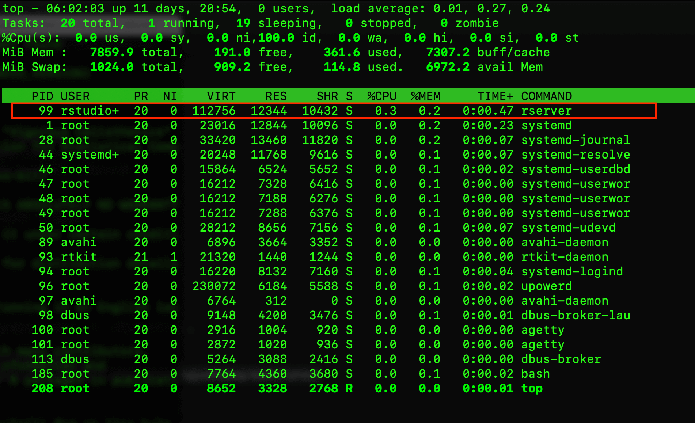
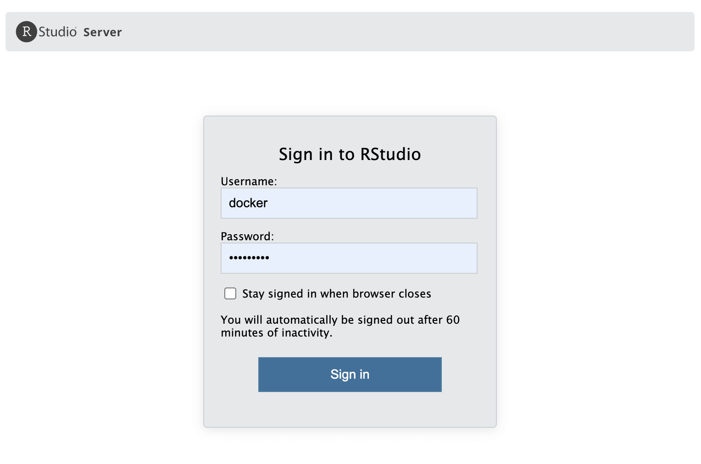

<!-- 
为什么要做这件事
做这件事的困难有哪些
是怎么处理这些困难的
做完后有哪些经验教训
后面还可以做哪些事情
文章层次结构先确定下
 -->

# 本文概览 {#overview}

首先我想说一下此番折腾和写作的目的：

1.  记录折腾的过程，下次折腾的时候可以续上，而不是又一次从头来过，每一次梳理都产出一篇技术博客，培养写作能力，写书正好需要。
1.  构建书籍所需的开发、测试环境，满足书中代码和内容的可重复性，方便读者上机操作，也方便作者在同一环境下协作，更方便后期维护在线版书籍，与社区互动。
1.  CRAN 检查 R 包质量的机器中包含 Fedora 36（截止写作时间），在可预见的未来会继续使用 Fedora，打造一个基于 Fedora 的容器，以便将来开发、检查和发布 R 包。书籍写作待到合适时候，随附的数据和代码以Ｒ包的形式独立出来，涉及Ｒ包开发、测试和发布，也需要开发环境。

::: rmdtip
在没有特别说明的情况下，下文提及的 RStudio 表示 RStudio Server 2022.12.0，Fedora 表示 Fedora 37。
:::





以前，我曾在 Windows 系统上安装虚拟机 Oracle VM VirtualBox，然后在[虚拟机内安装 Fedora](/2019/05/rstudio-server-fedora/)，再从源码编译安装 RStudio Server，在 VM （Virtual Machine 虚拟机，我主要用的是 Oracle VM VirtualBox）和 Docker 里折腾过 CentOS 6/7 和 Ubuntu 等系统，基本属于浅尝辄止，干了不少从源码编译的事情，软件装好了，但是没咋用它。装软件比用软件的时间多，时间久了，越装越快，越装越多，把 Fedora、RedHat 和 openSUSE 也装了一遍。这几年，RStudio 对 Fedora 提供更好的支持，可以通过 Fedora 的官方软件仓库安装 RStudio Server，这极大地方便了用户 ---- RStudio (Server) :heart: Fedora (Server)。

{ width=55% }

有了上面的基础，感觉打造基于 Fedora 的数据分析环境的时机到了。那么，先拿我的书籍项目来试水吧。借助 GitHub Action 构建 Docker 镜像，再让 GitHub Action 用自己构建的 Docker镜像编译书籍。对我来说会有一些挑战，需要了解一点Fedora 37 系统及其软件管理器 dnf，一些 Linux 常用命令，Docker 常用命令，Dockerfile 常用命令，Ｒ包及其依赖，笔者基础薄弱，边学边用，边折腾边积累。做完之后，感觉有点复杂，但是不难，本文会尽量详加介绍此番折腾的过程，作为入门级教程应该足够。对自己的这番折腾总结一下，就是对软件工具有所了解，但原理不清楚，做的是胶水工作，不够硬核和底层。

{ width=35% }

Docker 镜像以打包的方式处理依赖问题。其一软件依赖，比如书籍项目要求 Ｒ版本 4.2.0 及以上，截止本文发布时间，tensorflow 要求 Python 3.7 至 3.10。在不从源码编译的情况下，Fedora 37 只有 Python 3.11.x，Fedora 36 仅支持 R 4.1.x。其二 Ｒ包依赖，从Ｒ包官网了解 R 包依赖及其对系统软件的依赖。这次直接使用 Fedora 37 了事，不想在 Fedora 36 上从源码编译 R 软件，而 tensorflow 过段时间肯定会支持新版本 Python 3.11.x[^r-devel]。在构建 Docker 镜像时，没有从源码编译 R、Python、TinyTeX 等软件，是因为 Fedora 系统更新快，内置的软件版本比较新，足够满足书籍开发所需，用不着从源码编译，也省心省力，何乐不为。

[^r-devel]: 以前从源码编译软件的事情没少干，比如[从源码安装最新的开发版 R 软件](/2019/05/r-devel-ubuntu/)，[在 Fedora Server 上从源码安装 RStudio Server](/2019/05/rstudio-server-fedora/)。

目前打包了两个 Docker 镜像，本地开发推荐标准版 Docker 镜像，包含 Ｒ 软件、常见系统依赖、RStudio Server。本地复现书籍内容推荐专业版 Docker 镜像，包含更多的 Ｒ包、更多的系统依赖、Python 虚拟环境、CmdStan 框架、配置 Quarto 及 Pandoc等。专业版是在标准版的基础上又添加许多书籍开发和测试的软件工具。因为知道书籍项目的依赖很多，又存在前述诸多不熟悉的地方，开发 Dockerfile 是分阶段进行的，首先在本地开发的标准版 Dockerfile，然后是专业版，期间又学习了 GitHub Action，利用 GitHub Action提供的环境构建专业版 Docker镜像。[GitHub Action 是基于虚拟机的](https://github.com/actions/runner-images)，使用自定义容器的目的是方便维护和复现书籍内容，提供可重复性的重要支持。


# 开发 Dockerfile --- 入门篇 {#develop-dockerfile}


Dockerfile 文件主要包含一系列命令操作，看起来像是将 Shell 命令搬迁到文件中。接下来，陆续介绍 Dockerfile 里的内容，涉及常用的 Docker 命令，一起制作和使用 Docker 镜像。

|命令|含义|
|:--|:----|
|docker login| 登陆账户|
|docker logout| 登出账户|
|docker pull| 拉取镜像|
|docker run | 创建容器|
|docker exec| 运行命令|
|docker build| 构建镜像|
|docker push| 推送镜像|
|docker images| 查看镜像|
|docker rmi | 删除镜像|
|docker commit| 容器快照|
|docker ps| 查看容器|
|docker rm | 删除容器|
|docker start| 启动容器 |
|docker stop| 停止容器|


了解以上命令足够完成 Docker 入门和本文所涉及的项目，更多命令和详细介绍可参见书籍[《Docker 从入门到实践》](https://yeasy.gitbook.io/docker_practice/)。

## 登陆 Dockerhub

首先从 Docker 官网 <https://www.docker.com/> 下载和安装 Docker 桌面客户端软件，然后在 Docker Hub 上注册账户 <https://hub.docker.com/>。

```bash
echo "$DOCKER_PASSWORD" | docker login -u "$DOCKER_USERNAME" --password-stdin
```

- `DOCKER_USERNAME` 用户名
- `DOCKER_PASSWORD` 密码

## 拉取 Fedora 镜像

```
docker pull fedora:37
```

## 创建并进入容器

```
# 创建容器
docker run -itd -p 8484:8787 --name=daar \
  --privileged=true -v "/${PWD}:/home/rstudio" \
  -e USER=docker -e PASSWORD=docker123 fedora:37

# 进入容器
docker exec -it daar bash
```

`--privileged=true`
:   有时候，我们需要以管理员权限安装一些系统软件，比如 `sudo dnf install optipng`

`--name` 
:  给容器取名字 daar

`-i`
:  即 ` --interactive` 交互模式运行，让 STDIN （标准输入）开着

`-t`
:  即 `--tty` 分配一个 pseudo-TTY （终端模拟器，伪终端）

`-d` 
:  即 `--detach=false` 默认在后台运行容器

`-p` 
:  即 `--publish` 指定容器暴露的端口，`8484:8787` 表示主机端口 8484 映射容器端口 8787，这是主机和容器之间通信的一种方式

`-e` 
:  即 `--env` 指定环境变量，供容器使用

`-v` 
:  即 `--volume` 挂载主机目录到容器中的目录，主机和容器共享目录


## 配置标准用户账户


先创建非 root 的普通用户账户，设置好密码。如下便是创建用户组 staff，再创建用户 docker 并把它添加到 staff 组中。

```
# 添加用户组 staff 及用户 docker
groupadd staff \
  && useradd -g staff -d /home/docker docker
# 设置用户 docker 的密码为 docker123
echo 'docker:docker123' | chpasswd
```

如果用户账户及密码不对，则会报下面的错误。

```
Error: Incorrect or invalid username/password
```

还可以顺便添加到 `/etc/sudoers` 文件中，以便使用 sudo 命令。下面将 docker 用户添加到 sudoers 文件中，以后可以在 RStudio 的 Terminal 窗口中使用 sudo 命令安装系统仓库中的软件。

```
echo "docker	ALL=(ALL) 	ALL" >> /etc/sudoers
```

进一步，如果想连密码都不需要输入就可以安装系统软件，那么可以

```
echo "docker	ALL=(ALL) 	NOPASSWD: ALL" >> /etc/sudoers
```

更多说明可以见文件 `/etc/sudoers` 的内容。

## 安装配置 R 软件 {#setup-r}

安装 R-devel 自不必说，安装 R-littler 和 R-littler-examples 是为了在命令行快速地安装 R 包，配置软链接相当于快捷方式，再设置 CRAN 镜像、R 包安装目录和 R 运行的语言环境，最后用快捷方式安装两个 R 包。

```
# 安装 R 软件
dnf -y R-devel R-littler R-littler-examples
# 配置 R 软件
ln -s /usr/lib64/R/library/littler/examples/install.r /usr/bin/install.r \
 && ln -s /usr/lib64/R/library/littler/examples/install2.r /usr/bin/install2.r \
 && ln -s /usr/lib64/R/library/littler/examples/installGithub.r /usr/bin/installGithub.r \
 && ln -s /usr/lib64/R/library/littler/examples/testInstalled.r /usr/bin/testInstalled.r \
 && mkdir -p /usr/local/lib/R/site-library \
 && echo "options(repos = c(CRAN = 'https://cran.r-project.org/'))" | tee -a /usr/lib64/R/etc/Rprofile.site \
 && chmod a+r /usr/lib64/R/etc/Rprofile.site \
 && echo "LANG=en_US.UTF-8" >> /usr/lib64/R/etc/Renviron.site \
 && echo "export LC_ALL=en_US.UTF-8"  >> /etc/profile \
 && echo "export LANG=en_US.UTF-8"  >> /etc/profile \
 && echo "CXXFLAGS += -Wno-ignored-attributes" >> /usr/lib64/R/etc/Makeconf \
 && Rscript -e 'x <- file.path(R.home("doc"), "html"); if (!file.exists(x)) {dir.create(x, recursive=TRUE); file.copy(system.file("html/R.css", package="stats"), x)}' \
 && install.r docopt \
 && install2.r remotes
```

`install2.r` 命令需要 docopt 包，`installGithub.r` 命令需要 remotes 包。

::: rmdnote

```
Error in file.copy(file.path(R.home("doc"), "html", "R.css"), outman) :
  (converted from warning) problem copying /usr/share/doc/R/html/R.css
to /usr/lib64/R/library/00LOCK-<package>/00new/<package>/html/R.css:
No such file or directory
```

下面一行是为了处理安装 R 包时发出的上面警告。

```
Rscript -e 'x <- file.path(R.home("doc"), "html"); if (!file.exists(x)) {dir.create(x, recursive=TRUE); file.copy(system.file("html/R.css", package="stats"), x)}'
```
:::

最后，赋予 docker 用户访问 R 包安装目录的全权。

```
chown -R docker:staff /usr/local/lib/R/site-library
```


## 安装配置 RStudio Server {#setup-rstudio-server}

首先安装 RStudio Server 软件，然后设置为系统启动时启动

```
# 安装 rstudio-server 软件
dnf -y install rstudio-server \
 # 复制 rstudio-server.service 文件到初始化
 && cp /usr/lib/systemd/system/rstudio-server.service /etc/init.d/ \
 # 添加执行权限
 && chmod +x /etc/init.d/rstudio-server.service \
 # 注册启动服务
 && systemctl enable rstudio-server
```

rstudio-server.service 文件的路径可以通过命令 `rstudio-server status` 找到。

::: rmdnote
需要将 rstudio-server 服务注册到系统启动任务中，这样拉起容器的时候，rstudio-server 服务自动启动，就可以浏览器登陆和使用了。否则，需要先进入容器，启动 rstudio-server 服务，这就比较麻烦。
:::

RStudio Server 服务默认使用 8787 端口，浏览器登录使用服务，需要做主机端口和容器服务端口的映射，容器内需要暴露 8787 端口。

```
EXPOSE 8787/tcp
```

默认情况下，启动容器是不会启动任何服务的，包括一些系统服务，如 systemd。因此需要添加如下命令，告诉系统初始化。

```
CMD [ "/sbin/init" ]
```

::: rmdwarn

若系统初始化时不启动 systemd 服务，在使用 R 语言操作跟时区、日期相关的包和函数时，会报警告。

```
System has not been booted with systemd as init system (PID 1). Can't operate.
Failed to connect to bus: Host is down
```

```
Warning in system("timedatectl", intern = TRUE) :
   running command 'timedatectl' had status 1
```
:::


配置好后，可以使用 timedatectl 命令查看当前容器中的时区设置。

```bash
timedatectl show --property=Timezone
```

正常情况下，可以看到输出：

```
Timezone=Etc/UTC
```

而在 R 控制台输入 `Sys.timezone()` 可以看到 `UTC`，这是我在 Dockerfile 里设置好的，是预期的输出。


## 安装一些 LaTeX 宏包 {#setup-latex}

在以上述方式安装 R 软件的同时，会安装不少 LaTeX 宏包，为了能在 R Markdown 文档中使用中文环境，编译出 PDF 格式文档，还需要安装一些额外的 LaTeX 宏包。

```
dnf -y install texlive-sourceserifpro \
   texlive-sourcecodepro \
   texlive-sourcesanspro \
   texlive-pdfcrop \
   texlive-dvisvgm \
   texlive-dvips \
   texlive-dvipng \
   texlive-ctex \
   texlive-fandol \
   texlive-xetex \
   texlive-framed \
   texlive-titling \
   texlive-fira \
   texlive-awesomebox \
   texlive-fontawesome5 \
   texlive-fontawesome \
   texlive-newtx \
   texlive-tcolorbox
```

还有几个常用的工具一块安装上。

```
dnf -y install ghostscript optipng ImageMagick
```

[ghostscript](https://www.ghostscript.com/) 做字体处理，[optipng](https://optipng.sourceforge.net/) 做图片优化，[ImageMagick](https://imagemagick.org/) 做图像处理。

{ width=35% }

## 安装一些 R 包依赖

有很多 R 包会依赖一些系统软件，下面是一些最常用的。

```
dnf -y install libcurl-devel \
   openssl-devel \
   libssh2-devel \
   libgit2-devel \
   libxml2-devel \
   glpk-devel \
   gmp-devel \
   cairo-devel \
   v8-devel \
   igraph-devel \
   NLopt-devel
```

- （广义）线性混合效应模型包 [lme4](https://github.com/lme4/lme4) 需要 nloptr 包，[nloptr](https://github.com/astamm/nloptr) 包需要 NLopt-devel
- 网络分析与可视化包 [igraph](https://github.com/igraph/rigraph) 需要 libxml2-devel、glpk-devel、gmp-devel 等

## 安装一些系统软件

每个具体的实战项目所需的环境依赖是不一样的，下面这些有的必须，有的可选，必须和可选需要具体问题具体分析，具体到我的书籍项目，可以都安装上。

- glibc-langpack-en 英文环境所需语言包（必须）
- passwd 提供 chpasswd 命令修改账户密码（必须）
- initscripts 连带 systemd 一起安装，系统初始化启动脚本（必须）
- bzip2 文件（夹）压缩命令（可选）
- cargo R 包 gifski 需要（可选）
- firewalld 启用防火墙服务（可选）
- python3-virtualenv 创建 Python 虚拟环境（可选）

```
dnf -y install glibc-langpack-en \
   automake \
   texinfo \
   cargo \
   bzip2 \
   passwd \
   initscripts \
   firewalld \
   python3-virtualenv 
```

Dockerfile 里设置系统语言环境和时区，最后，将工作目录切换到 docker 用户主目录。

```
# Set locale
ENV LANG=en_US.UTF-8 \
    LANGUAGE=en_US.UTF-8

# Set default timezone
ENV TZ UTC

WORKDIR /home/docker/
```


## 本地构建 Docker 镜像

从指定 Dockerfile 构建 Docker 镜像

```
docker build --build-arg "QUARTO_VERSION=1.2.280" \
  -t xiangyunhuang/daar:latest -f ./Dockerfile .
```

- `-f` 即 `--file` 指定 Dockerfile 的路径
- `-t` 即 `--tag` 指定构建成功后镜像的名称
- `--build-arg` 传递构建参数给 Dockerfile 的 ARG 参数变量
- `.` 指定 Dockerfile 文件所在的目录，`.` 表示当前目录。

从镜像拉起容器

```
docker run -itd -p 8383:8787 --name=daar \
  --privileged=true -v "/${PWD}:/home/docker" xiangyunhuang/daar:latest
```

进入容器中查看各项配置是否正常，若有缺失，安装依赖并记录，直到本地编译出来 HTML、DOCX、PDF 和 EPUB 格式书籍，接着将缺失的依赖和配置添加到 Dockerfile 文件中，再重新构建镜像、检查、测试。

```
docker exec -it daar bash
```

命令 `docker exec` 的参数 `-i` 和 `-t` 的含义与命令 `docker run` 是一样的。

## 本地发布 Docker 镜像

一切正常后，推送到 Docker Hub。

```
docker push xiangyunhuang/daar:latest
```

常常不是一次性成功的，有时候需要修改镜像，进入容器中，添加一些环境依赖后，退出容器，想把新的内容加入镜像。从容器快照，打包镜像，提交容器，操作效果类似 `git commit -m`。

```bash
docker commit -a "Xiangyun Huang <xiangyunfaith@outlook.com>" \
 -m "Docker Image for Book" f8bb7e701514 xiangyunhuang/daar:1.0.0
```

- `-a` 表示 `author` 指定提交该镜像的作者
- `-m` 提交镜像的说明文字
- `f8bb7e701514` 容器的 ID
- `xiangyunhuang/daar` 镜像的名字
- `1.0.0` 指定镜像 TAG ，如果不指定，默认就是 latest

::: rmdwarn
开发 Dockerfile、 构建镜像、测试功能、发布镜像的这个过程不是一帆风顺的，要经过多次迭代。
:::


## 使用自定义的镜像 {#use-custom-images}

最后，构建的 Docker 镜像包含 13 层，好些层还很大，动辄上 G。


[Docker Hub](https://hub.docker.com/) 上显示 [3.29 G](https://hub.docker.com/repository/docker/xiangyunhuang/daar/tags?page=1&ordering=last_updated)，拉取到本地后，从图中可以看到 Docker 镜像的大小是 8.39 G，由此可知，Docker Hub 存储的镜像是压缩的。


进入容器后，通过命令 top 可以看到启动的服务及其状态信息，可以看到 RStudio Server 服务随着容器启动后自动加载了。



容器中已安装的[字体](data/installed_fonts.txt)、[软件包](data/installed_packages.txt)、[R 包](data/installed_r_packages.txt)和 [texlive 发行版](data/installed_texlive.txt)，点击链接即可查看具体内容，可以搜索查找是否已安装[^installed]。

[^installed]: 各个文件保存的内容分别是如下命令输出的结果：

    ```bash
    dnf list installed >> installed_packages.txt
    fc-list | sort >> installed_fonts.txt
    dnf list installed | grep texlive >> installed_texlive.txt
    ```

现在，可以从浏览器网址 <http://localhost:8383/> 登陆 RStudio Server， 登陆页见下图 \@ref(fig:rstudio-server-login)




登陆进来后，可以看到 RStudio Server 的界面，与桌面版没啥区别。


1. R 控制台，命令窗口
1. 帮助子窗口，显示帮助文档
1. 环境子窗口，显示当前运行环境中的变量信息。
1. RStudio IDE 得主菜单栏
1. 当前登陆 RStudio Server 的用户。

::: rmdtip
Docker 中的 RStudio 及相关软件的信息如下：

- RStudio 2022.12.0+353 "Elsbeth Geranium" Release (7d165dcfc1b6d300eb247738db2c7076234f6ef0, 2022-12-18) for Fedora release 37 (Thirty Seven)
- Mozilla/5.0 (Macintosh; Intel Mac OS X 10_15_7) AppleWebKit/537.36 (KHTML, like Gecko) Chrome/108.0.0.0 Safari/537.36
:::


`capabilities()` 查看当前 R 软件的能力


1. 除了 X11、 aqua 和 libxml 都支持，已然足够使用。
1. 可以看到主机通过挂载方式共享的文件目录

`sessionInfo()` 查看当前运行窗口的会话（Session）信息


## Docker 参数作为环境变量  {#docker-arg-env}

### 设置 Python 虚拟环境

书中数据建模的部分打算介绍一些深度学习的内容，涉及 Python 模块 tensorflow，设置 Python 虚拟环境，让 R 包 reticulate 能够发现和使用它。

```
# Set Python virtualenv
ENV RETICULATE_PYTHON_ENV=$RETICULATE_PYTHON_ENV
ENV RETICULATE_PYTHON=${RETICULATE_PYTHON_ENV}/bin/python

COPY requirements.txt requirements.txt
RUN virtualenv -p /usr/bin/python3 ${RETICULATE_PYTHON_ENV} \
 && source ${RETICULATE_PYTHON_ENV}/bin/activate \
 && pip install -r requirements.txt
```

当在 R 控制台中，运行 `reticulate::py_config()` 看到如下内容，说明 Python 虚拟环境配置好了。

```
python:         /opt/.virtualenvs/r-tensorflow/bin/python
libpython:      /usr/lib64/libpython3.11.so.1.0
pythonhome:     /opt/.virtualenvs/r-tensorflow:/opt/.virtualenvs/r-tensorflow
virtualenv:     /opt/.virtualenvs/r-tensorflow/bin/activate_this.py
version:        3.11.1 (main, Dec  7 2022, 00:00:00) [GCC 12.2.1 20221121 (Red Hat 12.2.1-4)]
numpy:          /opt/.virtualenvs/r-tensorflow/lib64/python3.11/site-packages/numpy
numpy_version:  1.24.1

NOTE: Python version was forced by RETICULATE_PYTHON
```

### 安装开发版 R 包

书中使用了一些存放在 Github 上的 R 包，它们还没有发布在 CRAN 上或者书籍本身需要开发版的 R 包。Github 有访问量限制， 只有设置个人访问令牌才不会超额。从 Github 上安装 R 包时，借助 export 命令导入环境变量，一次性使用 GITHUB_PAT，防止个人的 GITHUB_PAT 随 Docker 镜像一起分发出去。


```
# Set Extra R Packages
COPY DESCRIPTION DESCRIPTION
RUN export GITHUB_PAT=${GITHUB_PAT} && Rscript -e "remotes::install_deps('.', dependencies = TRUE)"
```

### 安装 Quarto 和 Pandoc

Quarto 软件内置一份 Pandoc 软件，Quarto 1.2.280 包含 Pandoc 2.19.2，Fedora 37 系统软件仓库不提供 Quarto，需要从 Quarto 官网下载安装。考虑到将来可能升级 Quarto，下面设置了环境变量 `QUARTO_VERSION`。用 Quarto 内置的版本替换了 Fedora 37 提供的低版本 Pandoc 2.14.0.3。

```
# Set Quarto and Pandoc
RUN curl -fLo quarto.tar.gz https://github.com/quarto-dev/quarto-cli/releases/download/v${QUARTO_VERSION}/quarto-${QUARTO_VERSION}-linux-amd64.tar.gz \
 && mkdir -p /opt/quarto/ \
 && tar -xzf quarto.tar.gz -C /opt/quarto/ \
 && ln -s /opt/quarto/quarto-${QUARTO_VERSION}/bin/quarto /usr/bin/quarto \
 && mv -f /usr/bin/pandoc /usr/bin/pandoc.bak \
 && ln -s /opt/quarto/quarto-${QUARTO_VERSION}/bin/tools/pandoc /usr/bin/pandoc \
 && rm -rf quarto.tar.gz
```


最后，关于环境变量，简单总结一下：

1.  Dockerfile 里 ENV 命令设置的环境变量是永久的，会随镜像一起打包。
1.  Linux 里 export 命令设置的环境变量是一次性的，Dockerfile 里 RUN 命令运行结束就消失了。
1.  Dockerfile 里的环境变量是可以通过 Docker ARG 参数在构建镜像时传递进去的。


## 清理 Docker 镜像垃圾

缺失软件依赖、R 包依赖、错误配置环境等导致从 Dockerfile 构建镜像的过程中报错。构建失败是很正常的，本地多次尝试构建镜像，会产生很多垃圾，不及时清理，Docker 会显示空间不足，而拉取失败，所以，每隔一段时间清理失败的构建及相关容器。

```
# 查看镜像
docker images
# 删除镜像
docker rmi 镜像 ID
# 查看容器
docker ps -a
# 删除容器
docker rm 容器名称
```


## Github Action :heart: Docker {#github-action-docker}


Github Action 默认是虚拟机中运行任务，也可以配置为在容器中运行任务。分两步：

1. 利用 Github Action 在线构建和发布自定义的 Docker 镜像。
1. 利用 Github Action 从自定义的 Docker 镜像拉起容器，在容器里编译和部署书籍。


### 在线构建和发布镜像

<!-- GHA + 构建镜像+ Docker Hub / GitHub Packages 发布 -->

将本地的构建过程迁移到线上，随着 Dockerfile 的更新，让 Github Action 自动帮我构建、更新镜像，这期间用到了一些 Action，其中最重要的是 `docker/build-push-action@v3`，下面展示文件 `docker-build-push.yml` 关键的部分，完整的文件内容见[链接](https://github.com/XiangyunHuang/data-analysis-in-action/blob/main/fedora_rstudio_pro.Dockerfile)。

```
jobs:
  docker:
    if: "contains(github.event.head_commit.message, '[docker]')"
    runs-on: ubuntu-22.04
    env:
      GITHUB_PAT: ${{ secrets.GITHUB_TOKEN }}
      RETICULATE_PYTHON_ENV: "/opt/.virtualenvs/r-tensorflow"
      CMDSTAN_VERSION: "2.31.0"
      CMDSTAN: "/opt/cmdstan/cmdstan-2.31.0"
      QUARTO_VERSION: "1.2.280"
    # 这中间还有下载代码仓库，登陆 Docker Hub 等操作
    steps:
      -
        name: Build and push
        uses: docker/build-push-action@v3
        with:
          context: .
          file: ./fedora_rstudio_pro.Dockerfile
          push: true
          tags: xiangyunhuang/daar:1.0.0
          build-args: |
            CMDSTAN=${{ env.CMDSTAN }}
            CMDSTAN_VERSION=${{ env.CMDSTAN_VERSION }}
            RETICULATE_PYTHON_ENV=${{ env.RETICULATE_PYTHON_ENV }}
            QUARTO_VERSION=${{ env.QUARTO_VERSION }}
            GITHUB_PAT=${{ env.GITHUB_PAT }}
```

Github Action 默认是采用虚拟机，这里选择 ubuntu-22.04 系统，配置一些系统环境变量，这些环境变量再作为参数，传入镜像构建过程中，`build-args` 相当于 `docker build --build-arg ARG` 构建。构建镜像需要指定 Dockerfile 文件路径 （即 `file: ./fedora_rstudio_pro.Dockerfile`） 及其所在目录（`context: .`）。构建还需要指定镜像的标签，即 `tags: xiangyunhuang/daar:1.0.0`。更多关于 `docker/build-push-action@v3` 的介绍见其官网 <https://github.com/docker/build-push-action>。

::: rmdtip
通过改变 Github Action 的环境变量（如 CMDSTAN、CMDSTAN_VERSION、QUARTO_VERSION 和 GITHUB_PAT 等）改变 Docker 镜像打包的软件版本、系统环境变量，实现了统一集中管理软件版本。
:::

构建完成后，陆续发布到了 GitHub Packages 和 Docker Hub

1.  Docker Hub 镜像地址 <https://hub.docker.com/repository/docker/xiangyunhuang/daar>
1.  GitHub Packages 地址 <https://github.com/XiangyunHuang/data-analysis-in-action/pkgs/container/daar>

拉取构建的镜像，如下：

```bash
# Docker Hub 镜像
docker pull xiangyunhuang/daar:latest
# GitHub Packages 镜像
docker pull ghcr.io/xiangyunhuang/daar:latest
```

### 在线编译和部署书籍

除了用 Github Action 来在线构建和发布镜像，还可以在线编译和部署书籍。我配置了两个任务：

1. 一个 Github Action 任务提供 Ubuntu 虚拟机，安装、配置和测试书籍所需的依赖后，编译书籍，获得网页版后，再发布到 [Github Pages](https://xiangyunhuang.github.io/data-analysis-in-action/) 和 [bookdown.org](https://bookdown.org/xiangyun/data-analysis-in-action/) (RStudio Connect)。
1. 另一个 Github Action 任务提供 Docker 环境，镜像是自己开发构建的，拉起容器，编译书籍后，将网页版部署到 [Netlify](https://data-analysis-in-action.netlify.app/)。

简言之，就是

1. GHA （Ubuntu VM）+ Github Pages / RStudio Connect （bookdown）
1. GHA （Ubuntu VM）+ Docker（Fedora） + Netlify

值得一提的是 GitHub Action 中使用容器的方法，确保虚拟机和容器共享书籍项目，关键配置如下：

```
jobs:
  build-deploy:
    if: "!contains(github.event.head_commit.message, '[docker]')"
    runs-on: ubuntu-22.04
    container:
      image: ghcr.io/xiangyunhuang/daar:1.0.0
      credentials:
         username: ${{ github.repository_owner }}
         password: ${{ secrets.GITHUB_TOKEN }}
      volumes:
        - ${{ github.workspace }}:/home/docker
      ports:
        - 8383:8787
```


`runs-on: ubuntu-22.04` 往下配置容器 `container:`，依次包括镜像来源，Github 访问令牌（因为我是从 Github Packages 获取镜像的），主机到容器的目录映射（挂载共享数据文件），端口映射（可选，因为并没有打算登陆 RStudio Server，当任务运行时，不限制登陆，感兴趣的读者可以试试看）。

接下来就是进入容器，进入书籍项目，再执行编译。

```
    steps:
      - name: Checkout
        uses: actions/checkout@v3
        
      - name: Render Book
        run: |
          quarto render
```

最后，将编译出来的网页版书籍发布到 Netlify，相关配置如下。

```
      - name: Deploy to Netlify
        if: contains(env.isExtPR, 'false')
        id: netlify-deploy
        uses: nwtgck/actions-netlify@v2
        with:
          publish-dir: './_book'
          production-branch: main
          github-token: ${{ secrets.GITHUB_TOKEN }}
          deploy-message:
            'Deploy from GHA: ${{ github.event.pull_request.title || github.event.head_commit.message }} (${{ github.sha }})'
          enable-pull-request-comment: true
          enable-commit-comment: true
        env:
          NETLIFY_AUTH_TOKEN: ${{ secrets.NETLIFY_AUTH_TOKEN }}
          NETLIFY_SITE_ID: ${{ secrets.NETLIFY_SITE_ID }}
        timeout-minutes: 10
```

指定发布的文件目录，配置 Netlify 的访问令牌 `NETLIFY_AUTH_TOKEN` 和网站 ID `NETLIFY_SITE_ID`，这些都可以存储在书籍项目仓库的设置里。更多详情见 `nwtgck/actions-netlify@v2` 的官网 <https://github.com/nwtgck/actions-netlify>。


# 优化 Dockerfile --- 进阶篇 {#optimize-dockerfile}

优化的目标主要是：

1. Docker 镜像尽可能小一些，不必要的依赖能少则少。
1. Dockerfile 配置更灵活些，维护更方便些。

优化方法就是逐行思考命令优化的可能，像多次使用到的命令，如 dnf 值得重点关注。每个 Dockerfile 文件中的 RUN 命令会产生中间层，也是重点关注对象，该合并的合并。

::: rmdtip
当前，就具体的书籍项目来说，按以上步骤构建的镜像体积大了些，但也小不了太多，目前是 3.29 G，毕竟用到的软件和 R 包很多。比如

- Edzer Pebesma, Roger Bivand 的书 [Spatial Data Science with applications in R](https://github.com/edzer/sdsr) 配套镜像高达 18 G
- Robin Lovelace, Jakub Nowosad, Jannes Muenchow 的书[Geocomputation with R](https://github.com/Robinlovelace/geocompr) 配套镜像 2G

在书籍完成初稿后，所需软件和 R 包依赖基本稳定后，可以考虑集中一波优化操作。
:::


## 重新组织项目结构

之前低估书籍项目的依赖复杂度，应该拆分出来基础版、标准版和专业版，便于分段开发、测试和维护，也可以对镜像瘦身，这可以模仿项目[Docker images for RStudio Professional Products](https://github.com/rstudio/rstudio-docker-products)的做法。也可以采用 Docker 多阶段构建让镜像瘦身，以一个 Dockerfile 文件划分出基础版、标准版和专业版，让镜像的功能拆分更加合理，降低耦合，更好维护。

## 安装二进制 R 包

后来，我也注意到 Fedora 社区提供编译好的 Ｒ包，约支持 CRAN 上发布的 18000个Ｒ包，编译和安装 Ｒ包本是费时费力的事情，需要处理 Ｒ包之间的依赖，以及Ｒ包对系统软件的依赖，现在通过 Fedora Copr [cran2copr](https://github.com/Enchufa2/cran2copr) (RPM repo of CRAN packages for Fedora) 可以非常轻松地安装 Ｒ包。

直接安装二进制包加快编译构建速度，比如益辉的项目[Extra Binary R packages for the Homebrew R](https://github.com/yihui/homebrew-cran-extra)，提供一些 CRAN 上不再可用的二进制 R 包，对 macOS 用户就比较友好。

```bash
dnf copr -y enable iucar/cran
dnf install -y R-CoprManager
```

比如安装 R 包 ggplot2 就和安装软件的操作一样了，更多介绍详情可以参考[Fedora Packages of R Software](https://cran.r-project.org/bin/linux/fedora/)。

```bash
dnf install -y R-CRAN-ggplot2
```

::: rmdnote
如何从 DESCRIPTION 文件读取 R 包列表，又如何将安装 R 包转化为 Shell 命令？需要注意命名规则，比如 ggplot2 包对应 R-CRAN-ggplot2，而未在 CRAN 上发布的 R 包需要单独处理。
:::


```r
# 根据 DESCRIPTION 文件获取 R 包依赖
desc_deps <- desc::desc_get_deps()
# 筛选 Imports 和 Suggests 级的依赖包
desc_pkgs <- desc_deps[desc_deps$type %in% c("Imports", "Suggests"), "package"]
# 添加前缀 R-CRAN-
desc_pkgs <- paste("R-CRAN-", desc_pkgs, sep = "")
# 去掉 Github 上的 R 包后，将 R 包列表保存到文件
cat(desc_pkgs, file = "desc_pkgs.txt")
```

先从 Copr 仓库安装编译好的二进制的 R 包，再安装 cmdstanr 包（来自专属仓库的 R 包），最后安装 Github 上的 R 包，并清理现场。

```
# Set Extra R Packages
COPY DESCRIPTION DESCRIPTION
COPY desc_pkgs.txt desc_pkgs.txt
RUN dnf -y copr enable iucar/cran \
  && dnf -y install R-CoprManager \
  && dnf -y install $(cat desc_pkgs.txt) \
  && Rscript -e 'install.packages("cmdstanr", repos = c("https://mc-stan.org/r-packages/", getOption("repos")), type="source")' \
  && export GITHUB_PAT=${GITHUB_PAT} \
  && Rscript -e "remotes::install_deps('.', dependencies = TRUE)" \
  && rm -f DESCRIPTION desc_pkgs.txt
```

::: rmdwarn
showtextdb 和 showtext 包是例外，必须从源码安装，否则，不能加载字体。

```
install2.r showtextdb showtext
```
:::


::: rmdtip
GitHub Action 提供的 Ubuntu 虚拟机和自定义的 Fedora 镜像都可以用 DESCRIPTION 文件管理书籍依赖的Ｒ包，当然用户本地也可以用，这达到了依赖集中管理和使用。
:::


## 不要安装弱依赖

配置 dnf 软件包管理器，不要安装软件弱依赖，弱依赖对软件正常运行是不必要的，类似 R 包的 Suggests 级依赖，给 Docker 镜像瘦身。

```bash
echo "install_weak_deps=False" >> /etc/dnf/dnf.conf
```

这操作基本相当于在 Ubuntu 系统上给 `apt-get` 命令加上 `--no-install-recommends` 参数。

```
apt-get install -y --no-install-recommends PKG
```

以安装软件 proj-devel 为例，配置不安装弱依赖，则只需占用 20 M 空间，而安装弱依赖则需要占用 589 M 空间，这有 **30 倍的瘦身效果**。当然，实际瘦身效果取决于软件本身的弱依赖大小。

配置文件中还有好些个设置，比如下面一行表示不安装软件的帮助文档，这意味着 man 命令无法查看命令帮助手册 [^tinytex]。

[^tinytex]: 这选项设置让我想起了 [TinyTeX](https://github.com/rstudio/tinytex) 项目，为了瘦身，默认不安装 LaTeX 宏包的帮助文档。

```
tsflags=nodocs
```

当输入 `man ls` 结果是 `No manual entry for ls`。当前 `/etc/dnf/dnf.conf` 文件中的配置如下：

```
# see `man dnf.conf` for defaults and possible options

[main]
gpgcheck=True
installonly_limit=3
clean_requirements_on_remove=True
best=False
skip_if_unavailable=True
tsflags=nodocs
install_weak_deps=False
```

更多配置选项和说明见 dnf 软件包管理器文档 <https://dnf.readthedocs.io/en/latest/>。


::: rmdtip
经过上面两步优化，Docker 镜像从 3.29 G 减少到 2.44 G，GitHub Action 构建镜像的时间从 90 分钟减少至 20 分钟。
:::

## 自定义用户账户


从环境变量设置用户账户，在拉取 Docker 容器的时候，传递环境变量 USER 和 PASSWORD 进而自动设置账户，这也是 Rocker 项目的做法，设置[默认账户](https://github.com/rocker-org/rocker-versioned2/blob/master/scripts/default_user.sh)和[初始化用户账户](https://github.com/rocker-org/rocker-versioned2/blob/master/scripts/init_userconf.sh)。下面举个例子，就是这样将用户账户传递进容器的。

```
docker run -itd -p 8484:8787 --name=daar \
  --privileged=true -v "/${PWD}:/home/docker" \
  -e USER=docker -e PASSWORD=docker123 ghcr.io/xiangyunhuang/daar:latest
```

接着，将此用户作为登陆 RStudio 的用户，RStudio 不允许 root 账户登陆的。是否需要将该用户添加到 sudoers 文件中，也是可以通过这种方式控制的，比如再传递变量 `-e ROOT=true` 赋予用户管理员权限，这部分留待读者去实现。


::: rmdnote
Github Action 调用自定义的镜像运行容器，仅支持在容器中以 root 身份运行命令，详见[链接](https://docs.github.com/en/actions/using-github-hosted-runners/about-github-hosted-runners#docker-container-filesystem)。以上配置的 docker 账户是不能在 Github Action 中使用的。`docker run` 命令 `-u` 参数指定以哪个账户在容器运行命令，本地是可以的。
:::

# 本文小结 {#summary}

1.  归纳整理一些踩坑 Github Action / Docker Container / Fedora 37  / RStudio Server，它们的交互及连续测试 CI 和连续部署 CD 的经验。借助 Github Action 打造自定义的镜像，从自定义的镜像中拉起容器，继而编译、测试书稿，再将书籍托管在 Netlify / Github Pages 等服务上。

1.  学习 [Rocker](https://github.com/rocker-org/rocker) 项目，产出一个镜像文件 Dockerfile，打造一个基于 Fedora 37 + RStudio Server 数据分析环境。Fedora 和 CentOS / RedHat 是一脉相承的，相比而言，Fedora 更新、更适合折腾，同情还在 CentOS 6/7 中[挣扎的人](https://yuanfan.rbind.io/project/installr/)，话说 [CentOS 已经不是以前的 CentOS 了](https://blog.centos.org/2020/12/future-is-centos-stream/)。填坑[从零搭建现代数据科学平台](https://github.com/cosname/cosx.org/issues/904)，充实[数据分析师的技能栈](https://github.com/cosname/cosx.org/issues/1047)。通过借鉴、模仿、抄袭等办法学习优秀的开源项目，融入自己的项目中解决问题。

1.  写书的过程中，发现写作水平的提升空间还很大，写长博客是锻炼的方式。写作参考范叶亮的技术笔记 --- [Tech 101](https://leovan.me/tech101/) 详细记录在虚拟机里搭建 Hadoop / Spark / Hive 的过程。过程力求详细，坑记录完整，以后就省心省力。在这样一些基础繁琐的问题上解决得更好、更有效率是很有意义的，顺便可以就某个或某几个工具深入学习、交流、分享。

# 参考材料 {#references}

1. Google 搜索和 SO 爆栈网
1. Docker images for RStudio Professional Products <https://github.com/rstudio/rstudio-docker-products>
1. R configurations for Docker <https://github.com/rocker-org/rocker>
1. Docker 从入门到实践 <https://yeasy.gitbook.io/docker_practice/>
1. Best practices for writing Dockerfiles <https://docs.docker.com/develop/develop-images/dockerfile_best-practices/>
1. Deployment, Configuration, and Administration of Fedora 37. <https://docs.fedoraproject.org/en-US/fedora/latest/system-administrators-guide/>
1. GitHub Action 官方文档 <https://docs.github.com/en/actions>
1. Netlify 官方文档 <https://docs.netlify.com/>
1. Posit Connect 官方文档 <https://docs.posit.co/connect/user/api-keys/>
1. RStudio Server (Posit Workbench) 官方文档 <https://docs.posit.co/rsw/>
1. Bash 教程 <https://github.com/wangdoc/bash-tutorial>
1. Fedora Packages of R Software. <https://cran.r-project.org/bin/linux/fedora/>

