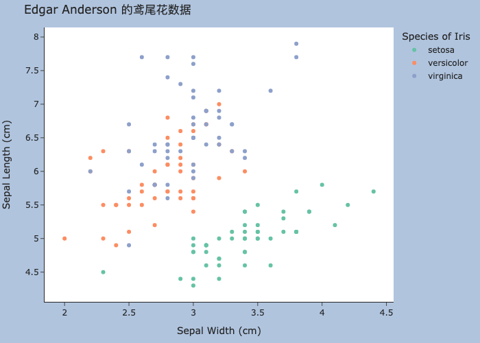
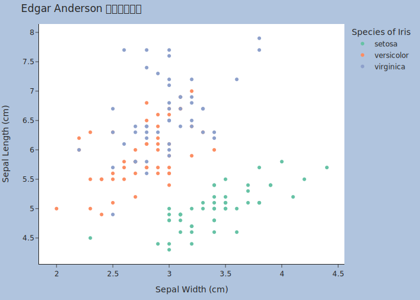
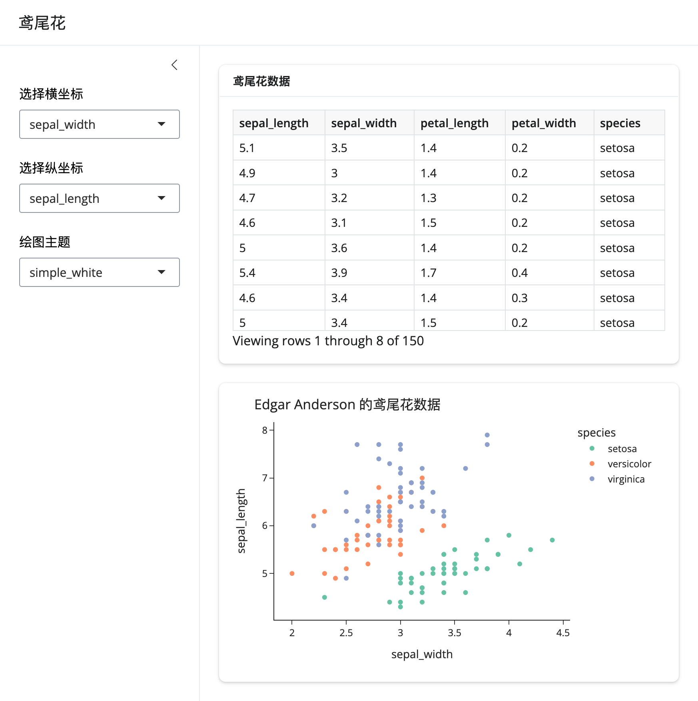

```{css}
#| echo: false

.modebar {
  display: none !important;
}

.plotly-graph-div {
  text-align: center;
  display: block; 
  margin-left: auto; 
  margin-right: auto;
}
```

本文介绍如何在 Python 语言中开发 Shiny 应用，涉及 shiny 框架、plotly 和 gt 模块。RStudio 团队曾开发了 R 语言中的 Shiny 框架，现在，他们又在 Python 语言中开发了类似功能的框架。Python 语言中缺少制作出版级表格的模块，现在， R 包 gt 的开发者又在 Python 环境中开发了类似功能的模块。在制作统计图形方面，无论是静态图形还是交互图形，Python 语言都不输 R 语言，比如 matplotlib（静态图形）、plotly（交互图形）等。

下面先安装几个本文涉及的模块，截至写作时间，都是较新的版本，本文使用的 Python 版本为 3.9.6。

``` bash
pip install shiny        # 版本 0.8.1
pip install shinywidgets # 版本 0.3.1
pip install plotly       # 版本 5.20.0
pip install kaleido      # 版本 0.2.1
pip install great_tables # 版本 0.5.0
pip install matplotlib.  # 版本 3.8.3
```

|              | R 语言 | Python 语言  |
|--------------|--------|--------------|
| 绘制静态图形 | Base R | matplotlib   |
| 绘制交互图形 | plotly | plotly       |
| 绘制静态表格 | gt     | great_tables |
| 创建交互应用 | shiny  | shiny        |

: Python 与 R 的对比

相比于 R 语言，Python 语言中的这几个模块丝毫不弱，而且由于社区规模更大、活跃度更高，模块功能会更多。

在制作 Shiny 应用前，复杂而耗时的计算早已完成，我们通常会在数据库中整理好数据集，所以，下面直接使用内置的数据集展示开发一个 Shiny 应用所用的 Python 模块。

# 绘图模块 plotly

导入 [plotly](https://github.com/plotly/plotly.py) 模块并加载该模块内置的数据集 iris（鸢尾花），接着，查看该数据集前几行。

```{python}
import plotly.express as px
iris = px.data.iris()
iris.head()
```

调用绘制散点图的函数 scatter，陆续设置横纵坐标变量、颜色映射、图形风格、横纵坐标标题、图形标题、配色的调色板以及与图形布局相关的参数，最终效果如下：

<!-- 产生交互式图形的 Python 代码块不支持设置交叉引用。 -->

```{python}
#| label: fig-plotly
#| fig-cap: "plotly"

fig = px.scatter(
  iris,
  x="sepal_width",
  y="sepal_length",
  color="species",
  template="simple_white",
  labels={
    "sepal_length": "Sepal Length (cm)",
    "sepal_width": "Sepal Width (cm)",
    "species": "Species of Iris",
  },
  title="Edgar Anderson 的鸢尾花数据",
  color_discrete_sequence=px.colors.qualitative.Set2,
)

# 调整图形布局
fig.update_layout(
  autosize=False,
  # 图形的宽高
  width=700, height=500,
  # 下左上右变空
  margin=dict(b=20, l=30, t=40, r=30),
  # 绘图区域的背景色
  paper_bgcolor="LightSteelBlue",
)
```

导出标量格式图形，导出的效果图如下：

```{python}
#| eval: !expr (!file.exists("img/iris.png"))

fig.write_image("img/iris.png")
```



导出矢量格式图形，导出的效果图如下：

```{python}
#| eval: !expr (!file.exists("img/iris.svg"))

import plotly.io as pio
# 设置默认的图片导出格式
pio.kaleido.scope.default_format = "svg"
# 取消加载公式库 MathJax
pio.kaleido.scope.mathjax = None
fig.write_image("img/iris.svg")
```



如果图形中有数学公式符号，必须加载公式库 MathJax ，此时，会在导出的图形的左下角出现一个框，这是 plotly 的[问题](https://github.com/plotly/plotly.py/issues/3469)。

# 绘图模块 matplotlib

[matplotlib](https://github.com/matplotlib/matplotlib) 可谓是 Python 语言中最经典的绘图模块，非常成熟，功能也多，有不少模块都是基于它。下面还是基于鸢尾花数据集，绘制风格类似前面 plotly 的分组散点图。

```{python}
#| label: fig-plt
#| fig-cap: matplotlib 绘制分组散点图

import matplotlib.pyplot as plt
# matplotlib 字体管理器
import matplotlib.font_manager as fm
import numpy as np # np.arange
# 设置字体属性
fontP = fm.FontProperties()
# 查看可用的字体 fm.get_font_names()
# 设置字体
fontP.set_family('Noto Sans CJK SC')
# 设置字号
fontP.set_size(14)
# 鸢尾花类别
species = ["setosa", "versicolor", "virginica"]
# 从调色板 Set2 中提取 3 个颜色值
colors = plt.colormaps['Set2'](np.arange(3))
# 设置绘图区域
plt.figure(figsize=[7,5], facecolor='lightsteelblue', layout="constrained")
# 设置绘图风格 plt.style.available
with plt.style.context("fast"):
    for i in range(len(species)):
        plt.scatter(
            x="sepal_width",
            y="sepal_length",
            color=colors[i],
            label=species[i],
            data=iris[iris["species"] == species[i]],
        )
    plt.xlabel("Sepal Width (cm)") # 横坐标标题
    plt.ylabel("Sepal Width (cm)") # 纵坐标标题
    plt.title("Edgar Anderson 的鸢尾花数据", loc="left", fontproperties=fontP)
    plt.legend(
        framealpha=0,  # 图例背景透明
        bbox_to_anchor=(1.05, 1),
        loc="upper left",
        borderaxespad=0.0,
        title="Species of Iris", # 图例标题
    )
plt.show()
```

无论是 R 语言还是 Python 语言，使用基础的绘图系统绘制分组散点图都不太容易。考虑到图例制作不太方便，先按鸢尾花种类分组，采用循环的方式，一组一组地绘制散点图。此外，横纵坐标轴标题，图例位置和标题，字体和颜色，全局绘图主题等内容的设置非常多。尽管如此，一旦熟悉 R 语言 Base R 的绘图系统，配置这些只需对照着功能翻 matplotlib 的帮助手册。

# 制表模块 itables

类似 R 包 [DT](https://github.com/rstudio/DT)，[itables](https://github.com/mwouts/itables) 模块也是基于 [DataTables](https://datatables.net/) 库。

```{python}
#| eval: false
from itables import init_notebook_mode, show

init_notebook_mode(all_interactive=True)
show(iris, lengthMenu=[5, 10, 30])
```

以上代码需要运行在 Jupyter 环境中，在 Quarto 文档中要使用 Jupyter 引擎。

# 制表模块 great_tables

先导入 [great_tables](https://github.com/posit-dev/great-tables) 模块的 GT 函数和 html 函数，前者实现表格操作的核心功能，后者借助 HTML 格式对局部细节进行调整。制作出来的表格风格简洁，很清爽。

```{python}
from great_tables import GT, html

gt_iris = (
  GT(iris.head())
  .tab_header(title="Edgar Anderson 的鸢尾花数据（部分）")
  .tab_source_note(source_note="数据来源：R 软件内置数据集")
  .tab_spanner(label="花萼", columns=["sepal_length", "sepal_width"])
  .tab_spanner(label="花瓣", columns=["petal_length", "petal_width"])
  .cols_move_to_start(columns=["species"])
  .cols_label(
    sepal_length=html("长度"),
    sepal_width=html("宽度"),
    petal_length=html("长度"),
    petal_width=html("宽度"),
    species=html("<b>种类</b>"),
  )
  .data_color(
    columns="sepal_length",
    palette="Oranges",
    na_color="white"
  )
  .cols_hide(columns="species_id")
)
gt_iris
```

顺便一提，plotly 模块支持[制作表格](https://plotly.com/python/table/)，只是内置的制表功能一方面比较弱（无法交互），另一方面使用不太方便（相比于 R 包 DT 或 gt）。

```{python}
import plotly.graph_objects as go

iris_head = iris.head().drop("species_id", axis = 1)
iris_table = go.Figure(
    data=[
        go.Table(
            header=dict(
                values=list(iris_head.columns), 
                fill_color="paleturquoise", 
                align="left"
            ),
            cells=dict(
                values=[
                    iris_head.sepal_length,
                    iris_head.sepal_width,
                    iris_head.petal_length,
                    iris_head.petal_width,
                    iris_head.species
                ],
                fill_color="lavender",
                align="left",
            ),
        )
    ]
)
iris_table.show()
```

# 网页应用 shiny

Python 语言中陆续出现很多流行的网页开发框架，其中，[shiny](https://github.com/posit-dev/py-shiny) 框架是最近两年 RStudio 出品的。该框架汲取了原 R 语言社区的 shiny 框架经验，以及参考了 Python 社区现有网页开发框架的特点。因此，新框架往往有一些[后发优势](https://posit.co/blog/why-shiny-for-python/)。



相比于 Shiny for R，最直接的感受是看起来更加清爽。以上 Shiny 应用的[代码见链接](demo/app.py)。图中表格渲染采用 shiny 内置的函数，自带行过滤和列排序，相比于 R 版功能更加强大，此外，通过[Jupyter Widgets](https://shiny.posit.co/py/docs/jupyter-widgets.html)支持第三方的专门制表模块[ipydatagrid](https://pypi.org/project/ipydatagrid)。图形制作采用 plotly 包，因其功能强大而成熟。

在熟悉 R 语言中的 shiny 包之后，会发现很多函数是类似的。不仅如此，[页面布局](https://shiny.posit.co/py/layouts/)、输入组件、输出控制等部分的使用逻辑都是一样的。所以，只需要从示例、模版出发，改动内容，非常方便。
